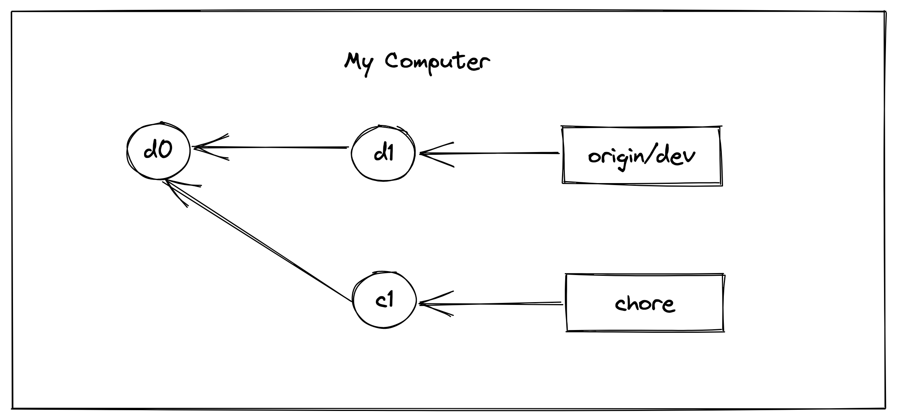
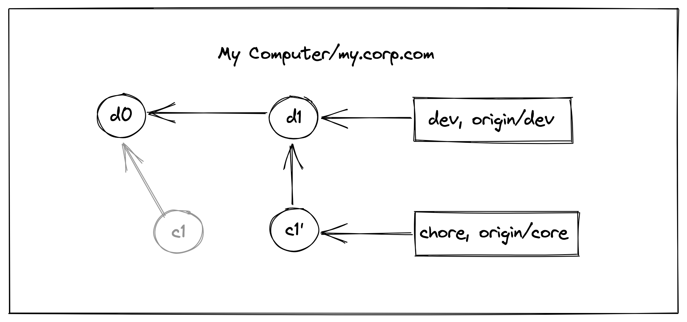
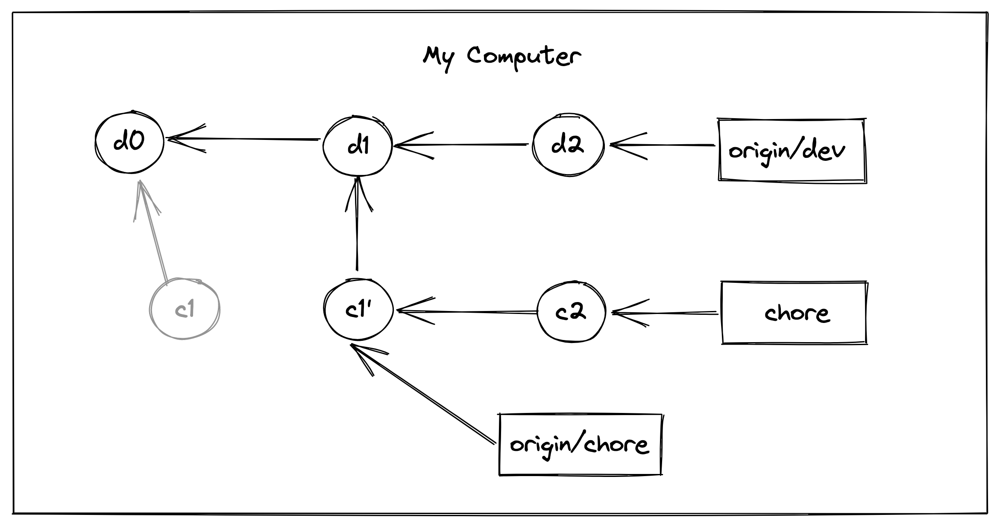
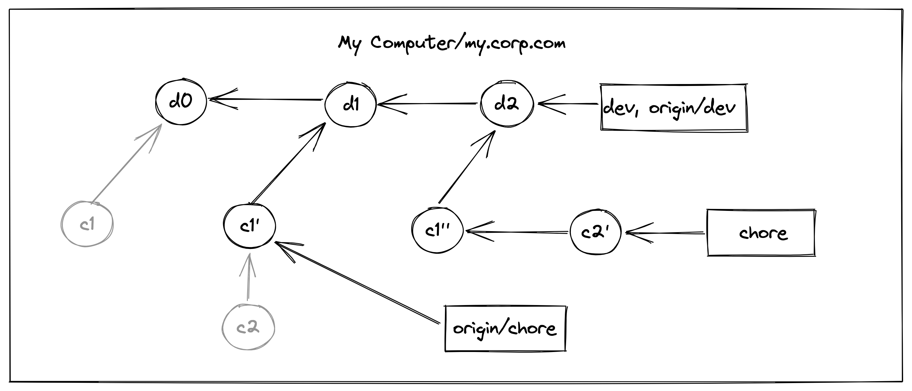
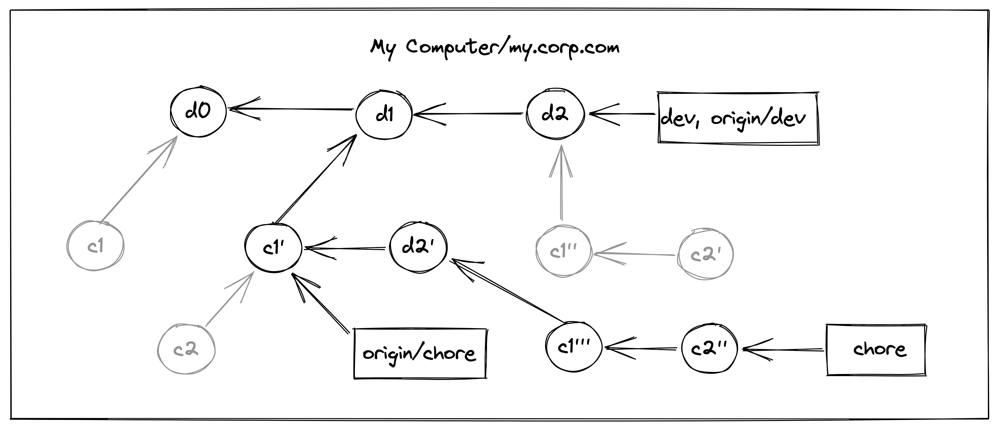
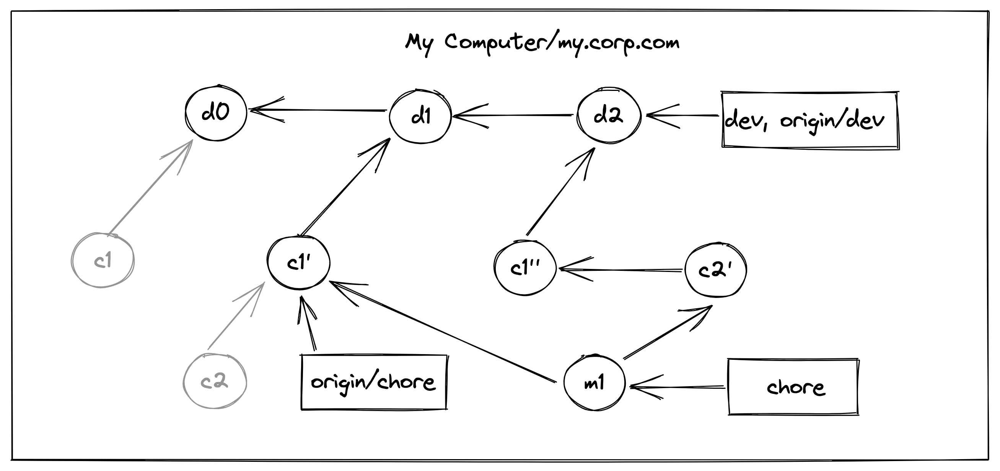
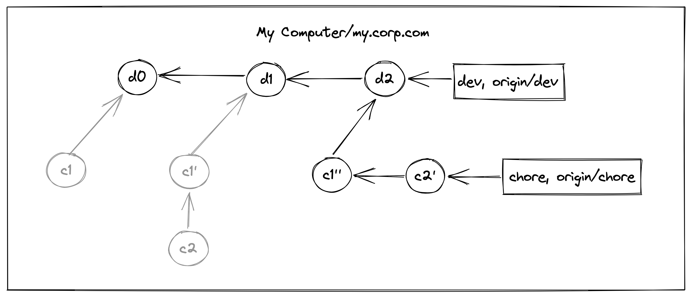

一种安全的 force push 场景。

<!--more-->

## 前言

最近同事问了一个问题，原文如下：

_在执行下面的操作后，会提示本地落后于远程，这是为啥？（实际并没有落后），非得 `git pull origin yyy --rebase` 一下。_

```sh
git checkout yyy
git fetch origin xxx
git rebase origin/xxx
git push origin yyy
```

又是 `rebase`，我的第一感觉是，是不是 rebase 之后，base 前移了？（后面想起来真是随口乱说，因为我并不知道什么是 **base 前移**），但是可以肯定的是：**既然本地落后了，那么远程必然是在和本地最近的同一个 commit 后又产生了新的提交**。

还来不及深入研究，同事又问了：_如果直接 `git push origin yyy --force`，会有啥后果？_

我第一印象就是，你不仅变基了，还推送到远程，马上就想到了 [`rebase` 的风险提示](https://git-scm.com/book/en/v2/Git-Branching-Rebasing#_rebase_peril)并发给了同事：

> **Do not rebase commits that exist outside your repository and that people may have based work on.**

并且还附上了我的一些感性想法：

- 我现在就只敢在我自己的分支 rebase。很多团队成员不一定理解这个，容易乱。
- 我觉得如果团队部分人 merge 部分人 rebase，就可能出问题，特别是你把别人 base 搞丢了，你还 force push，就会导致别人再 pull 的时候，根据你的新 base 继续生成 merge commit。

但其实上面的思考都没有很深入，有些偏感性。我心想这是一个很不错的实际场景，也许可以再深入研究一下，便尝试复原这个过程。

## 场景还原

在我仔细思考以后，我发现这其实是一个很通用的场景需求，而且我之前也遇到过。

首先，有一个业务分支，业务分支会持续开发迭代。同时，我脚手架基建有一个东西需要升级（同事是想把 TypeScript 升级到 v4），这个升级就我一个人来搞，我希望这个升级的提交记录变得线性，且最终合入到业务分支后，所有升级的记录都可以位于最后。同时，这两个过程是并行的，业务分支会不断向前走，而我的技术分支升级，我希望升级了一部分，就能把最新的业务分支代码同步到这个技术分支中进行验证，但是技术分支直到最终完成，才会合入业务分支，而且我希望可以进行 [fast-forward merge](https://git-scm.com/docs/git-merge#_fast_forward_merge)。

顺着上面这个实际场景，来考虑我同事遇到的问题。首先，我建了一个仓库，里面有一个开发分支（对应上面的业务分支）叫做 dev，其中初始 commit 为 d0，基于此我切了一个分支叫做 chore。

开发的第一天，dev 和 chore 都分别向前推进，其中 dev 提交了一个 commit d1，chore 提交了一个 commit c1，我本地最新的提交记录如下（为了画图方便，下图的 `origin/dev` 表示远程分支，下一步才会同步到本地，下同）：



在下班前，我需要提交 chore 分支的代码，而在提交前，我希望将 dev 分支最新的代码先合入用于验证。前面提到，我希望提交记录是线性的，所以这里我在 chore 分支下，使用 `git fetch origin dev && git rebase origin/dev`，代码验证通过后，再使用 `git push origin chore` 将代码推送到远程。一切 OK，我开开心心地下班了。此时的提交记录为（当然，我可能并不知道记录发生了这样的变化）：



到了第二天，我继续第一天的工作，流程也是一样的：首先我继续开发 chore，chore 前进了一个 commit，到达 c2，同时，团队成员也在迭代 dev，dev 也前进了一个 commit，到达 d2，此时我本地的记录为：



又到了快下班的时候，和昨天一样，我首先要把 dev 的代码同步到 chore 上来，看看新的技术改造 c2 是否生效，运行 `git fetch origin dev && git rebase origin/dev`，此时的提交记录为：



接下来是验证，验证通过以后，我非常开心，就差最后的 `git push origin chore` 就能下班了，可是执行以后，却报错了：

```sh
error: failed to push some refs to 'git@gitlab.com:tianzhich/git-strategy.git'
hint: Updates were rejected because the tip of your current branch is behind
hint: its remote counterpart. Integrate the remote changes (e.g.
hint: 'git pull ...') before pushing again.
```

意思是本地代码落后了，远程代码上有了新的提交，其实通过上面的记录图，不难看到，本地和远程相比，共同的最近 commit 为 d1，然后本地缺少 c1' 这个节点，新增了 d2-c2' 这三个节点，自然无法 push，也就是出现了我同事说的情况。

## 解决方案

那么接下来应该是尝试不同的解决方案。这里无非就两种，其一是按照提示那样，先通过 `git pull` 同步远程的 c1' 节点。第二种则是强制 push，执行 `git push origin chore -f`。虽然这篇文章会说明第二种的合理性，但是看到这种报错，大多数情况下正确的做法，应该是方案一，所以我们先来看看方案一。

### 执行 `git pull`

执行 `git pull` 也分为两种，一种是使用 rebase，一种则是常规的 merge。鉴于我们已经使用 rebase，这里也先讲它。

#### 使用 `git pull --rebse`

在 chore 分支下执行 `git pull origin chore --rebase` 以后，提交记录如下：



可以看到，在这个方案下，会产生太多的冗余节点，c1 重复了 4 次，c2 重复了 3 次，d2 重复了 2 次。虽然 c1 和 c2，以及 c1'' 和 c2' 都相当于废弃掉了，但是在最新的 chore 分支记录中，c1 仍然重复了 2 次（c1' 和 c1'''）。且假设此时 chore 开发完成，可以合入 dev 分支了，一旦我们 `rebase origin/dev`，那么 d2 也会重复 2 次。这才是分别只有两个新增 commit 的情况，如果提交了更多，则看起来无疑会更乱。

> ps1：常规的 rebase 时，如果使用 vscode 的集成 git 来操作，重复节点的 commit message 会是一样的，因为 vscode 不允许改。而使用命令行进行 rebase，冲突的 commit 可以编辑 message，未冲突的 commit 也会直接应用上去，除非使用交互式的 rebase 手动修改单个 commit。也正因为这样，重复的 commit message 会让人特别困惑，尤其是当你不了解 rebase 的时候。

> ps2：我在实际操作的时候，发现上面的 c1''' 节点不一定生成，因为在当 c1'' 的内容和 d2' 一致时，会跳过应用 c1'' 这一步。不过这是因为我示例代码十分简单，而且我自己知道如何解决冲突（有点作弊的意思），如果是正常团队开发，冲突比较棘手的话，出现上面的记录也是很自然的事。

rebase 成功后，此时便可以 `git push origin core` 了。我们假设这个时候，技术分支 chore 开发完成，我们要把 chore 合入最终的业务 dev 分支。为了保持业务 dev 分支上的线性记录，我们还是先在本地的 chore 分支变基到 origin/dev，紧接着需要将本地 chore 分支推送到远程（由于已变基，这个过程又会出现上面的冲突，需要再次执行 `git pull --rebase` 后再推送），此时，便可以在远程进行合并了。这里和上面的操作是一致的，我便不再画图了。由于反复捣腾，最终会产生更多冗余重复的节点。

#### 不使用 `git pull --rebse`

如果使用常规的 merge，则会生成一个 merge commit，假设为 m1：



相比 rebase，好处是产生的重复节点变少了，看着”稍微“清晰了点，但缺点也很明显，产生了一个 merge commit m1 节点，随着 dev 和 chore 各自不断演进，如果一直采用 merge，后期这类节点会越来越多，提交记录会不断交叉，反而看起来更乱。

那么，有没有更好的方法呢？当然有，那就是直接强制推送并覆盖远程分支。

### 执行 `git push --force`

一提到强制推送，肯定会有人站出来说这是不安全的。不过这是在你不了解提交记录演进的情况下，一旦你了解了提交记录会如何演进，并遵循一些准则，就可以安全地使用它。

下面是使用 `git push origin chore --force` 之后的提交记录：



可以看到，没有上面先执行 `git pull` 时产生的超多冗余节点，也没有 merge commit 节点。除了废弃掉的三个节点。看起来如此清晰，而且完全符合上面我说的需求：

- 提交记录线性
- chore 的记录都位于 dev 记录之后
- 两个分支可以各自演进，且 chore 可以随时同步 dev 的代码进行验证
- 最终可以使用 ff-merge 将 chore 代码合入 dev 分支，且无需反复地解决冲突，产生新节点或者 merge commit 节点

当然，这样做也是需要满足一定前提条件的，前面我也提到了，那就是**这个升级就我一个人来搞**。这是一个很宽泛的前提，往细了说，其实对应的是 rebase 风险提示的后半句：

> Do not rebase commits that exist outside your repository and **that people may have based work on.**

细心的读者可能发现了，在上面所有的图中，有一些废弃的节点，我用灰色标了出来，比如本地的 chore 分支 rebase onto dev 时，废弃的 c2，强制推送覆盖远程 chore 时，废弃的 c1' 等等。而这些节点，就是上面前半句里提到的 _commits_。这个升级就我一个人来完成，就是为了保证**别人没有提交记录基于这些节点**。如果有的话，在你看来这些节点是废弃了，但是一旦你同步别人的工作，这些节点又会出现在你的提交记录中。而反过来，当别人使用 merge 同步你的工作时，即使没有冲突，也会产生新的 merge commit。这样一来，如果团队中有开发者不了解背后这些原理，他将感到十分困惑。哪怕了解了，也会让提交历史变得难以阅读和理解。

这些在 [`rebase` 的风险提示](https://git-scm.com/book/en/v2/Git-Branching-Rebasing#_rebase_peril)中也有很好的解释，强烈建议大家读一读。

## 总结

这篇文章到此就结束了，它介绍了一种安全的 force-push 场景，如果你在工作中有这样的需求，不妨大胆尝试，来为你的工作提效。
