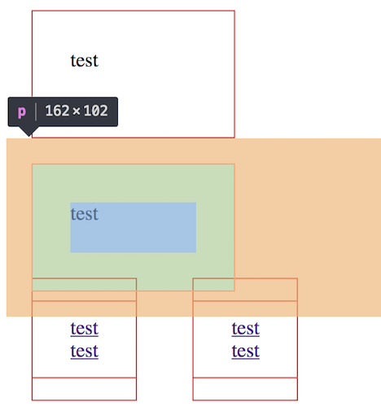
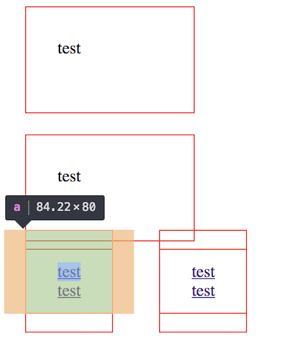
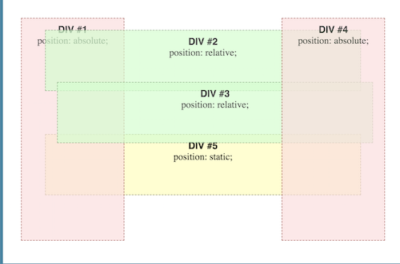
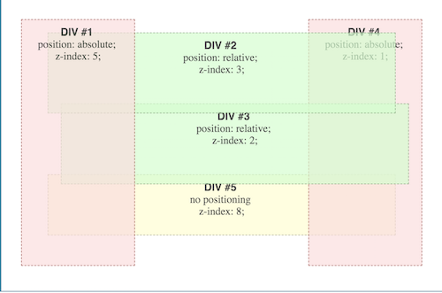
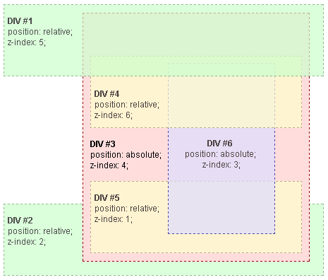

理解基本的文档流我们就能知道 HTML 文档显示在 Web 的过程，当我们需要复杂的布局时，就不得不认真思考诸如'BFC', 'Stacking Context'等名词，了解清楚了，才能在处理布局上更加游刃有余。

<!--more-->

## 前言

最开始学习 CSS 的时候，我一度认为 CSS 基础很简单，但是 CSS 布局是一块难啃的骨头。又到后来，我去亚马逊买了畅销书*HTML and CSS, design and build websites*，书上内容浅显易懂，但是关于 CSS 布局，也就只有一章，而且似乎也没有提到复杂的文档流，我印象中也并不知道'BFC', 'Stacking Contexts'这些名词。

最近的复习中不断出现'负 margin'，'BFC'，'Stacking Contexts'等等概念，又在 MDN 上了解到 CSS _[Visual Formatting Model](https://developer.mozilla.org/en-US/docs/Web/CSS/Visual_formatting_model)_，我觉得有必要系统地梳理一遍思路

本文以 MDN _[Visual Formatting Model](https://developer.mozilla.org/en-US/docs/Web/CSS/Visual_formatting_model)_ 这篇文章作为引导，并加入自己的理解和新增的知识点，不会涉及太多的布局真实场景，例如双飞翼布局，圣杯布局，多列等高布局等等，这里只作为基础

## CSS 标准盒子模型(Box Model)

CSS 标准盒子模型是呈现每一个独立元素的基础，组合起来构成文档流

以下是一个标准的盒子，由 4 个部分组成


标准盒模型我们设置`width`属性的时候，`width = content-width`，怪异盒模型`width = content-width + padding-width + border-width`

当我们设置背景色或者背景图片时，默认会延伸到 border 外围，但是 Z-Ordering 的顺序在 border 以下，也就是说，如果同时设置了`background`和`border`属性，border 区域还是显示 border，但是其`Z-Order`以下是`background`。我们可以使用[background-clip](https://developer.mozilla.org/en-US/docs/Web/CSS/background-clip)属性改变这一默认行为，具体不再叙述

### block 元素和 inline 元素形成盒子的区别

```html
<p>test</p>
<p>test</p>
<a href="">test</a>
<a href="">test</a><br />
<a href="">test</a>
<a href="">test</a>
```

```css
p,
a {
  width: 100px;
  height: 40px;
  border: 1px solid red;
  margin: 20px;
  padding: 30px;
}
```





仔细看上面两幅图，块级和行级元素盒子有以下几点不同

1. 块级元素盒子会自动占满一行，行级元素盒子不会
2. 块级元素可以设置宽高，行级元素宽高设置无效
3. 块级元素之间上下 margin 有折叠，行级元素设置上下 margin 无效，但是左右 margin 有效，而且不会折叠
4. 行级元素 content 部分出现在正常文档流中，设置上下 padding 会与其他元素发生重合，左右 padding 不会

## CSS 容器盒子(Containing Block)

仅仅了解完每个元素自己形成的盒子模型是不够的，因为自身的盒子在某些时候还会受到容器盒子(Containing Block)的影响，例如

1. 基于百分比的值来设定元素盒子的`width`,`height`,`margin`,`padding`，这里需要注意，除了`height`是基于父元素盒子的`height`之外，其余三个属性都是基于父元素盒子的`width`
2. 当设置为 Absolute Positioning 之后，基于百分比的值来设置盒子的偏移量，例如`top`,`left`等等，此时是基于父元素盒子**border 内侧**进行定位

关于容器盒子，我们最常认为它就是父元素的 content 部分，其实不然，有如下三种情况

1. 如果子元素 position 属性为默认值`static`或者是`relative`，则其 Containing Block 为父元素的 content 部分
2. 如果子元素 position 属性为`absolute`，则其 Containing Block 为第一个 position 不为`static`的父元素的 content+padding 部分，如果都是`static`，则为 Initial Containing Block
   > **Initial Containing Block**
   >
   > The initial containing block has the dimensions of the viewport, and is also the block that contains the [`html`](https://developer.mozilla.org/en-US/docs/Web/HTML/Element/html)element. Simply put, the absolutely positioned element will be contained outside of the [`html`](https://developer.mozilla.org/en-US/docs/Web/HTML/Element/html) element, and be positioned relative to the initial viewport.
   >
   > 简而言之，就是视窗(Viewport)
3. 如果子元素 position 属性为`fixed`，则其 Containing Block 为视窗(Viewport)

知道标准盒子模型以及容器盒子模型后，需要用一定的规则将这些盒子“组装”起来，以下我们来看看“组装”方式

## 正常流(Normal Flow)

一旦盒子模型创建成功，接下来便是将这些盒子按照一定规则组装起来，默认的组装规则就是 Normal Flow

使用`position: relative`或者默认的`position: static`，且没有设定浮动，此时元素就是在 Normal Flow 中

Normal Flow 中，块级元素盒子垂直方向一个挨着一个，行级元素盒子水平方向一个挨着一个，一行不够之后换到下一行

如果使用`position: relative`，可以将盒子基于原来的位置，通过设定`top`,`bottom`,`left`,`right`进行位移

## 浮动流(Floats)

设置一个元素为浮动之后，这个元素盒子在一行中移动到最左边或者最右边，并且脱离 Normal Flow

浮动元素对其后面的元素或者是其父元素都会产生影响，除非其后元素使用`clear`属性清除这一影响，我之前写过一篇[从圣杯和双飞翼看浮动流](https://tianzhich.github.io/blog/learning/2018/08/22/The-Magic-of-CSS-Float-Property/)的文章，里面详细解释了浮动流的过程

## 绝对定位(Absolute Positioning)

在 Floats 中，虽然盒子脱离了文档流，但是其对于之后的元素盒子或者是父元素盒子都会产生影响，除非影响被清除。但是在*Absolute Positioning Scheme*中，盒子可以说完全抽离 Normal Flow，且不再对其他元素产生影响

此时元素盒子的位置完全基于其容器盒子(Containing Block)，主要两种情况

1. 如果绝对定位使用`position: absolute`，容器盒子为第一个 position 不为`static`的父元素的 content+padding 部分
2. 如果绝对定位使用`position: fixed`，容器盒子为视窗(Viewport)

## 堆叠顺序(Z-Ordering)

前面提到的都是元素应该出现在文档中的位置，但是如果发生堆叠，那么显示顺序(Z-Ordering, or Stacking Ordering)是怎么样的呢？

### 不使用 z-index

HTML 文档默认显示给我们的是第 0 层，这也是`z-index`的默认值，为 0

- bottom layer _(farthest from the observer)_
- ...
- Layer -3
- Layer -2
- Layer -1
- Layer 0 _(default rendering layer)_
- Layer 1
- Layer 2
- Layer 3
- ...
- top layer _(closest to the observer)_

正常的堆叠顺序，遵循如下几个规则（顺序由底向上，如果发生重叠，只有最上的元素能被用户看到）

1. 根元素(`<html>`)的`background`和`border`，在堆底
2. 没有被定位的元素(`position: static`)，根据在 HTML 文档出现顺序，后面出现的在堆顶
3. 被定位的元素(除了`static`)，根据在 HTML 文档出现顺序，后面出现的在堆顶
4. 如果使用`display: flex`，且对 flex container 下的子元素使用`order`属性改变顺序，也会影响到堆叠顺序，`order`最高的元素出现在堆顶

依据上面的规则，我们看一个例子



### 使用 z-index

首先来看看`z-index`的定义

> The z-index CSS property specifies the z-order of **a positioned element and its
> descendants** or **flex items (children of an element with display: flex).** When elements overlap,
> z-order determines which one covers the other. An element with a larger z-index
> generally covers an element with a lower one.

也就是说，`z-index`只能在 flex-item 或者 positioned-items 下设置才有效，否则无效

再看一个例子（在上一个例子基础上使用`z-index`）



### Stacking Context

其实我们使用`z-index`，实际上是形成了一个*Stacking Context*，不同的*Stacking Context*下的元素层叠顺序互不影响，它们之间的层叠顺序由上层元素之间的层叠顺序决定

创建*Stacking Context*有如下几种常见方法

1. HTML 文档根元素`<html>`创建了默认的*Stacking Context*
2. 设置了`position: fixed`或者`absolute`的元素，且`z-index`值不为默认值`auto`
3. 设置了`display: flex`container 下的子元素，且`z-index`值不为默认值`auto`
4. 设置`opacity`值小于 1 的元素

### 使用 z-index 改变堆叠顺序

前面提到过，**不同的 Stacking Context 下的元素层叠顺序互不影响，它们之间的层叠顺序由上层元素之间的层叠顺序决定**

`z-index`的 initial(默认值)为`auto`

> **`auto`**
>
> The box does not establish a new local stacking context. The stack level of the generated box in the current stacking context is the same as its parent's box.

也就是说，如果一个元素没有创建*Stacking Context*，则其顺序由父级*Stacking Context*决定，最顶层的*Stacking Context*为根元素`<html>`创建，其 z-index 值为 0

还是先看一个例子，下面分别是文档结构和结果图

Root

- DIV #1
- DIV #2
- DIV #3
  - DIV #4
  - DIV #5
  - DIV #6



## 总结

到这里 Document Flow 和 CSS Formatting Model 也就结束了，涵盖了基本的布局规则。只有深入理解这些基础，才能更好地去理解以前的一些布局 Trick，比如双飞翼布局，圣杯布局等等，这些布局建立在这些基础上，如果理解了这些内容，自己实现一些布局 Trick 也不是不可能，虽然现在 Flex 布局已经可以解决很多问题了

## 参考

1. https://developer.mozilla.org/en-US/docs/Web/CSS/Visual_formatting_model
2. https://developer.mozilla.org/en-US/docs/Web/CSS/z-index
