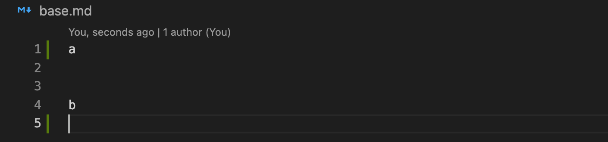
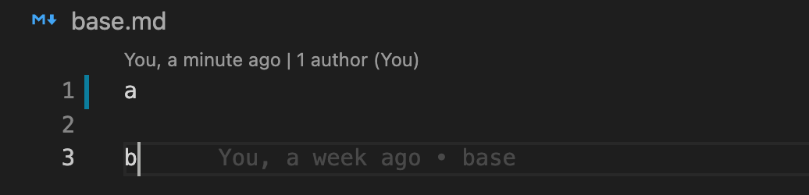
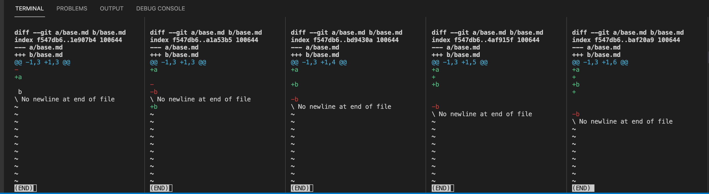

从一次奇怪的合并冲突深入 git diff。

<!--more-->

## 前言

这篇文章来源于 [一种安全的 force push 场景](../a-secure-force-push-scenario)，在**解决方案 -> 使用 `git pull --rebse`** 这部分，我发现 git 产生了一次很奇怪的冲突，冲突行的位置在我看来发生了偏移。由于自己对 git 及其背后的冲突原理并不是特别了解，一下也找不到合适的关键词去搜寻答案，且这个问题能否用一个 demo 进行复现，我心里也没个底。抱着钻研到底的精神，在写作前面这篇文章的同时，我开始尝试用简单的 demo 复现这个奇怪的冲突。

> 文中所用 Git 版本为：**git version 2.24.3 (Apple Git-128)**

## 场景还原

梳理清楚以后，这个场景还是比较简单的。首先，我创建了一个空仓库，新建了一个分支 `base`，在其中新建了一个文件 `base.md`，文件内容如下（为了便于理解，我为每一行加上了行号，下同）：

```md
1:
2:
3: b
```

保存文件并提交了一个 commit 以后，我基于这个 commit 切了一个新分支 `feat`，并更新 `base.md` 如下：

```md
1:
2:
3: b
4:
5: c
```

保存并提交后，切回 `base` 分支，更新 `base.md` 如下（注意我在文件末尾加了一个空行）：

```md
1: a
2:
3: b
4:
```

继续保存并提交完成后，执行 `git merge feat`。这里请大家停下来思考一下，会产生冲突吗？为什么会/不会呢？如果会的话，产生的冲突是哪部分呢？

答案是会有冲突，但是冲突的位置你答对了吗？

```md
01: a
02:
03: <<<<<<< HEAD (Current Change)
04: b
05: =======
06:
07: b
08:
09: c
10: >>>>>>> feat (Incoming Change)
11:
```

到此以后，请大家仔细看看上面第 6 行，这是一个空行。不知道有没有人与我一样对此感到困惑？为什么这里会产生一个空行？如果我选择 `Incoming Change`，文件中的 a 和 b 之间会产生两个空行，我需要手动删除一行，以及删除最后一行，才能完全和分支 `feat` 一致。

这和我想的不一样，直观来看，分支 `feat` 的变化是 b 后面增加了一个空行和一个含有字母 c 的行。而分支 `base` 则是第一行由空行变为含有一个字母 a 的行，其次是 b 后面增加了一个空行。字母 a 这一行只有 `base` 分支发生了更改，因此没有冲突，而字母 b 下面 `base` 分支是增加一个空行，`feat` 分支为增加一个空行加上增加一个带字母 c 的行。在我最初的理解里，**增加一个空行**这部分是没有冲突的，而 `feat` 在此基础上再增加了一个带字母 c 的行，也是没有冲突的，因此最终会直接合并（采用 `feat` 的变更）。

后来仔细想想，上面这种想法还是 too young too naive。从正常开发角度看，即使开发者 A 在文件最后新增的内容包括了开发者 B 新增的，肯定也无法直接采用开发者 A 的，因为 A 增加的代码虽然包括了 B 的，但是功能上可能实现的东西和 B 完全不同，因此这里需要抛出冲突，让用户去选择。当然，这只是我的猜想，git 显然不会考虑你实现了什么功能，但是它的内部肯定是支持判断这类冲突的。

> 其实，后来仔细一想，如果 A 和 B 都对文件末尾进行了更改，即使 A 的更改包含了 B 的，git 也会提示冲突。这是非常合理的行为。

回到主题，直观来看，我认为冲突应该是这样的：

```md
01: a
02:
03: b
04: <<<<<<< HEAD (Current Change)
05:
06: =======
07:
08: c
09: >>>>>>> feat (Incoming Change)
```

如果你的直观感受和我想的一样，那么可以继续阅读下去。如果不一样，也欢迎评论区告诉我你的想法，我猜测要么你精通 git merge 和 diff 相关的原理，要么，你也有非凡的见解。

## 如何阅读 git diff

通过上面的部分，我们可以很简单地复现这一场景，接下来要做的，便是寻求答案。其实，一开始我是无从下手的，不知道如何搜索关键词，也不了解 git 背后的原理。不过我猜测冲突肯定和 diff 有关（后来被证明确实是这样，但当时我只是猜测），所以，首先我们要会阅读 diff。

想到 diff，一般我们可能习惯于使用编辑器查看，以我使用的 vscode 为例，对于分支 `feat` 的变更截图如下：


可以看到，新增部分用绿色标识了出来，我们还可以通过右上角的「Open Changes with Previous Revision」按钮来左右对比：


再来看看分支 `base` 的变更：


分支 `feat` 的变更很好理解，但是 `base` 呢？我刚看到这样的标识也是一脸懵逼，不就是编辑了第一行，然后增加了末尾一行，怎么还出现删除标记了？而且左右对比展示时出现了错行，错行代表什么？我此时又继续猜测上面的冲突肯定和这种古怪的 diff 有关（后来被证明也是正确的），我稍微更改了变更，比如在字母 a 和 b 之间增加两行：



又或者只增加 a，而末尾不变：



可以看到，a 和 b 之间空出两行时，相当于增加一行 a，以及末尾增加一行空行。而仅增加 a 时，相当于对第一行进行编辑。此时我还是没想出来上面为什么会有删除标记，因为直观上并没有做删除操作。

这个时候其实我已经开始请教一个同事，并把这些结果告诉他，他建议我直接在命令行使用 `git diff` 而不是使用编辑器来看，因为编辑器可能在 `git diff` 上做了一些处理和优化。我觉得他说得很对，又按照他所说的，使用命令行来查看。

还是先看分支 `feat` 的变更：

```sh
diff --git a/base.md b/base.md
index f547db6..0d91235 100644
--- a/base.md
+++ b/base.md
@@ -1,3 +1,5 @@


-b
\ No newline at end of file
+b
+
+c
\ No newline at end of file
(END)
```

这里我简要介绍一下，第一行 `diff --git a/base.md b/base.md` 表示对比的两个文件，一般 a 表示当前文件，b 表示变更后的。而第二行 `index f547db6..0d91235 100644` 用于标识 git 内部的一些元数据 hash，一般我们不用关心。接下来是 `---` 和 `+++`，其中 `---` 是来源于前者的变更，在下面的内容中用 `-` 标出，`+++` 则是来源于后者，用 `+` 标出（也可以认为 `-` 表示删除，`+` 表示新增）。再到 `@@ -1,3 +1,5 @@`，这表示从第 1 行开始，提取了 3 行，然后再从第 1 行开始，添加了 5 行。关于更多的介绍可以查看[这篇教程](https://www.atlassian.com/git/tutorials/saving-changes/git-diff)。

接下来我们来看看内容部分，最后的 `(END)` 是命令行结尾的标识，和文件内容无关，我们忽略。最开始空出的两行没有变更，因此无操作。从第 3 行开始，我们看到的 `-b` 表示这一行被删除了，`\ No newline at end of file` 表示文件结尾没有空行，接下来表示新增了三行，分别是含字母 `b`，空行以及含字母 `c`，最后该文件结尾仍然没有空行。

> 这里说一下 `\ No newline at end of file`。为什么字母 `b` 这行发生了变更？不是仅仅增加了两行吗？这是因为当我们敲下回车的时候，本质是在 `b` 这行增加了换行符，所以如果一行后跟着 `\ No newline at end of file`，表明这行没有换行符。需要注意的是，一个文件最多有一行没有换行符，且位于最后一行。

看上面的 diff，细心的读者应该能发现，vscode 中的新增对应 `+`，删除对应 `-`，而编辑则是先 `-` 后 `+`。实际上，上面这些操作就是 git 生成的一组指令集，git 借助这组指令，可以将 `a/base.md` 转化为 `b/base.md`。例如上面这组指令集是：

1. 保持第一行不变
2. 保持第二行不变
3. 删除第三行的字母 `b`（无换行符）
4. 第三行新增字母 `b`，然后回车（有换行符）
5. 第四行由于是空行，直接回车（有换行符）
6. 第五行新增字母 `c`，无需回车（无换行符）

通过执行这一组指令，git 实现了文件的变更。建议读者依据这样的指令去亲自模拟 git 操作一遍，这和我们直接编辑还是有很大不同的，尤其要注意的一点就是换行符属于一行的末尾，这意味着如果是删除带换行符的一行，实际上是从该行的下一行首进行操作（敲击删除键先删除换行符）。同理，如果是新增带换行符的一行，在该行操作完毕以后，还要敲击回车键以新增换行符，这在计算机看来只是该行以换行符结尾，但在人看来却是在下面再新增了一行。

带着这样的方法，我们再来看看分支 `base` 的 diff：

```sh
diff --git a/base.md b/base.md
index f547db6..a1a53b5 100644
--- a/base.md
+++ b/base.md
@@ -1,3 +1,3 @@
+a

-
-b
\ No newline at end of file
+b
(END)
```

指令集为：

1. 第一行新增字母 `a`，然后回车（有换行符）
2. 保持第二行不变
3. 删除第三行（由于第三行是空行，实际上是鼠标移到第四行首，敲击删除键以删除回车符即可）
4. 删除第三行的字母 `b`（无换行符）
5. 第三行新增字母 `b`，然后回车（有换行符）

到这里为止就能解释之前为何 vscode 出现了删除标记，因为 diff 后的指令集中确实有删除操作，就是删除字母 `b` 所在行及其上方一共两行。前面提到，git 借助这一组指令集来完成文件的变更，因此，就可能存在两组或多组不同的指令集，但是最后的变更是一样的。在这个例子中，显然 git 生成的这组指令集和我们人为操作时感受到的”不太一样“。

### 原生 diff 和编辑器展示的差异

一般情况下，编辑器展示的 diff 更有助于我们阅读，但是对于理解 git 内部的操作并无太大帮助，而且有时候还会出现不一致的情况，这也是我偶然发现的。

拿 vscode 举例，diff 时如果在一个文件中查看，总共有三个颜色标识，蓝色代表编辑，红色代表删除，绿色代表新增。而如果用双列模式查看，则没有蓝色标识，蓝色的编辑此时用”左侧一行显示红色+右侧同一行显示绿色“来表示。双列展示新增时，左侧用 `///////` 表示错位行，右侧对应的是绿色的新增行，删除则是相反。

这样的标识对于人的理解来说很方便，也完全够用。但是其忽视了”换行符“这个细节，前面提到，换行符是归属于当前行的，而我们新增一行时，实际上也更改了当前行，而这个更改在 vscode 的 diff 中就没有表现出来。

除此之外，再来看看我偶然发现的一个不一致的情况，还是回到分支 `base` 的最初状态，文件 `base.md` 内容如下：

```md
1:
2:
3: b
```

当变更为：

```md
1: a
2:
3: b
```

或者：

```md
1: a
2:
3: b
4:
```

使用上述两种变更时，vscode 展示的 diff 和 `git diff` 中对字母 `a` 这一行的操作是一致的（前者是编辑，后者是新增）。

但是如果我变更如下：

```md
1: a
2:
3: b
4:
5:
```

vscode 中显示的对字母 `a` 这一行的操作是编辑，而 `git diff` 显示的操作是仅新增：


这里算是一个很小的细节，甚至说是隐藏的。而且我也不知道这是否算是 vscode 编辑器的一个 bug，如果大家有了解的，可以评论区留言。

### 相同的操作，不同的 git diff

关于 git diff 生成的指令集，我还发现在看似”相同“的操作下，生成的指令集却不”相同“的情况。在上面部分，我的变更从仅新增 `a`，到 `b` 这一行后新增一行，再到 `b` 这一行后新增两行。这里还是遵循这样的规律，由仅新增 `a`，到 `b` 末尾新增一行，直到 `b` 末尾新增 4 行，分别看看他们的 `git diff`：



不难看出，仅增加 `a` 时，是对 `a` 所在行的编辑，然后是我们分支 `base` 变更的情况。当文件末尾增加到 2 行时，变成了先增加 `b` 再删除原来的 `b`。增加到 3 行时，会在增加的 `a` 和 `b` 两行间加 1 行。直到最后才变得规律，在增加的 `b` 所在行后面分别增加所需的空行。

看起来有点无规律可循。由于本文并没有深入研究到 git 的 diff 引擎算法层面，提到这个，只是想进一步说明，git diff 生成的指令集，确实和我们常规思考的不一样。认识到这一点以后，我们回到主题，来看看冲突产生的根源。

## 从 git diff 再到合并冲突

git 背后生成了一套与我们所想不同的操作指令集，这和合并产生的冲突有什么关系？实际上，`git merge` 时，git 会找到两个分支的最近公共 commit，基于这个 commit，git 对两个分支分别执行 diff 得到两套 diff 指令集，git 会尝试合并这两套指令集来完成 merge，一旦有指令发生操作上的重叠，git 便会提示冲突。因此，合并冲突，实际上是指令集的冲突，产生什么样的冲突，和 diff 生成什么样的指令集是密切相关的。

回到上面的冲突，为了更好地说明冲突是如何产生的，下面我使用 [`merge.conflictstyle diff3`](https://git-scm.com/book/en/v2/Git-Tools-Advanced-Merging#_checking_out_conflicts) 来展示冲突的文件内容，你可以通过 `git checkout --conflict=diff3` 来使用，也可以通过 `git config --global merge.conflictstyle diff3` 进行全局配置。这种形式下，会多出一个 `merge base`，可以理解为这两个变更最近的一次共同 commit 内容。

采用 `diff3` 来展示冲突：

```md
01: a
02:
03: <<<<<<< ours
04: b
05: ||||||| base
06:
07: b
08: =======
09:
10: b
11:
12: c
13: >>>>>>> theirs
14:
```

这样一看，就清晰多了。在 git 看来，两者冲突，是因为分支 `base` 是想删除 `b` 上方一行，而分支 `feat` 则是想保留这一行并新增下面两行。那为什么分支 `base` 这里会解析出删除操作？就是因为前面的指令集。下面我们再对比看看这两组指令集：

分支 `base` 的 diff 指令集为：

1. 第一行新增字母 `a`，然后回车（有换行符）
2. 保持第二行不变
3. 删除第三行（由于第三行是空行，实际上是鼠标移到第四行首，敲击删除键以删除回车符即可）
4. 删除第三行的字母 `b`（无换行符）
5. 第三行新增字母 `b`，然后回车（有换行符）

分支 `feat` 的 diff 指令集为：

1. 保持第一行不变
2. 保持第二行不变
3. 删除第三行的字母 `b`（无换行符）
4. 第三行新增字母 `b`，然后回车（有换行符）
5. 第四行由于是空行，直接回车（有换行符）
6. 第五行新增字母 `c`，无需回车（无换行符）

注意看，前者的第 4-5 条指令和后者的 3-4 条指令完全重合。对于前两行，并无冲突（只要一方为保持不变，则应用另外一方的变更），因此直接应用即可。这里的冲突在于前者的第 3-5 条指令和后者的 3-6 条指令的冲突，尤其是前者的第 3 条指令指出需要先删除第三行（也就是字母 `b` 上方的空行），这也解决了为什么这里有删除操作，以及删除的是什么这两个问题。

## 我的疑问和看法

回顾一下冲突展示结果：

```md
01: a
02:
03: <<<<<<< ours
04: b
05: ||||||| base
06:
07: b
08: =======
09:
10: b
11:
12: c
13: >>>>>>> theirs
14:
```

对于上面的冲突结果，不知道大家有没有和我一样，持有一个疑问：注意末尾最后一行是在冲突之外的，而我认为更合适的是它位于第 5 行：

```md
01: a
02:
03: <<<<<<< ours
04: b
05:
06: ||||||| base
07:
08: b
09: =======
10:
11: b
12:
13: c
14: >>>>>>> theirs
```

这样更符合指令的操作情况，而且当接收 theirs 也就是分支 `feat` 的变更时，无需再手动去删除末尾这一行，这样更接近分支 `feat` 本来的变更。关于这个疑问，如果有对 merge 更了解的，也欢迎评论区告诉我。

除了这个疑问，关于 diff 生成这样的指令，而不是更接近我们思考的一组。我猜想这也许是 git 的 diff 引擎算法所做的一些权衡，只不过这个权衡恰好在我这个特殊的例子中没有发挥出它应有的价值。例如，假设 git diff 对于分支 `base` 的变更生成的是如下一组指令：

1. 删除第一行（由于第一行是空行，实际上是鼠标移到第二行首，敲击删除键以删除回车符即可）
2. 第一行新增字母 `a`，然后回车（有换行符）
3. 保持第二行不变
4. 删除第三行的字母 `b`（无换行符）
5. 第三行新增字母 `b`，然后回车（有换行符）

此时再对比分支 `feat` 的 diff 指令：

1. 保持第一行不变
2. 保持第二行不变
3. 删除第三行的字母 `b`（无换行符）
4. 第三行新增字母 `b`，然后回车（有换行符）
5. 第四行由于是空行，直接回车（有换行符）
6. 第五行新增字母 `c`，无需回车（无换行符）

此时产生的冲突则是前者的第 4-5 条指令和后者的第 3-6 条指令，展示结果如下：

```md
01: a
02:
03: <<<<<<< ours
04: b
05: ||||||| base
06: b
07: =======
08: b
09:
10: c
11: >>>>>>> theirs
12:
```

这样的冲突，除了仍然有我上面疑问部分提出的问题，看起来显然更符合我们的思考过程（也是我在上面的**场景还原**部分提出来的直观感受）。

## 总结

除了上面我的一个疑问，这个问题就算解决了。回忆这次的解决过程，还是挺艰难的，我找不到相关的材料，而且由于问题太细，可能没有人注意和关注过。为此我在 StackOverflow 上提出了两个问题，分别是 [Why git diff have different behaviors?](https://stackoverflow.com/questions/69187176/why-git-diff-have-different-behaviors) 和 [Why git changes the line order when merge conflicts occurs?](https://stackoverflow.com/questions/69190498/why-git-changes-the-line-order-when-merge-conflicts-occurs)。从原始问题的标题就能知道，我当时并不了解 git diff 和 merge 的本质，提的问题标题都是用很表面的文字陈述，幸运的是，马上就有热心的歪果仁解答了我的疑惑，且最终收获满满。例如文中的 git diff 产生的不同指令集，以及更直观展示冲突的 diff3 样式，甚至最后我提出的假设性看法，都源于这两个提问。

这里要感谢 [torek](https://stackoverflow.com/users/1256452/torek) 的耐心解答，他在回答中也提出了 git 的 diff 引擎基于一些算法来生成最终的变更指令集。我们甚至可以通过一些参数，例如 [indent-heuristic](https://www.git-scm.com/docs/diff-heuristic-options) 来调整这一行为，只不过刚好对于我这个例子来说，调整貌似没有什么效果。

关于这两个提问，感兴趣的可以过去看看，其中大部分结论我都写在了这篇文章之中。希望大家对 git diff 和 merge 有了比以往更深入的见解。
