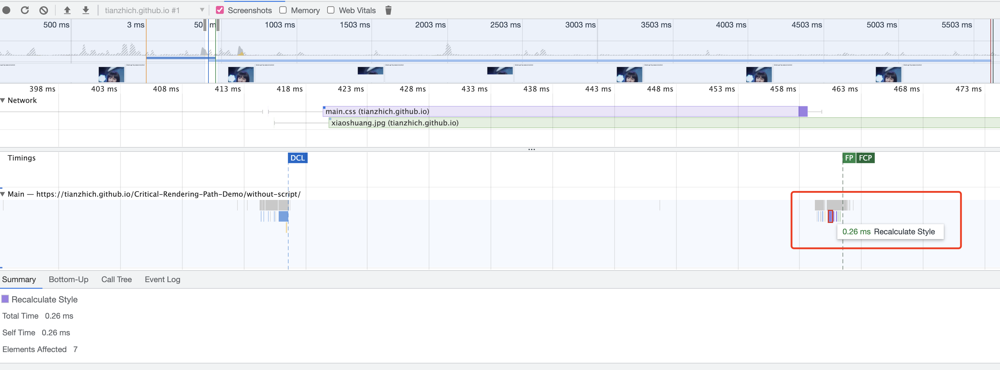
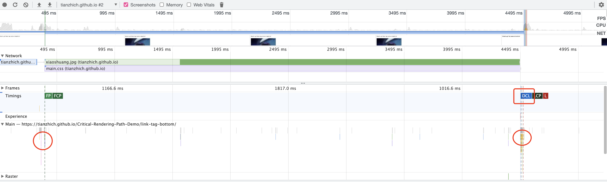
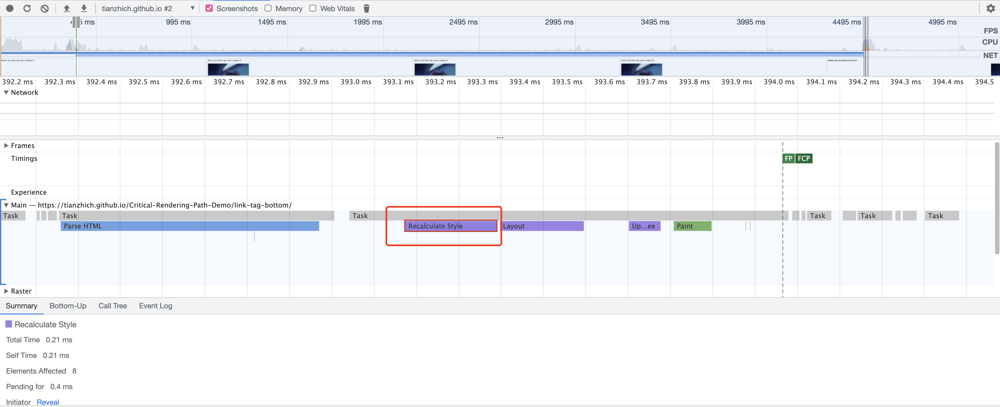
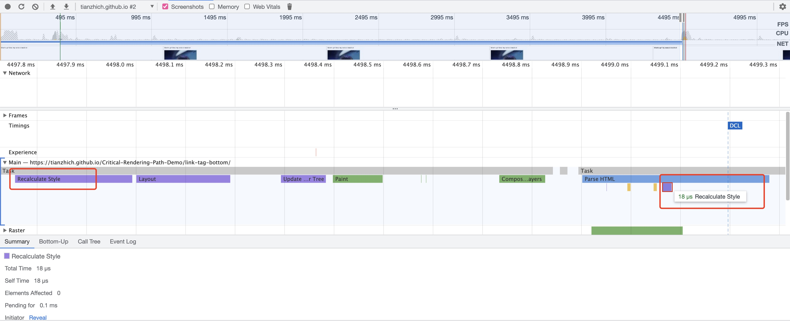
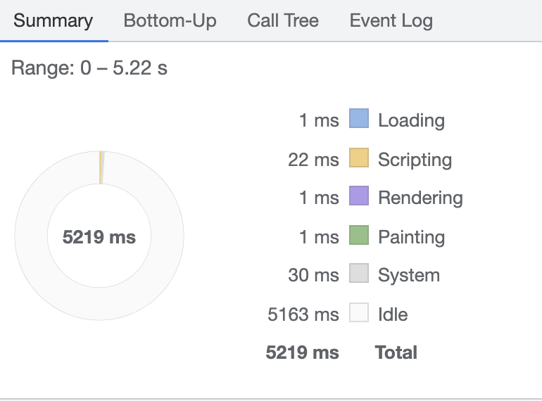

除了知道如何用代码实现一个页面之外，最重要的是明白这个页面是如何被浏览器解析和渲染，并最终呈现在我们面前的。

<!--more-->

## 更新

### 2021-12-15

见下文 [CSS 在 HTML 中不同位置的影响](#2021-12-15-更新) 部分。

## 前言

作为 Web 工程师，我们每天写 HTML，CSS 和 JavaScript，但是浏览器是如何解析这些文件，最终将它们以像素显示在屏幕上的呢？

这一过程叫做 _Critical Rendering Path_。

## Critical Rendering Path

_Critical Rendering Path_，中文翻译过来，叫做**关键渲染路径**。指的是浏览器从请求 HTML，CSS，JavaScript 文件开始，到将它们最终以像素输出到屏幕上这一过程。包括以下几个部分：

1. 构建 DOM
   - 将 HTML 解析成许多 Tokens
   - 将 Tokens 解析成 object
   - 将 object 组合成为一个 DOM 树
2. 构建 CSSOM
   - 解析 CSS 文件，并构建出一个 CSSOM 树（过程类似于 DOM 构建）
3. 构建 Render Tree
   - 结合 DOM 和 CSSOM 构建出一颗 Render 树
4. Layout
   - 计算出元素相对于 viewport 的相对位置
5. Paint
   - 将 render tree 转换成像素，显示在屏幕上

值得注意的是，上面的过程并不是依次进行的，而是存在一定交叉，后面会详细解释。

想要提高网页加载速度，提升用户体验，就需要在第一次加载时让重要的元素尽快显示在屏幕上。而不是等所有元素全部准备就绪再显示，下面一幅图说明了这两种方式的差异。


**为了便于理解，我下面使用 Chrome Dev Tool 的 Performance 来描述 CRP 过程，但是根据[官网文档](https://developers.google.com/web/fundamentals/performance/critical-rendering-path/measure-crp#devtools)，DevTool 并不适合特别精确细致的分析，不过对于理解 CRP，已经足够。**

## 构建 DOM

_DOM (Document Object Model，文档对象模型)_，构建 DOM 是必不可少的一环，浏览器从发出请求开始到得到 HTML 文件后，第一件事就是将 HTML 解析成许多 Tokens，再将 Tokens 转换成 object，最后将 object 组合成一颗 DOM 树。

这个过程是循序渐进的，我们假设 HTML 文件很大，一个*RTT (Round-Trip Time，往返时延)* 只能得到一部分，浏览器得到这部分之后就会开始构建 DOM，并不会等到整个文档就位才开始渲染。这样做可以加快构建过程，而且由于自顶向下构建，后面的构建不会对前面造成影响。**而后面我们将会看到，CSSOM 则必须等到所有字节收到才开始构建。**


**这一部分对应 Dev Tool Performance Panel 里的*Parse HTML*过程。**

## 构建 CSSOM

_CSSOM (CSS Object Model，CSS 对象模型)_，构建过程类似 DOM，当 HTML 解析中遇到`<link>`标签时，会请求对应的 CSS 文件，当 CSS 文件就位时便开始解析它（如果遇到行内`<style>`时则直接解析），这一解析过程可以和构建 DOM 同时进行。

假设有如下 CSS 代码：

```css
body {
  font-size: 16px;
}
p {
  font-weight: bold;
}
span {
  color: red;
}
p span {
  display: none;
}
img {
  float: right;
}
```

构建出来的 CSSOM 是这样的：


需要注意的是，上面并不是一颗完整的 CSSOM 树，文档有一些默认的 CSS 样式，称作*user agent styles*，上面只展示了我们覆盖的部分。

如果是外部样式，CSSOM 的构建必须要获得一份完整的 CSS 文件，而不像 DOM 的构建是一个循序渐进的过程。因为 CSS 文件中包含大量的样式，后面的样式会覆盖前面的样式，如果我们提前就构建 CSSOM，可能会得到错误的结果。

**这一部分对应 Dev Tool Performance Panel 里的过程如下：**

1. 如果是内联样式，CSSOM 构建包含在*Parse HTML*过程中
2. 如果是外部样式，包含在*Parse Stylesheet*过程中
3. 如果没有设置样式，使用*User Agent Style*，则包含在*Parse HTML*过程中

## 构建 Render Tree

这也是关键的一步，浏览器使用 DOM 和 CSSOM 构建出 Render Tree。此时不像构建 DOM 一样把所有节点构建出来，浏览器只构建需要在屏幕上显示的部分，因此像`<head>`,`<meta>`这些标签就无需构建了。同时，对于`display: none`的元素，也无需构建。

> `display: none`告诉浏览器这个元素无需出现在 Render Tree 中，但是`visibility: hidden`只是隐藏了这个元素，但是元素还占空间，会影响到后面的**Layout**，因此仍然需要出现在 Render Tree 中。


构建过程遵循以下步骤：

1. 浏览器从 DOM 树开始，遍历每一个“可见”节点。
2. 对于每一个"可见"节点，在 CSSOM 上找到匹配的样式并应用。
3. 生成 Render Tree。

**这一部分对应 Dev Tool Performance Panel 里*Layout*过程**

### 扩展：CSS 匹配规则为何从右向左

相信大多数初学者都会认为 CSS 匹配是左向右的，其实恰恰相反。学习了 CRP，也就不难理解为什么了。

CSS 匹配发生在 Render Tree 构建时（Chrome Dev Tools 将其归属于*Layout*过程）。此时浏览器构建出了 DOM，而且拿到了 CSS 样式，此时要做的就是把样式跟 DOM 上的节点对应上，浏览器为了提高性能需要做的就是快速匹配。

首先要明确一点，浏览器此时是给一个"可见"节点找对应的规则，这和 jQuery 选择器不同，后者是使用一个规则去找对应的节点，这样从左到右或许更快。但是对于前者，由于 CSS 的庞大，一个 CSS 文件中或许有上千条规则，而且对于当前节点来说，大多数规则是匹配不上的，到此为止，稍微想一下就知道，如果从右开始匹配（也是从更精确的位置开始），能更快排除不合适的大部分节点，而如果从左开始，只有深入了才会发现匹配失败，如果大部分规则层级都比较深，就比较浪费资源了。

除了上面这点，我们前面还提到 DOM 构建是"循序渐进的"，而且 DOM 不阻塞 Render Tree 构建（只有 CSSOM 阻塞），这样也是为了能让页面更早有元素呈现。考虑如下情况，如果我们此时构建的只是部分 DOM，而 CSSOM 构建完成，浏览器就会构建 Render Tree。这个时候对每一个节点，如果找到一条规则从右向左匹配，我们只需要逐层观察该节点父节点是否匹配，而此时其父节点肯定已经在 DOM 上。但是反过来，我们可能会匹配到一个 DOM 上尚未存在的节点，此时的匹配过程就浪费了资源。

## Layout

我们现在为止已经得到了所有元素的自身信息，但是还不知道它们相对于 Viewport 的位置和大小，Layout 这一过程需要计算的就是这两个信息。

根据这两个信息，Layout 输出元素的*Box Model（盒模型）*，关于这个，我也写过一篇文章[_深入理解文档流（Document Flow）和视觉格式化模型（CSS Visual Formatting Model）_](https://juejin.im/post/6844904131342106638)。

**这里的 Layout 阶段和 Chrome Dev Tool 中的*Layout*过程是不同的**。根据[官网文档](https://developers.google.com/web/fundamentals/performance/critical-rendering-path/render-tree-construction)的解释，*Layout*过程捕捉了 Render Tree 构建和 Layout 部分：

> The "Layout" event captures the render tree construction, position, and size calculation in the Timeline.

目前为止，我们已经拿到了元素相对于 Viewport 的详细信息，所有的值都已经计算为相对 Viewport 的精确像素大小和位置，就差显示了。

## Paint

浏览器将每一个节点以像素显示在屏幕上，最终我们看到页面。

这一过程需要的时间与文档大小、CSS 应用样式的数量和复杂度、设备自身都有关，例如对简单的颜色进行 Paint 是简单的，但是`box-shadow`进行 paint 则是复杂的。

**这一部分对应 Dev Tool Performance Panel 里*Paint*过程**

## 引入 JavaScript

前面的过程都没有提到 JavaScript，但在如今，JavaScript 却是网页中不可缺的一部分。这里对它如何影响 CRP 做一个概要，具体细节我后面使用 Chrome Dev Tools 进行了测验。

1. 解析 HTML 构建 DOM 时，遇到 JavaScript 会被阻塞
2. JavaScript 执行会被 CSSOM 构建阻塞，也就是说，JavaScript 必须等到 CSSOM 构建完成后才会执行
3. 如果使用异步脚本，脚本的网络请求优先级降低，且网络请求期间不阻塞 DOM 构建，直到请求完成才开始执行脚本

## 使用 Chrome Dev Tools 检测 CRP

为了模拟真实网络情况，我把 Demo 部署到了我的[githubpage](https://tianzhich.github.io/Critical-Rendering-Path-Demo/)，你也可以在仓库找到[源代码](https://github.com/tianzhich/Critical-Rendering-Path-Demo)。

**同时，不要混淆 DOM, CSSOM, Render Tree 这三个概念，我刚开始就容易混淆 DOM 和 Render Tree，这两个是不同的**

**下面的 Chrome 截图部分，如果不清晰，请直接点击图片查看原图**

### 代码部分

#### HTML

```html
<html>
  <head>
    <meta charset="UTF-8" />
    <meta name="viewport" content="width=device-width, initial-scale=1.0" />
    <link rel="stylesheet" href="../css/main.css" />
    <title>Critical Rendering Path with separate script file</title>
  </head>

  <body>
    <p>What's up? <span>Bros. </span>My name is tianzhich</p>
    <div>
      
    </div>
    <script src="../js/main.js"></script>
  </body>
</html>
```

#### JavaScript

```javascript
var span = document.getElementsByTagName("span")[0];
span.textContent = "Girls. "; // change DOM text content
span.style.display = "inline"; // change CSSOM property

// create a new element, style it, and append it to the DOM
var loadTime = document.createElement("div");
loadTime.textContent = "You loaded this page on: " + new Date();
loadTime.style.color = "blue";
document.body.appendChild(loadTime);
```

#### CSS

```css
/* // [START full] */
body {
  font-size: 16px;
}

p {
  font-weight: bold;
}

span {
  color: red;
}

p span {
  display: none;
}

img {
  float: right;
}
/* // [END full] */
```

### 不加载 JS 情况

首先来看没有加载 JS 的情况


上图中，浏览器收到 HTML 文件后，便开始解析构建 DOM。

**需要注意，上图接收的只是图片的一部分**

接下来我们详细看看这三个部分：

#### DOM 构建


可以看出，浏览器解析到`<link>`，``等等标签时，会马上发出 HTTP 请求，而且解析也将继续进行，解析完成后会触发[readystatechange](https://developer.mozilla.org/en-US/docs/Web/API/Document/readyState)事件和[DOMContentLoaded](https://developer.mozilla.org/en-US/docs/Web/Events/DOMContentLoaded)事件，在上图中，由于时间间隔已经到了 100 微秒级别，事件间隔有些许差异，但不影响我们对这一过程的理解。

细心的话可能会注意到上图中还触发了*Recalculate Style* (紫色部分)，这一过程表示 CSS 样式的一些计算过程。但是此时我们并没有拿到 CSS，这一部分从何而来呢？我在下面第 4 部分做了分析。

#### 页面首次出现画面

下面这一过程依次展示了 CSS 解析构建 CSSOM，Render Tree 生成，layout 和 paint，最终页面首次出现画面


从这里我们可以看出，DOM 即使构建完成，也需要等 CSSOM 构建完成，才能经过一个完整的 CRP 并呈现画面，因此为了画面尽快呈现，我们需要尽早构建出 CSSOM，比如：

1. html 文档中的`<style>`或者`<link>`标签应该放在`<head>`里并尽早发现被解析（第 4 部分我会分析将这两个标签放在 html 文档后面造成的影响）
2. 减少第一次请求的 CSS 文件大小
3. 甚至可以将最重要部分的 CSS Rule 以`<style>`标签发在`<head>`里，无需网络请求

#### 页面首次出现图片


上图说明，浏览器接收到部分图片字节后，便开始渲染了，而不是等整张图片接收完成才开始渲染，至于渲染次数，本例中的图片大小为 90KB 左右，传输了 6 次，渲染了 2 次。我觉得这应该和网络拥塞程度以及图片大小等因素有关。

还有一点需要注意，两次渲染中，只有首次渲染引发了 Layout 和之后的 Update Layer Tree，而第二次渲染只有 Update Layer Tree，我猜想对于图片来说，浏览器第一次渲染便知道了其大小，所以重新进行 Layout 并留出足够空间，之后的渲染只需要在该空间上进行 paint 即可。整张图片加载完毕之后，触发 Load 事件。

**上图包括之后图片中的 Chrome 扩展脚本可以忽视**，虽然使用了隐私模式做测验（避免缓存和一些扩展脚本的影响），但我发现还是有一个脚本无法去除，虽然这不影响测验结果。

接下来我们考虑 JavaScript 脚本对 CRP 的影响

### 引入 JS

#### 行内 Script (Script 位于 html 尾部)


上图来看，Parse HTML 这一过程被 JavaScript 执行打断，而且 JavaScript 会等待 CSSOM 构建完成之后再执行，执行完成之后，DOM 继续构建。

前面的例子中，我们看到 DOM 几乎都是在 CSSOM 构建完成前就构建完成了，而引入 JS 后，DOM 构建被 JS 执行打断，而 JS 执行又必须等 CSSOM 构建完毕，这无疑延长了第一次 CRP 时间，让页面首次出现画面的时间更长。

如果使用外部 script 脚本，这一时间会更长，我们来看看这种情况。

#### 外部 Script (Script 位于 html 尾部)


对于网络请求的资源，浏览器会为其分配优先级，优先级越高的资源响应速度更快，时间更短，在这个例子中，CSS 的优先级最高，其次是 JS，优先级最低的是图片。

我们主要来看第一部分，后面部分和第 1 个研究类似


可以看到，增加了对 JS 文件的网络请求时间，一轮 CRP 时间更长了。对比上面的行内 Script 可能时间差异没有那么明显，因为这个例子中的 JS 文件体积小，传输时间只比 CSS 多一点，如果 JS 稍大，由于请求优先级低于 CSS，则差异会明显变大。

### Async Script

如果 Script 会对页面首次渲染造成这么大的影响，有没有什么好的办法解决它呢？

答案是肯定的，就是使用异步脚本`<script src="" async />`。

使用异步脚本，其实就是告诉浏览器几件事：

1. 无需阻塞 DOM，在对 Script 执行网络请求期间可以继续构建 DOM，直到拿到 Script 之后再去执行
2. 将该 Script 的网络请求优先级降低，延长响应时间

需要注意如下几点：

1. 异步脚本是网络请求期间不阻塞 DOM，拿到脚本之后马上执行，执行时还是会阻塞 DOM，但是由于响应时间被延长，此时往往 DOM 已经构建完毕（下面的测验图片将会看到，CSSOM 也已经构建完毕而且页面很快就发生第一次渲染），异步脚本的执行发生在第一次渲染之后。
2. 只有外部脚本可以使用`async`关键字变成异步，而且注意其与延迟脚本 (`<script defer>`)的区别，后者是在 Document 被解析完毕而 DOMContentLoaded 事件触发之前执行，前者则是在下载完毕后执行。
3. 对于使用`document.createElement`创建的`<script>`，默认就是异步脚本。

直接看图


由于 Script 执行修改了 DOM 和 CSSOM，因此重新经过*Recalculate Style*、计算 Layout、重新 Paint，最终呈现页面。由于速度很快（总共只用了 140ms 左右），因此我们还是察觉不到这个变化。

### CSS 在 HTML 中不同位置的影响

前面留下了一个问题，CSSOM 没有构建完成，为什么刚开始的 Parse HTML 同时就有*Recalculate Style*这部分？或许这部分会给你一个答案。

这里为了避免 JS 带来的影响，使对比更有针对性，删除了 JavaScript。

#### `<style>`或`<link>`在 HTML 文件头部

先来回顾一下在头部设置`<link>`


前面的 DOM 构建部分出现了*Recalculate Style*，之后获得 CSS 并解析后还有一次，一共出现了**2 次**


再来看看改成`<style>`，*Recalculate Style*一共出现**1 次**


#### `<style>`或`<link>`在 HTML 文件尾部

先来看看设置`<style>`在尾部，*Recalculate Style*出现了**1 次**


再看设置`<link>`在尾部，*Recalculate Style*一共出现**2 次**。**下图中左半部分有误，标出了两次，其中前 1 次叫做*Schedule Style Recalculation*，后 1 次才是真正的*Recalculate Style*。**


#### 实验结果

实验中将`<link>`放在头部，`<style>`放在头部，`<link>`放在尾部，`<style>`放在尾部，*Recalculate Style*的次数分别是 2，1，2，1。

**我们需要了解 Chrome Dev Tools Performance Panel 下*Recalculate Style*的定义：**

> To find out how long the CSS processing takes you can record a timeline in DevTools and look for "Recalculate Style" event: unlike DOM parsing, the timeline doesn’t show a separate "Parse CSS" entry, and instead captures parsing and CSSOM tree construction, plus the recursive calculation of computed styles under this one event.

上面这段描述就是*Recalculate Style*包括 CSS 的解析和 CSSOM 的构建，还包括一些递归的样式计算（例如计算父元素大小时需要先递归计算子元素的大小）。但是我在实验中却发现 CSS 解析和 CSSOM 构建准确来说发生在*Parse HTML*和*Parse Stylesheet*中。因此，我更愿意把它以字面意思理解，也就是一些**样式的计算**。

**除此之外，要明确浏览器还有一个默认的*User Agent Style*，我们的 Style 只是对其进行一个覆盖。**

**最后猜想这 4 个结果的原因：**

1. 浏览器如果发现`<head>`里存在`<link>`，则会发出 css 请求，同时继续解析 html，并使用*User Agent Style*构建 CSSOM。此时 DOM 构建不被阻塞，DOM 和 CSSOM 会马上构建完成，接着触发一次*Recalculate Style*，但是不会出现*Layout*。当 css 接收完成，CSSOM 更新完成后，触发第二次*Recalculate Style*。

2. `<style>`放在头部，浏览器马上就能解析 CSS，CSSOM 和 DOM 构建完成后，就可以马上触发一次*Recalculate Style*。

3. `<style>`放在尾部，和头部一样。不过如果有 JavaScript，则表现和`<link>`放在尾部类似。

4. `<link>`放在尾部是最糟糕的情况，因为这不仅会阻塞 DOM 构建，还会浪费资源。浏览器首先使用*User Agent Style*构建 CSSOM，完成后触发一次*Recalculate Style*，并且进行*Layout*、_Paint_（此时 DOM 构建被阻塞，而且此时的*Layout*和*Paint*是资源浪费）。当 css 请求完成后 DOM 恢复构建，同时触发 CSSOM 更新和第二次*Realculate Style*，当 DOM 构建完毕后触发 DOMContentLoad 事件，并进行*Layout* - > _Paint_。

---

#### 2021-12-15 更新

这篇文章最初写于 2018-09-20（使用的 Chrome 版本不记得了），今天在 Chrome（macOS, 96.0.4664.55（正式版本） (x86_64)）中再次测试发现，当使用 `<link>` 时，结果有一些不一样。

其中，当 `<link>`位于头部时，_Recalculate Style_ 只出现了 1 次，DOM 构建中出现的那次在这个版本中不再出现，直到接收 CSS 文件，才开始 CSSOM 构建，Render Tree 构建直到页面出现。和头部直接放 `<style>` 不同的仅仅是增加了 CSS 文件的请求时间。



当 `<link>` 位于尾部时，_Recalculate Style_ 仍然出现了 3 次，和之前不同的主要有如下两点：

1. 之前 DOM 构建没有被阻塞，现在 DOM 构建被阻塞，DCL（DOMContentLoaded）事件延迟
2. 之前的前两次 _Recalculate Style_ 出现在第一次渲染周期，最后一次出现在最后一个渲染周期。现在第一次 _Recalculate Style_ 出现在第一次渲染周期，而后两次出现在最后一个渲染周期

如下图，DOM 构建被一分为二，DCL 事件延迟触发（可以对比之前的截图）



再对这两部分放大，首先是第一次渲染（_Recalculate Style_ 出现了 1 次）



其次是第二次渲染（_Recalculate Style_ 出现了 2 次）



总的来说，这里面的细节还是比较多的，我也不清楚上面的变化是 Chrome 修复的 bug 还是作为优化，建议大家自己使用我的例子去试一试。

在 Performance Tab 下有一个 Summary，里面涵盖了几个大致的阶段。如下图所示，对应到本文的 CRP，Loading 表示 DOM 和 CSSOM 构建，Scripting 表示 JavaScript 的执行过程，Rendering 表示 Render Tree 的构建以及 Layout，Painting 表示 Paint。值得注意的是 _Recalculate Style_ 属于 Rendering，但是对于 `<style>`，由于没有 _Parse Stylesheet_ 这部分，因此它涵盖了 CSSOM 的构建，而对于 `<link>` 请求的样式文件，有单独的 _Parse Stylesheet_ 来表示 CSSOM 构建这一过程（以上属于个人猜测）。



---

所以，我们需要将`<style>`和`<link>`放在头部，对于`<style>`在尾部，这个例子省略了 JS 的影响，如果加入 JS，则结果又会不一样。

本来想再测试一下 JS 在 HTML 中不同位置的影响，但是就 CRP 这一过程来讲，这部分比较容易叙述清楚，因为 JS 不管在哪个位置都会默认阻塞 DOM。如果 DOM 尚未构建完成，JS 中对不在 DOM 的元素进行操作，会抛出错误，脚本直接结束。如果将脚本设置为`async`，则放在前面也是 OK 的，例如使用`document.createElement`创建的`<script>`，其默认使用的就是异步。

## 总结

这篇文章是我阅读了 Google Developer 的[Web Performance Fundamentals](https://developers.google.com/web/fundamentals/performance/critical-rendering-path/)后，自己做实践得到的总结。非常建议每位 FEDer 阅读这一系列文章。文章作者[Ilya Grigorik](https://developers.google.com/web/resources/contributors/ilyagrigorik)还和 Udacity 开设了联合课程[Website Performance Optimization](https://classroom.udacity.com/courses/ud884)以及他关于[Web Performance 的一次演讲](https://www.youtube.com/watch?v=PkOBnYxqj3k)，都值得一看。

由于水平有限，我只看了前半部分（关于 CRP），后半部分则关于在 Web Performance Optimization 的实践。

疏漏之处，欢迎指正。

## 参考

1. https://developers.google.com/web/fundamentals/performance/critical-rendering-path/ (Recommended)
2. [Website Performance Optimization - Udacity](https://classroom.udacity.com/courses/ud884)
3. https://stackoverflow.com/questions/5797014/why-do-browsers-match-css-selectors-from-right-to-left/
4. https://www.youtube.com/watch?v=PkOBnYxqj3k
