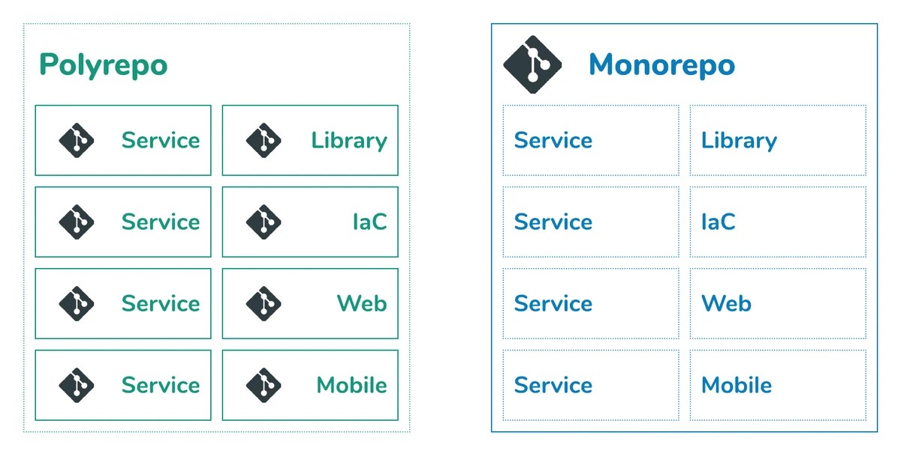
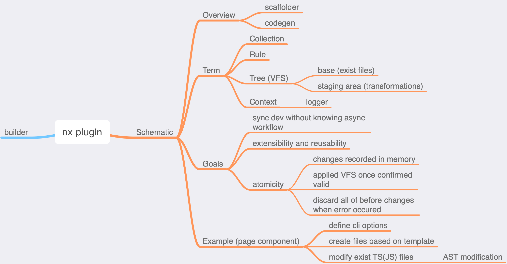
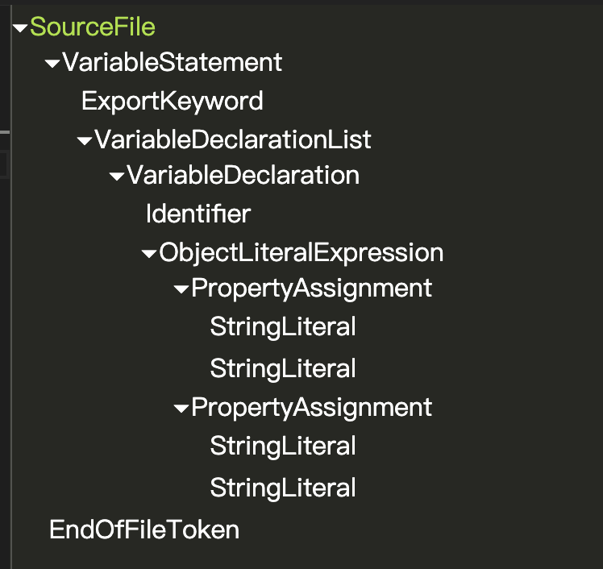
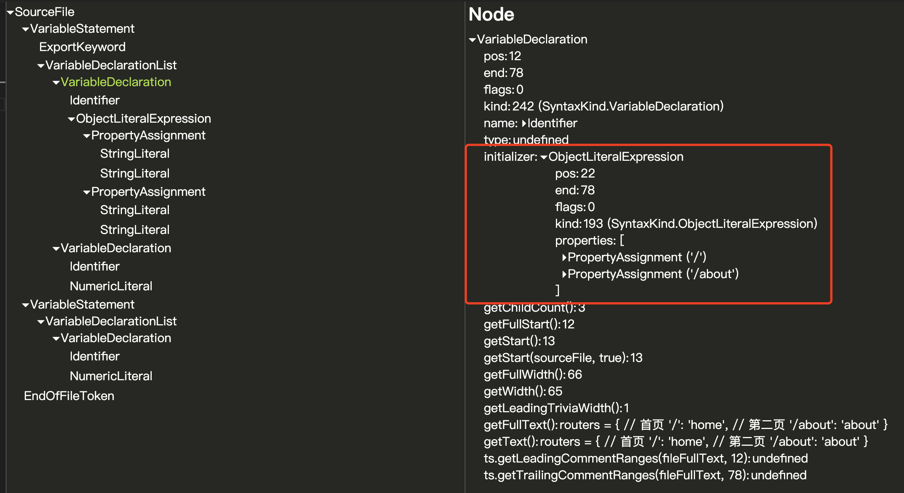

如何写一个 nx schematic plugin？

<!--more-->

## 前言

玩过 Angular 的同学都知道 Angular 作为一个 Framework，拥有一套完备的生态，还集成了强大的 CLI。而 React 则仅仅是一个轻量级的 Library，官方社区只定义了一套组件的周期规则，而周边社区可以基于此规则实现自己的组件，React 并不会提供给你一套开箱即用的方案，而需要自己在第三方市场挑选满意的组件形成“全家桶”，这也是 React 社区活跃的原因之一。

最近工作中在考虑使用**monorepo**对项目进行管理，发现了一套 dev toolkit 叫做[**Nx**](https://nx.dev/)，Nx 使用 monorepo 的方式对项目进行管理，其核心开发者[_vsavkin_](https://github.com/vsavkin)同时也是 Angular 项目的早期核心成员之一，他把 Angular CLI 这套东西拿到 Nx，使其不仅可以支持 Angular 项目的开发，现在还支持 React 项目。

Nx 支持开发自己的**plugin**，一个 plugin 包括 schematics 和 builders（这两个概念也分别来自 Angular 的[schematics](https://angular.io/guide/schematics)以及[cli-builders](https://angular.io/guide/cli-builder)），schematics 按字面意思理解就是“纲要”的意思，也就是可以基于一些模板自动化生成所需的文件；而 builders 就是可以自定义构建流程。

今天要讲的就是如何开发一个属于自己的 Nx plugin (包含 schematics)，我会使用它来自动化创建一个页面组件，同时更新 router 配置，自动将其加入 react router 的 config。

## 关于 Monorepo

这篇文章不会详细介绍什么是**monorepo**，mono 有“单个”的意思，也就是单个仓库（所有项目放在一个仓库下管理），对应的就是**polyrepo**，也就是正常一个项目一个仓库。如下图所示：



更多关于 monorepo 的简介，可以阅读以下文章：

1. [Advantages of monorepos](https://danluu.com/monorepo/)
2. [How to develop React apps like Facebook, Microsoft, and Google](https://blog.nrwl.io/how-to-develop-react-apps-like-facebook-microsoft-and-google-bdcafcfbc9be)
3. [Misconceptions about Monorepos: Monorepo != Monolith](https://blog.nrwl.io/misconceptions-about-monorepos-monorepo-monolith-df1250d4b03c)

## 关于 Nx plugin

先贴一张脑图，一个一个讲解 schematic 的相关概念：



前面提到 Nx plugin 包括了 builder（自动化构建）和 schematic（自动化项目代码的增删改查）。一个成型的 Nx plugin 可以使用 Nx 内置命令执行。

对于文章要介绍的 schematics，可以认为它是自动化代码生成脚本，甚至可以作为脚手架生成整个项目结构。

## Schematics 要实现的目标

Schematics 的出现优化了开发者的体验，提升了效率，主要体现在以下几个方面：

1. 同步式的开发体验，无需知道内部的异步流程

   Schematics 的开发“感觉”上是同步的，也就是说每个操作输入都是同步的，但是输出则可能是异步的，不过开发者可以不用关注这个，直到上一个操作的结果完成前，下一个操作都不会执行。

2. 开发好的 schematics 具有高扩展性和高重用性

   一个 schematic 由很多操作步骤组成，只要“步骤”划分合理，扩展只需要往里面新增步骤即可，或者删除原来的步骤。同时，一个完整的 schematic 也可以看做是一个大步骤，作为另一个 schematic 的前置或后置步骤，例如要开发一个生成 Application 的 schematic，就可以复用原来的生成 Component 的 schematic，作为其步骤之一。

3. schematic 是原子操作

   传统的一些脚本，当其中一个步骤发生错误，由于之前步骤的更改已经应用到文件系统上，会造成许多“副作用”，需要我们手动 FIX。但是 schematic 对于每项操作都是记录在运行内存中，当其中一项步骤确认无误后，也只会更新其内部创建的一个虚拟文件系统，只有当所有步骤确认无误后，才会一次性更新文件系统，而当其中之一有误时，会撤销之前所做的所有更改，对文件系统不会有“副作用”。

接下来我们了解下和 schematic 有关的概念。

## Schematics 的相关概念

在了解相关概念前，先看看 Nx 生成的初始 plugin 目录：

```
your-plugin
    |--.eslintrc
    |--builders.json
    |--collection.json
    |--jest.config.js
    |--package.json
    |--tsconfig.json
    |--tsconfig.lib.json
    |--tsconfig.spec.json
    |--README.md
    |--src
        |--builders
        |--schematics
            |--your-schema
                |--your-schema.ts
                |--your-schema.spec.ts
                |--schema.json
                |--schema.d.ts
```

### Collection

Collection 包含了一组 Schematics，定义在 plugin 主目录下的`collection.json`：

```json
{
  "$schema": "../../node_modules/@angular-devkit/schematics/collection-schema.json",
  "name": "your-plugin",
  "version": "0.0.1",
  "schematics": {
    "your-schema": {
      "factory": "./src/schematics/your-schema/your-schema",
      "schema": "./src/schematics/your-schema/schema.json",
      "aliases": ["schema1"],
      "description": "Create foo"
    }
  }
}
```

上面的 json 文件使用@angular-devkit/schematics 下的 collection schema 来校验格式，其中最重要的是`schematics`字段，在这里面定义所有自己写的 schematics，比如这里定义了一个叫做"your-schema"的 schematic，每个 schematic 下需要声明一个 rule factory（关于`rule`之后介绍），该 factory 指向一个文件中的默认导出函数，如果不使用默认导出，还可以使用`your-schema#foo`的格式指定当前文件中导出的`foo`函数。

`aliases`声明了当前 schematic 的别名，除了使用`your-schema`的名字执行指令外，还可以使用`schema1`。`description`表示一段可选的描述内容。

`schema`定义了当前 schematic 的 schema json 定义，nx 执行该 schematic 指令时可以读取里面设置的默认选项，进行终端交互提示等等，下面是一份`schema.json`：

```json
{
  "$schema": "http://json-schema.org/schema",
  "id": "your-schema",
  "title": "Create foo",
  "examples": [
    {
      "command": "g your-schema --project=my-app my-foo",
      "description": "Generate foo in apps/my-app/src/my-foo"
    }
  ],
  "type": "object",
  "properties": {
    "project": {
      "type": "string",
      "description": "The name of the project.",
      "alias": "p",
      "$default": {
        "$source": "projectName"
      },
      "x-prompt": "What is the name of the project for this foo?"
    },
    "name": {
      "type": "string",
      "description": "The name of the schema.",
      "$default": {
        "$source": "argv",
        "index": 0
      },
      "x-prompt": "What name would you like to use for the schema?"
    }，
    "prop3": {
      "type": "boolean",
      "description": "prop3 description",
      "default": true
    }
  },
  "required": ["name", "project"]
}
```

`properties`表示 schematic 指令执行时的选项，第一个选项`project`表示项目名，别名`p`,使用`$default`表示 Angular 内置的一些操作，例如`$source: projectName`则表示如果没有声明`project`，会使用 Angular `workspaceSchema`（nx 中为`workspace.json`）中的`defaultProject`选项，而第二个选项的`$default`则表明使用命令时的第一个参数作为`name`。

`x-prompt`会在用户不键入选项值时的交互，用来提示用户输入，用户可以不用预先知道所有选项也能完成操作，更复杂的`x-prompt`配置请查阅[官网](https://angular.io/guide/schematics-authoring#schematic-prompts)。

说了这么多，以下是几个直观交互的例子，帮助大家理解：

nx 使用`generate`选项来调用 plugin 中的 schematic 或者 builder，和 Angular 的`ng generate`一致：

```shell
# 表示在 apps/app1/src/ 下生成一个名为bar的文件

$ nx g your-plugin:your-schema bar -p=app1
# 或者
$ nx g your-plugin:your-schema -name=bar -project app1
```

如果使用交互（不键入选项）

```shell
# 表示在 apps/app1/src/ 下生成一个名为bar的文件

$ nx g your-plugin:your-schema
? What is the name of the project for this foo?
$ app1
? What name would you like to use for the schema?
$ bar
```

接下来看看 Schematics 的两个核心概念：**Tree**和**Rule**

### Tree

根据官方对`Tree`的介绍：

> The virtual file system is represented by a Tree. The Tree data structure contains a base (a set of files that already exists) and a staging area (a list of changes to be applied to the base). When making modifications, you don't actually change the base, but add those modifications to the staging area.

`Tree`这一结构包含了两个部分：VFS 和 Staging area，VFS 是当前文件系统的一个虚拟结构，Staging area 则存放 schematics 中所做的更改。值得注意的是，当做出更改时，并不是对文件系统的及时更改，而只是将这些操作放在 Staging area，之后会把更改逐步同步到 VFS，知道确认无误后，才会一次性对文件系统做出变更。

### Rule

> A Rule object defines a function that takes a Tree, applies transformations, and returns a new Tree. The main file for a schematic, index.ts, defines a set of rules that implement the schematic's logic.

`Rule`是一个函数，接收`Tree`和`Context`作为参数，返回一个新的`Tree`，在 schematics 的主文件`index.ts`中，可以定义一系列的`Rule`，最后将这些`Rule`作为一个综合的`Rule`在主函数中返回，就完成了一个 schematic。下面是`Tree`的完整定义：

```typescript
export declare type Rule = (
  tree: Tree,
  context: SchematicContext
) => Tree | Observable<Tree> | Rule | Promise<void> | Promise<Rule> | void;
```

来看看一个简单的 schematic 主函数，我们在函数中返回一个`Rule`，`Rule`的操作是新建一个默认名为`hello`的文件，文件中包含一个字符串`world`，最后将这个 Tree 返回。

```typescript
// src/schematics/your-schema/index.ts

import { Rule, SchematicContext, Tree } from "@angular-devkit/schematics";

// You don't have to export the function as default. You can also have more than one rule factory
// per file.
export function myComponent(options: any): Rule {
  return (tree: Tree, _context: SchematicContext) => {
    tree.create(options.name || "hello", "world");
    return tree;
  };
}
```

### Context

最后是`Context`，上面已经提到过，对于 Schematics，是在一个名叫`SchematicContext`的 Context 下执行，其中包含了一些默认的工具，例如`context.logger`，我们可以使用其打印一些终端信息。

## 如何开发一个 Nx Schematic?

**下面的所有代码均可以在[我的 GitHub 里](https://github.com/tianzhich/nx-plugin-demo)下载查看，觉得不错的话，欢迎大家 star。**

接下来进入正题，我们开发一个 nx plugin schematic，使用它来创建我们的页面组件，同时更新路由配置。

假设我们的项目目录结构如下：

```
apps
    |...
    |--my-blog
        |...
        |--src
            |--components
            |--pages
                |--home
                    |--index.ts
                    |--index.scss
                |--about
            |--routers
                |--config.ts
                |--index.ts
            |...
```

`router/config.ts`文件内容如下：

```typescript
export const routers = {
  // 首页
  "/": "home",
  // 个人主页
  "/about": "about",
};
```

现在我们要新增一个博客页，不少同学可能就直接新建一个目录，复制首页代码，最后手动添加一条路由配置，对于这个例子倒是还好，但是如果需要更改的地方很多，就很浪费时间了，学习了 Nx plugin schematics，这一切都可以用 Schematic 实现。

### 搭建 Nx 环境并使用 Nx 默认的 Schematic 创建一个 plugin

如果之前已经有了 Nx 项目，则直接在项目根目录下使用以下命令创建一个 plugin：

```sh
$ nx g @nrwl/nx-plugin:plugin [pluginName]
```

如果是刚使用 Nx，也可以使用下面的命令快速新建一个项目，并自动添加一个 plugin：

```sh
$ npx create-nx-plugin my-org --pluginName my-plugin
```

### 设置好 Schematic 选项定义

现在 Nx 为我们创建了一个默认的 plugin，首先更改`packages/plugin/collection.json`，为 schema 取名叫做“page”

```json
{
  "$schema": "../../node_modules/@angular-devkit/schematics/collection-schema.json",
  "name": "plugin",
  "version": "0.0.1",
  "schematics": {
    "page": {
      "factory": "./src/schematics/page/page",
      "schema": "./src/schematics/page/schema.json",
      "description": "Create page component"
    }
  }
}
```

接下来定义我们提供的 schema option，这里需要修改`src/schematics/page/schema.json`和`src/schematics/page/schema.d.ts`，前者作为 JSON Schema 被 Nx plugin 使用，后者作为类型定义，开发时用到。

对于 page，我们需要提供两个必须选项：name 和对应的 project，两个可选选项：connect（是否 connect to redux）、classComponent（使用类组件还是函数组件）。

下面分别是`schema.json`和`schema.d.ts`：

```json
{
  "$schema": "http://json-schema.org/draft-07/schema",
  "id": "page",
  "title": "Create page component",
  "type": "object",
  "properties": {
    "name": {
      "type": "string",
      "description": "The name of the page component",
      "$default": {
        "$source": "argv",
        "index": 0
      },
      "x-prompt": "What name would you like to use?"
    },
    "project": {
      "type": "string",
      "description": "The project of the page component",
      "$default": {
        "$source": "projectName"
      },
      "alias": "p",
      "x-prompt": "Which projcet would you like to add to?"
    },
    "classComponent": {
      "type": "boolean",
      "alias": "C",
      "description": "Use class components instead of functional component.",
      "default": false
    },
    "connect": {
      "type": "boolean",
      "alias": "c",
      "description": "Create a connected redux component",
      "default": false
    }
  },
  "required": ["name", "project"]
}
```

```typescript
export interface PageSchematicSchema {
  name: string;
  project: string;
  classComponent: boolean;
  connected: boolean;
}
```

### 开发 Schematic

#### 创建所需模板文件

模板文件就是通过一些模板变量来生成真正的文件。每一个页面默认有两个文件，`index.ts`和`index.scss`，因此创建模板文件如下：

`index.ts.template`

```tmpl
<% if (classComponent) { %>
import React, { Component } from 'react';
<% } else { %>
import React from 'react';
<% } %>
<% if (connect) { %>
import { connect } from 'react-redux';
import { IRootState, Dispatch } from '../../store';
<% } %>

import { RouteComponentProps } from 'react-router-dom';
import './index.scss';

<% if (connect) { %>
type StateProps = ReturnType<typeof mapState>;
type DispatchProps = ReturnType<typeof mapDispatch>;
type Props = StateProps & DispatchProps & RouteComponentProps;
<% } else { %>
type Props = RouteComponentProps;
<% } %>


<% if (classComponent) { %>
class <%= componentName %> extends Component<Props> {
  render() {
    return (
      <div className="<% className %>">
        Welcome to <%= componentName %>!
      </div>
    );
  }
}
<% } else { %>
const <%= componentName %> = (props: Props) => {
  return (
    <div className="<%= className %>">
      Welcome to <%= componentName %>!
    </div>
  );
};
<% } %>

<% if (connect) { %>
function mapState(state: IRootState) {
  return {

  }
}

function mapDispatch(dispatch: Dispatch) {
  return {

  }
}
<% } %>

<% if (connect) { %>
export default connect<StateProps, DispatchProps, {}>(mapState, mapDispatch)(<%= componentName %>);
<% } else { %>
export default <%= componentName %>;
<% } %>
```

`index.scss.template`

```
.<%= className %> {

}
```

我们将模板文件放到`src/schematics/page/files/`下。

#### 基于模板文件创建所需文件和目录

我们一共需要做四件事：

1. 格式化选项（把 schematic 默认的选项进行加工，加工成我们所需的全部选项）。
2. 基于模板文件创建所需文件和目录。
3. 更新`app/src/routers/config.ts`。
4. 使用 eslint 格式化排版。

先来实现 1 和 2：

`page.ts`:

```typescript
import { PageSchematicSchema } from "./schema";
import { names } from "@nrwl/workspace";
import { getProjectConfig } from "@nrwl/workspace/src/utils/ast-utils";

interface NormalizedSchema extends PageSchematicSchema {
  /** element className */
  className: string;
  componentName: string;
  fileName: string;
  projectSourceRoot: Path;
}

/** 加工选项 */
function normalizeOptions(
  host: Tree,
  options: PageSchematicSchema
): NormalizedSchema {
  const { name, project } = options;
  const { sourceRoot: projectSourceRoot } = getProjectConfig(host, project);
  // kebab-case fileName and UpperCamelCase className
  const { fileName, className } = names(name);
  return {
    ...options,
    // element className
    className: `${project}-${fileName}`,
    projectSourceRoot,
    componentName: className,
    fileName,
  };
}
```

接下来使用模板文件：

`page.ts`

```typescript
import { join } from "@angular-devkit/core";
import {
  Rule,
  SchematicContext,
  mergeWith,
  apply,
  url,
  move,
  applyTemplates,
} from "@angular-devkit/schematics";
import { PageSchematicSchema } from "./schema";
import { names } from "@nrwl/workspace";
import { getProjectConfig } from "@nrwl/workspace/src/utils/ast-utils";

interface NormalizedSchema extends PageSchematicSchema {
  /** element className */
  className: string;
  componentName: string;
  fileName: string;
  projectSourceRoot: Path;
}

/** 基于模板创建文件 */
function createFiles(options: NormalizedSchema): Rule {
  const { projectSourceRoot, fileName } = options;
  const targetDir = join(projectSourceRoot, pagePath, fileName);
  return mergeWith(
    apply(url("./files"), [applyTemplates(options), move(targetDir)])
  );
}
```

原理是使用 Angular Schematics 自带的`mergeWith`的`Rule`，接收一个`Source`，`Source`的定义如下：

> A source is a function that generates a Tree from a specific context.

也就是说`Source()`会生成一棵新的`Tree`。然后将其和原来的`Tree`合并。

由于我们需要从模板文件中加载，首先需要使用`url`加载文件，`url`接收文件或文件夹的相对地址，返回一个`Source`，然后我们使用`apply`对`url`加载模板文件后的`Source`进行加工，`apply`接收一个`Source`和一个`Rule`的数组，将`Rule[]`应用后返回一个新的`Source`。

这里我们需要进行两种“加工”，首先使用`options`替换模板文件中的变量，最后将这些文件使用`move`移动到对应的目录下即可。

#### 更新 router config

来到了最重要也是比较难的一个步骤，我们还需要修改`src/routers/config.ts`中的`routers`变量，在里面增加我们刚加上的 page component。

由于这里是 TS 文件，所以需要分析 TS 的 AST _(Abstract Syntax Tree)_，然后修改 AST，最后使用修改的 AST 对原来内容进行覆盖即可。

修改 AST 可以使用 TS 官方的[Compiler API](https://github.com/microsoft/TypeScript/wiki/Using-the-Compiler-API)结合[TypeScript AST Viewer](https://ts-ast-viewer.com/)进行。不过由于 AST 的复杂结构，TS Compiler API 也不太友好，直接使用 API 对 AST 进行操作非常困难。例如 AST 的每个节点都有 position 信息，做一个新的插入时，还需要对 position 进行计算，API 并没有人性化的操作方式。

由于上面的原因，我最终选择了[ts-morph](https://ts-morph.com/)，ts-morph 以前也叫做 ts-simple-ast，它封装了 TS Compiler API，让操作 AST 变得简单易懂。

看代码之前，我们先使用[TS AST Viewer](https://ts-ast-viewer.com/)分析一下`routers/config.ts`这段代码的 AST：

```typescript
export const routers = {
  // 首页
  "/": "home",
  // 第二页
  "/about": "about",
};
```

AST 如下（只含根节点信息）：


我们来层层分析：

1. 从声明到赋值，整段语句作为`Variable Statement`。
2. 由于`routers`是被导出的，包含了`ExportKeyword`。
3. 从`routers = xxx`作为`VariableDeclarationList`中的唯一一个`VariableDeclaration`。
4. 最后是`Identifier`“routers”，再到字面量表达式作为它的 value。
5. ...

由于下面代码用到了`Initializer`，上述的对象字面量表达式`ObjectLiteralExpression`就是`routers`这个`VariableDeclaration`的`Initializer`：



看懂 AST 后，更新 router 后的代码就容易理解了：

```typescript
import { join, Path } from "@angular-devkit/core";
import {
  Rule,
  Tree,
  chain,
  SchematicContext,
  mergeWith,
  apply,
  url,
  move,
  applyTemplates,
} from "@angular-devkit/schematics";
import { PageSchematicSchema } from "./schema";
import { formatFiles, names } from "@nrwl/workspace";
import { getProjectConfig } from "@nrwl/workspace/src/utils/ast-utils";
import { Project } from "ts-morph";

/** 更新路由配置 */
function updateRouterConfig(options: NormalizedSchema): Rule {
  return (host: Tree, context: SchematicContext) => {
    const { projectSourceRoot, fileName } = options;
    const filePath = join(projectSourceRoot, routerConfigPath);
    const srcContent = host.read(filePath).toString("utf-8");

    // 使用ts-morph的project对AST进行操作
    const project = new Project();
    const srcFile = project.createSourceFile(filePath, srcContent, {
      overwrite: true,
    });
    try {
      // 根据变量标识符拿到对应的VariableDeclaration
      const decl = srcFile.getVariableDeclarationOrThrow(
        routerConfigVariableName
      );
      // 获取initializer并转换成string
      const initializer = decl.getInitializer().getText();
      // 使用正则匹配对象字面量的最后一部分并做插入
      const newInitializer = initializer.replace(
        /,?\s*}$/,
        `,'/${fileName}': '${fileName}' }`
      );
      // 更新initializer
      decl.setInitializer(newInitializer);
      // 获取最新的TS文件内容对源文件进行覆盖
      host.overwrite(filePath, srcFile.getFullText());
    } catch (e) {
      context.logger.error(e.message);
    }
  };
}
```

在如何对`Initializer`进行操作时，我最开始想到的是将其使用`JSON.parse()`转换成对象字面量，然后进行简单追加，后面发现这段内容里还可能包含注释，所以只能通过正则匹配确定字面量的“尾部部分”，然后进行匹配追加。

#### 使用 eslint 做好排版

操作完成后我们可以使用 Nx workspace 提供的`formatFiles`将所有文件排版有序。最后我们只需要在默认导出函数里将上述`Rule`通过`chain`这个`Rule`进行汇总。来看看最终代码：

```typescript
import { join, Path } from "@angular-devkit/core";
import {
  Rule,
  Tree,
  chain,
  SchematicContext,
  mergeWith,
  apply,
  url,
  move,
  applyTemplates,
} from "@angular-devkit/schematics";
import { PageSchematicSchema } from "./schema";
import { formatFiles, names } from "@nrwl/workspace";
import { getProjectConfig } from "@nrwl/workspace/src/utils/ast-utils";
import { Project } from "ts-morph";

interface NormalizedSchema extends PageSchematicSchema {
  /** element className */
  className: string;
  componentName: string;
  fileName: string;
  projectSourceRoot: Path;
}

// 页面组件目录
const pagePath = "pages";
// 路由配置目录
const routerConfigPath = "routers/config.ts";
// 路由配置文件中需要修改的变量名
const routerConfigVariableName = "routers";

/** 加工选项 */
function normalizeOptions(
  host: Tree,
  options: PageSchematicSchema
): NormalizedSchema {
  const { name, project } = options;
  const { sourceRoot: projectSourceRoot } = getProjectConfig(host, project);
  // kebab-case fileName and UpperCamelCase className
  const { fileName, className } = names(name);
  return {
    ...options,
    // element className
    className: `${project}-${fileName}`,
    projectSourceRoot,
    componentName: className,
    fileName,
  };
}

/** 基于模板创建文件 */
function createFiles(options: NormalizedSchema): Rule {
  const { projectSourceRoot, fileName } = options;
  const targetDir = join(projectSourceRoot, pagePath, fileName);
  return mergeWith(
    apply(url("./files"), [applyTemplates(options), move(targetDir)])
  );
}

/** 更新路由配置 */
function updateRouterConfig(options: NormalizedSchema): Rule {
  return (host: Tree, context: SchematicContext) => {
    const { projectSourceRoot, fileName } = options;
    const filePath = join(projectSourceRoot, routerConfigPath);
    const srcContent = host.read(filePath).toString("utf-8");
    const project = new Project();

    const srcFile = project.createSourceFile(filePath, srcContent, {
      overwrite: true,
    });
    try {
      const decl = srcFile.getVariableDeclarationOrThrow(
        routerConfigVariableName
      );
      const initializer = decl.getInitializer().getText();
      const newInitializer = initializer.replace(
        /,?\s*}$/,
        `,'/${fileName}': '${fileName}' }`
      );
      decl.setInitializer(newInitializer);
      host.overwrite(filePath, srcFile.getFullText());
    } catch (e) {
      context.logger.error(e.message);
    }
  };
}

// 默认的rule factory
export default function (schema: PageSchematicSchema): Rule {
  return function (host: Tree, context: SchematicContext) {
    const options = normalizeOptions(host, schema);
    return chain([
      createFiles(options),
      updateRouterConfig(options),
      formatFiles({ skipFormat: false }),
    ]);
  };
}
```

### 测试

写好了 schematic，别忘了进行测试，测试代码如下：

`page.spec.ts`

```typescript
import { Tree, Rule } from "@angular-devkit/schematics";
import { SchematicTestRunner } from "@angular-devkit/schematics/testing";
import { createEmptyWorkspace } from "@nrwl/workspace/testing";
import { join } from "path";
import { PageSchematicSchema } from "./schema";
import { updateWorkspace, names } from "@nrwl/workspace";

const testRunner = new SchematicTestRunner(
  "@plugindemo/plugin",
  join(__dirname, "../../../collection.json")
);

export function callRule(rule: Rule, tree: Tree) {
  return testRunner.callRule(rule, tree).toPromise();
}

export async function createFakeApp(
  tree: Tree,
  appName: string
): Promise<Tree> {
  const { fileName } = names(appName);

  const appTree = await callRule(
    updateWorkspace((workspace) => {
      workspace.projects.add({
        name: fileName,
        root: `apps/${fileName}`,
        projectType: "application",
        sourceRoot: `apps/${fileName}/src`,
        targets: {},
      });
    }),
    tree
  );
  appTree.create(
    "apps/app1/src/routers/config.ts",
    `
    export const routers = {
      // 首页
      '/': 'home',
      // 个人主页
      '/about': 'about'
    };
  `
  );
  return Promise.resolve(appTree);
}

describe("plugin schematic", () => {
  let appTree: Tree;
  const options: PageSchematicSchema = { name: "myPage", project: "app1" };

  beforeEach(async () => {
    appTree = createEmptyWorkspace(Tree.empty());
    appTree = await createFakeApp(appTree, "app1");
  });

  it("should run successfully", async () => {
    const tree = await testRunner
      .runSchematicAsync("page", options, appTree)
      .toPromise();
    // file exist
    expect(tree.exists("apps/app1/src/pages/my-page/index.tsx")).toBeTruthy();
    expect(tree.exists("apps/app1/src/pages/my-page/index.scss")).toBeTruthy();

    // router modified correctly
    const configContent = tree.readContent("apps/app1/src/routers/config.ts");
    expect(configContent).toMatch(/,\s*'\/my-page': 'my-page'/);
  });
});
```

测试这块能用的轮子也比较多，我这里简单创建了一个假的 App（符合上面说的目录结构），然后进行了一下简单测试。测试可以使用如下指令对 plugin 中的单个 schematic 进行测试：

```sh
$ nx test plugin --testFile page.spec.ts
```

如果写的 plugin 比较复杂，建议再进行一遍 end2end 测试，Nx 对 e2e 的支持也很好。

### 发布

最后到了发布环节，使用 Nx build 之后便可以自行发布了。

```sh
$ nx build plugin
```

**上述所有代码均可以在[我的 GitHub 里](https://github.com/tianzhich/nx-plugin-demo)下载查看，同时代码里还增加了一个真实开发环境下的 App-demo，里面将 plugin 引入了正常的开发流程，更能感受到其带来的便捷性。觉得不错的话，欢迎大家 star。**

## 总结

其实要写好这类对文件系统“增删改查”的工具，关键还是要理解文件内容，比如上面的难点就在于理解 TS 文件的 AST。使用 ts-morph 还可以做很多事情，比如我们每增加一个文件，可能需要在出口`index.ts`中导出一次，使用 ts-morph 就一句话的事情：

```typescript
const exportDeclaration = sourceFile.addExportDeclaration({
  namedExports: ["MyClass"],
  moduleSpecifier: "./file",
});
```

当然，Nx 和 Angular 提供了这一套生态，能用的工具和方法非常多，但是也需要我们耐心查阅，合理使用。目前来说 Nx 封装的方法没有详细的文档，可能用起来需要直接查阅`d.ts`文件，没那么方便。

**工欲善其事，必先利其器。Happy Coding!**
