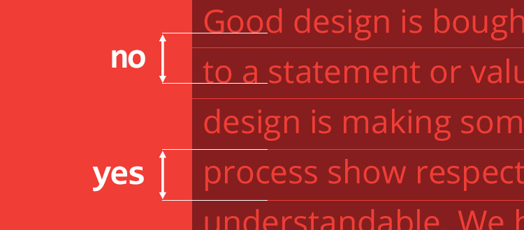
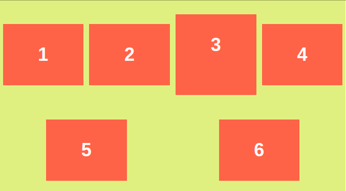
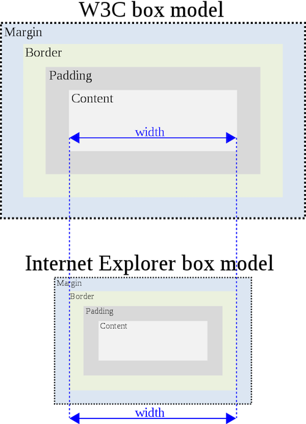

Web 开发者面试题集第四篇，关于 CSS。

<!--more-->



秋招提前批已经基本结束了，即将进入金九银十，正式的号角已经打响。春招，以及秋招提前批一路过来，断断续续也面了一些公司，自己在笔记上也有总结，甚至自己进行过一些猜题。发现基本问到的问题八九不离十，但是有些知识，特别是偏工程的知识点，如果没遇到过，很难产生深刻的印象。结合自己之前的笔记，也想在正式进入 9 月之前，整理一个面试题集系列，加深理解。

这是这个系列的第四篇，关于 CSS。


## 元素水平垂直居中

这个话题感觉被问烂了，网上已经有很多方法，我这里只给出常见且好记忆的几种方法

### 单行文字居中

```css
div {
  background-color: red;
  height: 100px;
  line-height: 100px;
  text-align: center;
}
```

理解单行文字居中的原理，我们首先需要理解`line-height`，这里要避免一个误区

包括在我看过的*HTML and CSS, Design and Build Website*这本书，以及一些文档中，都还将 CSS 的`line-height`认为是两行文字基线之间的距离，在一些软件例如 Photoshop, Word 中确实是这样，但是 CSS 的`line-height`是这样的（**no**表示基线之间距离，**yes**才是 CSS 的`line-height`距离）


<span>_In CSS, the `line-height` is not the distance between baselines_</span>

这样的话，设置了`line-height`等于容器`height`才能使单行文字居中

### 绝对定位(已知居中元素宽高)

```css
div {
  background-color: red;
  height: 200px;
  width: 400px;
  position: absolute;
  right: 0;
  bottom: 0;
  top: 0;
  left: 0;
  margin: auto;
}
```

### 绝对定位+负边距位移(已知居中元素宽高)

```css
div {
  background-color: red;
  height: 200px;
  width: 400px;
  position: absolute;
  top: 50%;
  left: 50%;
  margin-top: -100px;
  margin-left: -200px;
}
```

### 使用 transform 属性(居中元素未知宽高)

和上一个类似，只不过使用`transform`属性进行位移

```css
div {
  background-color: red;
  position: absolute;
  top: 50%;
  left: 50%;
  transform: translate(-50%, -50%);
}
```

### 使用 flex-box(display: flex)

`flex-direction` 默认值为`row`，此时`justify-content: center`用于水平居中元素，`align-items: center`用于垂直居中元素，如果设置`flex-direction: column`，则上面两个属性作用相反

```css
div {
  display: flex;
  justify-content: center;
  align-items: center;
  height: 100%;
}
```

**扩展：**需要注意`flex-box`还有一个属性叫做`align-content`，在默认情况下`flex-direction: row`，如果只有一行元素，则`align-content`不起作用，多行元素时，`align-content`可以调整行与行之间的距离，比如


<span>using `align-items: center` and `align-content: space-around`</span>

### 参考

1. https://iamvdo.me/en/blog/css-font-metrics-line-height-and-vertical-align#line-height-problems-and-beyond

## IE 怪异盒模型和 HTML 正常盒模型



两种盒模型的主要区别在 CSS 属性`width`和`height`的计算方式上，拿`width`来举例

> IE Box Model: width = border + padding + content
>
> W3C Box Model: width = content

默认使用的是 W3C 盒模型计算方式，如果我们要使用怪异盒模型，我们需要使用`box-sizing`这个属性，这个属性有两个值`content-box`和`border-box`，前一个值为默认值(W3C 盒模型)，后一个值表示使用怪异模型

## position 有哪些属性

总共四大类

> 1. Positioned Elements, 除了`static`
> 2. Relatively Positioned Elements, `relative`，相对于自身本来的位置
> 3. Absolute Positioned Elements, `absolute`和`fixed`，前者相对于第一个*positioned*父元素，后者相对于视窗
> 4. Stickily Positioned Elements, `sticky`

这里主要说一下`sticky`属性，假设一个容器中某个元素使用了`position: sticky`，且容器高度超过了视窗高度（也就是可以滚动），假设对该元素设置`top: 10px`，随着容器的滚动，该元素不会移出视窗，在移动到距离视窗 10px 的位置会固定下来（类似`fixed`），直到该容器全部移出视窗，此时该元素才会随着容器一起移出

<iframe height='291' scrolling='no' title='Sticky positioning' src='//codepen.io/tianzhich/embed/RYQYdm/?height=291&theme-id=dark&default-tab=css,result&embed-version=2' frameborder='no' allowtransparency='true' allowfullscreen='true' style='width: 100%;'>See the Pen <a href='https://codepen.io/tianzhich/pen/RYQYdm/'>Sticky positioning</a> by Tian Zhi (<a href='https://codepen.io/tianzhich'>@tianzhich</a>) on <a href='https://codepen.io'>CodePen</a>.
</iframe>

## 清除浮动的方式

首先要清楚，浮动元素会对其后面的元素布局产生影响，所以，清除浮动指的不是清除已经浮动的元素的布局，而是清除前面浮动元素对自己产生的影响，有下面几种情况

> **浮动元素不占据文档流，因此后面的元素会当它不存在，但是有以下几点需要注意：**
>
> **1. 如果其兄弟元素是块级元素，会当它不存在而覆盖它**
>
> **2. 如果是行内元素，则是会围绕它**
>
> **3. 如果兄弟是块级元素但是其内容是行内元素，那么这些行内元素还是会围绕浮动元素**

如果只是简单清除前面浮动元素对自己的影响，使用`clear`属性就能解决，`clear: left`表示将之前左浮动的元素视为正常元素，`clear`属性还有`both`，`right`值

浮动元素还会对父元素产生影响，如果一个父元素中的子元素全部浮动，这个父元素高度会坍塌，也就是高度为 0 因为**父元素如果没有设置高度，其高度是由它最后一个子元素的文档流位置决定的**

如果需要使得父元素被撑开，可以使用如下几个方法

1. 让父元素的最后一个子元素不再浮动，并且使用它来清除浮动

2. 基于上面一个方法，我们也可以使用伪元素达到这个目的，这叫做 clearfix

```css
#container::after {
  content: "";
  display: block;
  clear: both;
}
```

3. 最后一个方法让父元素使用`overflow: auto`或者`overflow: hidden`创建一个 BFC(_Block Formatting Context_)，BFC 可以包含浮动元素，让区域有高度

## BFC 是什么

BFC，也是被问到较多的一个问题，这里说说它的原理和一些使用场景

**BFC(Block Formatting Context, 块级格式上下文)**，可以理解为是元素创建的一块区域，这块区域可以包含它里面的所有元素(包括浮动元素)

### 创建方式

BFC 创建方式有很多，可以直接[查看 MDN 的解释](https://developer.mozilla.org/en-US/docs/Web/Guide/CSS/Block_formatting_context)

这里说几种常见的方式，这几种方式也可以用来解决如下场景问题

1. 块级元素设置`overflow`为除默认值`visible`之外的任一值
2. 绝对定位元素(`absolute`或`fixed`)
3. 浮动元素
4. flex 布局元素(`display: flex`下的子元素)
5. 显式生成 BFC，使`display: flow-root`，这种方法还处于草案阶段，需要考虑兼容问题

### 包含浮动元素

BFC 最初被我知道是用来解决浮动元素无法撑开父元素的问题

```css
#container {
  overflow: auto; /* 或者 overflow: hidden */
}
```

### 解决边距折叠

它还可以解决一个重要的问题，就是[_Margin Collapsing_（边距折叠）](https://developer.mozilla.org/en-US/docs/Web/CSS/CSS_Box_Model/Mastering_margin_collapsing)

边距折叠有以下几种情况

1. 假设两个`div`，上面的`div`定义了`margin-bottom`，下面的`div`定义了`margin-top`，它们之间的`margin`由两者的较大值决定

```html
<div id="container">
  <h1>The bottom margin of this heading is collapsed...</h1>
  <p>...with the top margin of this paragraph.</p>
</div>
```

```css
h1 {
  margin-bottom: 15px;
}
p {
  margin-top: 10px;
}
```


解决方案 1：让它们浮动起来，然后再用伪元素清除浮动(下面为了简单起见我直接让后者清除)

```css
h1 {
  margin-bottom: 15px;
  float: left;
}
p {
  margin-top: 10px;
  clear: left;
  float: left;
}
```

解决方案 2：父级元素使用`display: flex`，**这种布局根本不存在 margin collapsing 的问题**

上面的方案 1 不是好的解决办法，或者是使用绝对定位，这都打乱了正常的文档流。但是我发现直接设置`overflow: auto`或者是使用`display: flow-root`都无法解决，所以最好直接使用 flex 布局

2. 父级 container 元素下的第一个元素会折叠`margin-top`，最后一个元素会折叠`margin-bottom`，表现为第一个元素使用`margin-top`和最后一个元素使用`margin-bottom`都无法撑开父元素。而且如果父元素自己也设置了`margin-top`或者`margin-bottom`，会与第一个元素或者最后一个元素设置的`margin`发生重叠

```html
<div>
  <p>The margin of this paragraph ends up outside the parent.</p>
</div>
```

```css
div {
  margin-top: 10px;
}
p {
  margin-top: 20px;
}
```


解决方案：

```css
/* 方案1 */
div {
  overflow: auto;
}
/* 方案2 */
div {
  display: flex;
}
/* 方案3 */
div {
  display: flow-root;
}
```

3. 空元素上下边距折叠

```html
<div id="container">
  <div>Top block.</div>
  <div id="empty"></div>
  <div>Bottom block.</div>
</div>
```

```css
#empty {
  margin-top: 50px;
  margin-bottom: 50px;
}
```


解决方案：

```css
/* 方案1, 注意这里使用 flow-root和overflow都无效*/
#container {
  display: flex;
  flex-direction: column;
}
/* 方案2 */
#empty {
  display: flex; /* 或者display: flow-root 或者overflow: auto */
}
```

### 使用`overflow`创建 BFC 的缺点

使用`overflow`创建的 BFC，虽然解决了浮动元素的问题，但是在边距折叠中，只有第二三种情况可以使用这种方式，而且，使用它创建 BFC，还有如下缺点

1. 上面的情况父元素都没有设置高度，如果父元素需要设置高度，则使用`overflow: scroll`创建 BFC 可能会出现不必要的滚动条；同理，使用`overflow: hidden`则可能会截断重要的内容
2. 道理和第一点类似，`overflow`属性本来就是用来告诉开发人员如果文档内容溢出应该如何处理的问题，如果开发人员不理解 BFC，他很难知道一段代码是用来创建 BFC 还是处理溢出的情况

因此草案[CSS Display Module Level 3](https://drafts.csswg.org/css-display/#valdef-display-flow-root)提出了`display: flow-root`用来规范创建 BFC 的方式

### 参考

1. https://magnusbenoni.com/collapsing-margins-css/
2. https://developer.mozilla.org/en-US/docs/Web/Guide/CSS/Block_formatting_context

## Repaint(重绘)和 Reflow(重排)

重绘是指元素的显示样式发生改变，不涉及到布局位置的改变，例如改变`background-color`，`visibility`等等；而重排则会影响到元素的布局位置，例如设置`display: none`，改变字体大小，改变浏览器窗口大小等等

重排会影响到其兄弟元素，父子元素都发生改变，会影响页面加载的性能，以下几种做法可以尽量减小这种影响

1. 改变元素样式时尽可能针对到某个特定元素，避免扩大影响的范围
2. 避免多次使用 JS 改变行内样式，每次更改行内样式，如果涉及到位置变化，都会引发一次 Layout，我们可以更改其父元素样式，引发一次 Layout 即可
3. 尽量在**绝对定位**的元素上使用动画，动画触发多次 Layout，比较影响性能，为了不让其影响到其他元素，应该将其设置在脱离正常文档流的元素上
4. 减小 table 布局的使用，单元格里一个小小的改变将会影响整个 table 的布局

关于页面加载以及 Layout 这一过程的细节，可以看我的另一篇文章，[深入理解浏览器解析渲染 HTML](../how-a-webpage-is-displayed/)
