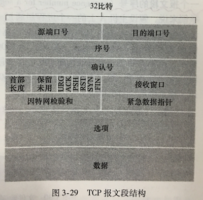
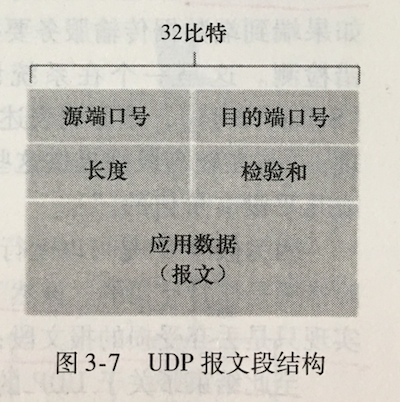
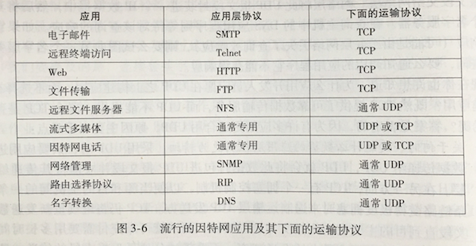
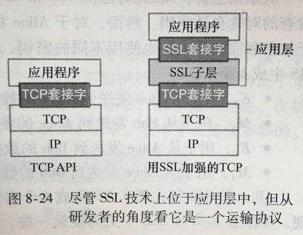
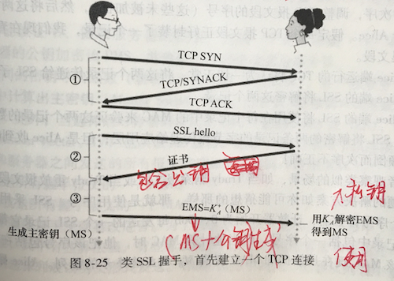
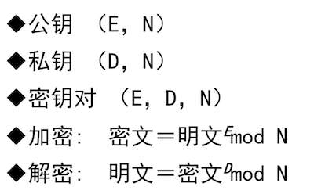
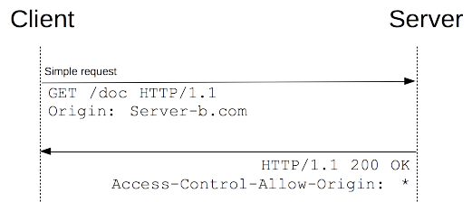
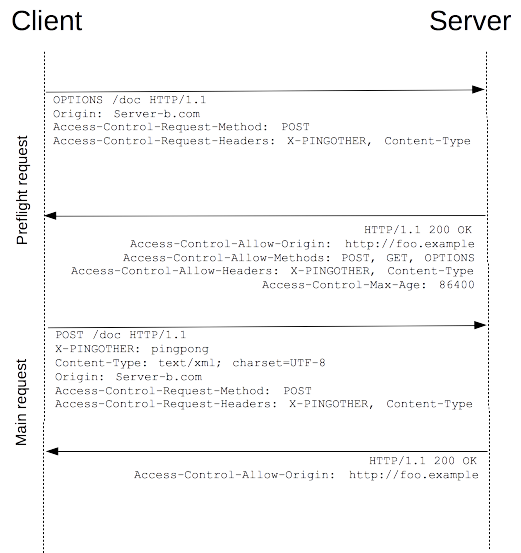
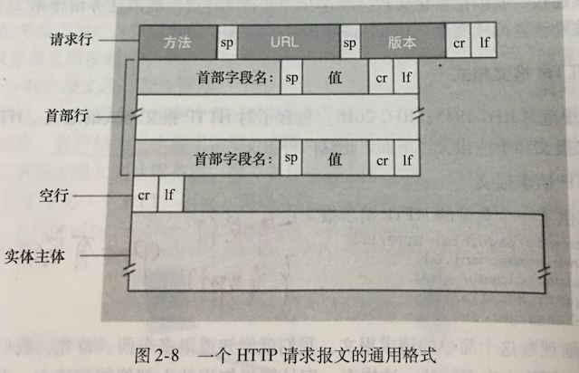

Web 开发者面试题集第二篇，关于计算机网络。

<!--more-->


秋招提前批已经基本结束了，即将进入金九银十，正式的号角已经打响。春招，以及秋招提前批一路过来，断断续续也面了一些公司，自己在笔记上也有总结，甚至自己进行过一些猜题。发现基本问到的问题八九不离十，但是有些知识，特别是偏工程的知识点，如果没遇到过，很难产生深刻的印象。结合自己之前的笔记，也想在正式进入 9 月之前，整理一个面试题集系列，加深理解

这是这个系列的第二篇，关于前端开发者需要掌握的计算机网络知识，作为一名前端开发者，web 和网络基础是很重要的，当然，也是面试中最容易被问到的。


## TCP 和 UDP 的区别

这是一个老生常谈的问题了，答的时候只要思路清晰，抓住重点即可

1. 从报文段的角度，TCP 首部 20 字节，UDP 首部 8 字节，UDP 报文段开销比 TCP 小很多





2. 从连接建立的角度来看，TCP 是面向连接的，连接建立需要三次握手；而 UDP 无连接建立，不会有建立连接产生的时延，速度更快
3. 从连接管理的角度来看，TCP 连接建立之后客户端和服务器需要维护连接的状态（包括接收和发送方缓存，拥塞控制参数，确认号和控制号等等），UDP 不维护这些状态，因此服务器资源可以用来支持更多活跃用户
4. 上面三点几乎都感觉 UDP 明显优于 TCP，那是因为还没谈到使用场景。TCP 需要占用更多资源，这些资源几乎都用来保障其数据准确性了。因此，使用场景上，UDP 适合于对数据精度要求不高，但是却无法忍受过多时延的应用，典型常见的是 DNS，DNS 作为访问网站前的域名-IP 映射，如果时延过大，明显会影响冲浪体验，而且 DNS 的映射不会经常变动，我们还可以将映射结果保存起来，对数据精度自然要求没那么高了。而对于一些文件传输，我们往往要求数据不能丢失，时间倒不是第一考虑因素，此时应该使用 TCP



## HTTP 和 HTTPS 的区别

http 和 https 的主要差别在于's'，'s'表示 secure，指代更加安全的 http 协议

对于 http 来说，我们的 http 报文是经过 TCP 套接字转交给 TCP 的，而 TCP 没有提供任何加密机制，我们的数据原原本本地交给 TCP 后，服务端再由 TCP 提取出来 http 报文转交给上面的应用层接收进程

而 https 则使用了 SSL(Secure Socket Layer)，叫做安全套接字层，此时的 http 报文先经过 SSL 加密后再转交给 TCP 套接字层，服务端由 TCP 套接字提取出报文来再转交给 SSL 解密，最后转交给应用层接收进程



SSL 技术上的实现是在应用层的，如果一个应用程序要使用 SSL 的服务，他需要在该应用程序的客户端和服务端包括 SSL 的代码（使用现有的一些类库）。SSL 有他自己的套接字 API，这类似于传统的 TCP 套接字 API

HTTPS 的优缺点：

- 优点

  1. 可认证用户端和服务端，确保数据发送准确（基于网站注册的证书识别该网站）

  2. HTTPS 协议是由 SSL+HTTP 协议构建的可进行加密传输、身份认证的网络协议，要比 http 协议安全，可防止数据在传输过程中被窃取、改变，从而确保数据的完整性

  3. 谷歌曾在 2014 年 8 月份调整搜索引擎算法，并称“比起同等 HTTP 网站，采用 HTTPS 加密的网站在搜索结果中的排名将会更高”

- 缺点
  1. HTTPS 协议需要握手交换密钥信息，这个过程增加了连接时间
  2. HTTPS 连接需要分配额外的连接缓存，不如 HTTP 高效
  3. SSL 证书需要钱，功能却强大的证书费用越高，一般小网站，个人网站没必要使用
  4. SSL 证书需要绑定域名，如果一个 IP 有多个域名，只能在一个域名下使用 SSL 服务。证书服务机构也有提供通配符域名，例如: `https://*.tianzhich.com`，但是价格更昂贵

**扩展：使用 SSL 的握手阶段**

使用 SSL 宏观上有三个阶段：握手，密钥导出和数据传输，后两者涉及较深的网络安全知识。这里只简单说下第一个阶段：握手



握手阶段首先需要建立一个 TCP 连接，然后的过程就是密钥传输，关于密钥传输有**对称加密**和**非对称加密**

> - 对称加密：加密和解密使用同一个密钥，保障安全性就是保障密钥的安全，而由于密钥必须要发给解密者，中途可能会被窃取，因此安全程度不高，但由于使用同一个密钥，加解密速度较快
> - 非对称加密：发送密文生成一对密钥，公钥暴露给给接收方用来加密数据，自己使用对应的私钥进行解密，由于公钥只能用来加密数据，私钥用来解密但是只有自己知道，而且算法强度往往更复杂，因此加密速度较慢，但是更安全

上面的情况是：接收方（右边女士）在它的网站使用了 SSL，当发送方（左边男士）发送第一个请求时，接收方将证书提供给发送方，发送方使用证书中包含的公钥对主密钥进行加密，接收方收到后，用自己的私钥解密主密钥，之后的信息通过主密钥加密传输

这样本质上使用了非对称加密对主密钥进行加解密，这样保障了主密钥传输过程的安全性，但是最后还是使用对称加密对信息进行传输（主密钥），因为这样速度较快

关于非对称加密，知乎上有一个[高赞的通俗易懂的例子: 如何用通俗易懂的话来解释非对称加密? - ThreatHunter 的回答 - 知乎](https://www.zhihu.com/question/33645891/answer/192604856)

如果看完上面的例子，还想继续了解非对称加密算法的本质，那我们可以继续聊聊非对称加密的一个经典算法(**RSA 算法**)。当然，这道题答到这里也很不错了

**扩展：RSA 算法**

1. 欧拉函数

   - 欧拉函数 $\varphi(n)$ 是小于或等于 n 的正整数中与 n 互质的数的数目
   - 例如：$\varphi(8) = 4$，因为 1，3，5，7 均和 8 互质

2. 模反元素

   - 如果两个正整数 a 和 n 互质，那么一定可以找到整数 b，使得 ab-1 被 n 整除，或者说 ab 被 n 除的余数是 1
   - b 叫做 a 关于 n 的模反元素，$ab \equiv 1\pmod n$
   - 模反元素不止一个
   - 例如：上面的 $a=3$ 和 $n=8$ 互质，可以找到 $b=3, 11...$ 满足条件

3. 欧拉定理

   - 如果两个正整数 a 和 n 互质，则 n 的欧拉函数 $\varphi(n)$ 可以让下面的等式成立：

     $$
     a^{\varphi(n)} \equiv a\times a^{\varphi(n)-1}\equiv1\pmod n
     $$

   - 根据模反元素的定义，$a^{\varphi(n)-1}$是 a 的模反元素

   - 例如：$a=3$和$n=5$互质，$\varphi(5)=4$，则有：$a\times a^3 = 81$，$(81-1)\\%5=0$

4. 小费马定理（欧拉定理的一个特例）

   - 两个正整数中的 n 为一个质数 p，此时$\varphi(p) = p-1$，此时欧拉定理可以写成
     $$
     a^{p-1} \equiv1\pmod p
     $$

5. RSA 算法

   

   - p,q：随机挑选两个大质数（上图没有）

   - N：$N = p\times q$

   - r：$r = \varphi(N) = \varphi(p\times q) = \varphi(p) \times \varphi(q)$，这条定理也直接给出，这里不证明了，数学有点渣渣，想了解证明定理的可以[查看维基百科 -- Chinese remainder theorem](https://en.wikipedia.org/wiki/Chinese_remainder_theorem)

     > 注意，这里还可以使用 lcm(求最小公倍数)$r=lcm(\varphi(p), \varphi(q))=lcm(p-1, q-1)$。关于这两个方法的选择上来说，深入起来也可以[长篇大论](<https://en.wikipedia.org/wiki/RSA_(cryptosystem)#Key_generation>)，这里也不讨论了。。。

   - E：随机选择的和 r 互质且小于 r 的数字

   - D：E 的模反元素，$E\times D \equiv 1\pmod r$

6. RSA 算法加解密证明

   - 上面的定义表达式都使用了$\equiv$，为了证明方便以及阅读，先将加解密式子转换成数学表达式，设明文为 c, 密文为 m

   $$
   \begin{alignedat}{2}
   encode:\space&m&=c\^E\space\\%\space N \\\
   decode:\space&c&=m\^D\space\\%\space N \\\
   \end{alignedat}
   $$

   - 要证明解密出来的密文就是原来的明文，即需要证明

     $$
     c=(c^E\\%N)^D\\%N
     $$

   - 证明上面这个式子需要一个结论和其推导结论，这两个个结论先给出，后面再给出证明

     $$
     \begin{aligned}
     (a\times b)\\%N&=a\\%N\times b\\%N \\\
     \Rightarrow a^M\\%N&=(a\\%N)^M \\\
     \end{aligned}
     $$

   - 根据这个结论，上面证明的式子可以化简为

     $$
     \begin{aligned}
     &c=(c^E\\%N)^D\\%N \\\
     \Rightarrow&c=(c\\%N)^{ED}\\%N \\\
     \Rightarrow&c=(c\\%N\\%N)^{ED} \\\
     \Rightarrow&c=(c\\%N)^{ED} \\\
     \Rightarrow&c=c^{ED}\\%N
     \end{aligned}
     $$

   - 又因为$E\times D \equiv 1\pmod r$，设$ED=k\times r+1=k\times \varphi(N)+1$，所以

     $$
     \begin{aligned}
     &c=c^{k\times \varphi(N)+1}\\%N \\\
     \Rightarrow&c=(c\times c^{k\times \varphi(N)})\\%N \\\
     \Rightarrow&c=(c\\%N)\times (c^{\varphi(N)}\\%N)^{k} \\\
     \end{aligned}
     $$

   - RSA 算法的关键处就在于找到一个与明文 c 互质的 N，后面也会解决找的问题，这里假设找到的 N 可以与任何明文 c 互质，根据欧拉定理化简可以得证

     $$
     c=(c\\% N)\times 1^k=c
     $$

   - 到这里还有两个问题，首先是$(a\times b)\\%N=a\\%N\times b\\%N$结论的证明，假设$a=k_1\times N+t_1, b=k_2\times N+t_2$，则

     $$
     \begin{aligned}
     a\times b&=k_1\times k_2\times N^2+t_1\times t_2+(k_1\times t_2+k_2\times t_1)\times N \\\
     \Rightarrow(a\times b)\\% N&=0+(t_1\times t_2)+0=a\\%N\times b\\%N \\\
     \end{aligned}
     $$

   - 第二个问题是，如何确保一个 N，能够使得所有明文 c 都与其互质

     RSA 在 N 的选择上，有一个限制，其明文 c 大小必须小于 p 和 q，这样一来，c 与 p 和 q 分别互质，自然也与其乘积 N 互质

7. RSA 算法为什么安全

   - 由于公钥会被公开，也就是说 E 和 N 我们会公开使用，最为重要的就是私钥中的 D，一旦 D 泄露，就会泄密
   - 那么知道公钥对(E, N)如何拿到 D 呢？和生成钥匙对的过程一样

     1. 首先将 N 分解成 p, q
     2. 计算出 r：$r = \varphi(N) = \varphi(p\times q) = \varphi(p) \times \varphi(q)$或者$r=lcm(\varphi(p), \varphi(q))=lcm(p-1, q-1)$
     3. $D=\frac {k\times r+1}{E}$

   - 关键就在于由 p, q 计算出 N 非常容易，但是想把其分解成两个质数 p, q 难度极大。目前公开破译的 N 位数是 768 位，实际使用一般是 1024 位或是 2048 位，所以理论上特别的安全。

8. 参考：[RSA 的证明](https://blog.csdn.net/desert187/article/details/51123269)

## HTTP 响应状态码

| 分类  | 描述                                 |
| ----- | ------------------------------------ |
| 1\*\* | 服务器收到请求，需要继续执行某些操作 |
| 2\*\* | 成功，操作成功并被处理               |
| 3\*\* | 重定向，进一步操作以完成请求         |
| 4\*\* | 客户端错误                           |
| 5\*\* | 服务端错误                           |

下面是典型的几个状态码

- 101，Switching Protocols，切换协议。服务器根据客户端的请求切换协议。只能切换到更高级的协议，例如，切换到 HTTP 的新版本协议
- 200，OK，请求成功
- 301，Moved Permanently，永久移动。请求的资源已被永久的移动到新 URI，返回信息会包括新的 URI，浏览器会自动定向到新 URI。今后任何新的请求都应使用新的 URI 代替
- 302，Found，临时移动。与 301 类似。但资源只是临时被移动。客户端应继续使用原有 URI
- 304，Not Modified，未修改。所请求的资源未修改，服务器返回此状态码时，不会返回任何资源。客户端通常会缓存访问过的资源，通过提供一个头信息指出客户端希望只返回在指定日期之后修改的资源
- 400，Bad Request，客户端请求的语法错误，服务器无法理解
- 401，Unauthorized，请求要求用户的身份认证
- 403，Forbidden，服务器理解请求客户端的请求，但是拒绝执行此请求（区分 400）
- 404，Not Found，服务器无法根据客户端的请求找到资源（网页）。通过此代码，网站设计人员可设置"您所请求的资源无法找到"的个性页面
- 500，Internal Server Error，服务器内部错误，无法完成请求
- 501，Not Implemented，服务器不支持请求的功能，无法完成请求
- 502，充当网关或代理的服务器，从远端服务器接收到了一个无效的请求

## 解决跨域有哪些方法

### 什么是同源策略

同源策略/SOP（Same Origin Policy）是一种约定，同源指的是“协议+域名+端口”三者相同，同源策略是浏览器的安全机制之一

### 什么是跨域

广义的跨域，即是一个域下的文档或脚本去请求另一个域下的资源，包含了跳转链接，表单提交，iframe 的加载等等

而一般提到的跨域，是狭义的跨域，即由同源策略限制造成的请求不能发送的问题

### 解决跨域的方法

### JSONP

JSONP 是我最早了解跨域的方式，那时候使用的是 jQuery，jQuery 使用 JSONP 非常的简单和方便

### 原生 JS 解决

```javascript
var tag = document.createElement("script");
tag.src = "somewhere_else.php?callback=foo";

document.getElementsByTagName("head")[0].appendChild(tag);

function foo(res) {
  console.log(res);
}

// 服务端返回内容如下，返回对象作为参数传入回调函数，并将回调函数作为全局函数调用
foo({ status: true, data: "bar" });
```

### jQuery 解决跨域问题

```javascript
$.ajax({
  url: "somewhere_else.php",
  type: "get",
  dataType: "jsonp",
  jsonpCallback: "foo",
});

function foo(res) {
  console.log(res);
}

// 服务端返回内容如下，返回对象作为参数传入回调函数，并将回调函数作为全局函数调用
foo({ status: true, data: "bar" });
```

JSONP 的解决方式只适用于 get 请求，因为其本质上是使用`<script>`元素，并且添加`src`属性，利用`<script>`请求一个脚本之后，能够立刻执行脚本内容这一特点。这就需要浏览器的配合，浏览器将可执行脚本中定义的函数暴露到全局，这样浏览器就可以执行这个函数，并获得服务端返回的对象了

我们可能会想，使用``也可以实现跨域请求，因为它也可以发出一个请求，但是要明确使用``标签无法获得服务端返回的数据，当然，如果只是想发送一个请求而无需使用回调，那么使用这两种方式也都 OK 了

### Nginx 反向代理

最初项目中就有使用 Nginx 进行反向代理，当时因为是前后端分离打包成容器，Nginx 仅仅做一个反向代理访问后端 API 容器，而前后端是在同一个域名下的，因此不存在跨域问题

如果 Nginx 代理访问的后端容器是在不同域名下，就算是实现了跨域。我们知道，跨域是因为有同源策略，同源策略是浏览器安全机制的一部分，是为了防止恶意脚本执行请求，跨域并不是 HTTP 协议的一部分。因此 Nginx 服务器转发 HTTP 请求，只是使用 HTTP 协议，不会执行脚本，因此也就无跨域一说了

### CORS

CORS(Corss-Origin Resource Sharing)，跨域资源共享，是解决跨域最普遍的方式，现在的项目在测试时，访问的测试接口就需要这个

> 跨域资源共享是一种机制，在请求报文和响应报文中加入一些字段，让浏览器允许当前域的文档或脚本有权限访问不同域的资源

使用 CORS 时的报文头部信息

- Request Header：*origin*头部信息指出发送源的 origin 信息，例如：`http://foo.example`
- Response Header：*Access-Control-Allow-Origin*头部信息指示其能允许跨域访问的源*origin*信息，例如：\*表示所有

下面是一个基本的请求



然而，出于安全性考虑，在发送真实请求，特别是(PUT, DELETE)请求前，服务端需要先验证该请求是否会对用户数据造成影响，这一次请求是否安全，因此还有一种*preflighted requests*，这其实是一个*option request*。

使用*option request*指出下一次真实请求的方式以及请求的头部信息，服务端接收后再决定是否允许真实请求，如果允许，下一次请求才是浏览器真正的请求



当然，解决跨域还有很多方式，只不过我自己也没用到过，先就不考虑了，第一篇参考的博主写的很详细，需要的同学可以进去详细了解

### 参考

1. https://segmentfault.com/a/1190000011145364
2. https://developer.mozilla.org/en-US/docs/Web/HTTP/CORS

## 前端性能优化方式有哪些

页面的加载速度直接关联着用户的体验。研究表明，用户最满意的打开网页时间是 2-5 秒，如果等待超过 10 秒，99% 的用户会关闭这个网页。因此，我们需要做前端优化

前端优化方式分为三大类

1. 减少请求数（包括 HTTP 请求，DNS 请求）

   - 使用浏览器缓存

   - 减少重定向请求

     有的网站针对不同终端采用了不同的页面，不同页面对应的域名也不同，如果使用手机访问了桌面端网址时，会重定向到手机网址，会进行新的 DNS 查询，HTTP 请求，延长了加载时间。最好使用响应式设计，一个页面覆盖所有终端

   - 减少 DNS 查询

     不同的图片最好挂载同一个域名下，避免把不同图片挂载不同域名下，减少 DNS 查询次数

2. 资源本身的优化

   - 图片资源的大小和格式优化

   - 使用字体图标代替图片，或者使用 SVG 图标代替图片

     例如 Font-Awesome

   - CSS Sprites 技术

     一次只请求一张图片，通过展示图片的不同位置（设置`background-position`）来达到请求多张图片的效果，多用于展示按钮的不同状态，例如"link, hover, active, visited"

   - 优化 JS 和 CSS 文件

     Webpack 打包压缩，移除文件中不必要的空白字符，替换较长的变量名等等

   - 开启网络压缩

     _HTTP Request Header_：`Accept-Encoding: gzip,deflate`

     _HTTP Response Header_: `Content-Encoding: gzip`

3. 找最快的服务器（使用 CDN，Content Delivery Network，内容分发网络）

   - 据砖家统计，网络资源中有 70%的是静态资源。这就意味着，有 70%的内容产生后是不会变化，那么将它们全部放在 CDN 上面，可以提升这 70%的资源的下载速度
   - 大部分公司都设有自己的 CDN 服务器，上面有大部分的静态资源（例如 Bootstrap，Font Awesome，jQuery 等等），一般是一些 CSS & JS 文件，而如果需要将自己的图片资源等等放在上面，则需要使用付费服务
   - CDN 服务器一般在每个省甚至每个市都有，用于分发这些静态内容，当某个城市的用户要拉取某个资源时，CDN 通过负载均衡技术，会首选从本地的 CDN 服务器上拉取，这样可以保证他最快速的获得该资源

## Get 和 POST 的区别

get 和 post 的区别也是最常见的问题，而且几乎每人都能答到一些，下面我从使用场景和报文角度给出分析

### 使用场景

网页的大多数请求为 GET 请求，用于简单请求一个页面，或者是请求一张图片，调用 API 获取一些基本数据等等，提交简单的表单数据，例如表单只是一两个简单的键值对且不是敏感数据时，可以以 URL 参数的形式发送 get 请求

如果我们需要提交复杂的表单数据，或者是需要保障数据的安全性，此时可以使用 POST 请求

### 报文差异

先来看看 HTTP 请求报文



两者的主要差异在于实体主体，GET 请求无需使用实体主体，而 POST 请求实体主体中需要存放表单数据

## Cookie 和 Session 的区别

首先，我们要知道 HTTP 是一个无状态的协议，服务器不保存连接的状态信息，这样做可以简化 Web 服务器的设计，而且可以使它用来处理更多的 TCP 连接，打造高性能服务器。这样的话，如何识别用户身份呢？

当然是依靠 Cookie 机制对用户身份进行跟踪

Cookie 机制包含三个部分

1. Cookie 在请求报文和响应报文的一个首部行
   - _Request Header：_`cookie`
   - _Response Header：_`set-cookie`
2. 浏览器保存的 cookie 文件
3. 位于服务端的数据库、内存、文件或者服务器集群

Cookie 的工作机制

1. 首次访问时，Web 服务器产生一个唯一识别码，用于索引其后端数据库的一个表项，然后响应报文首部行有一个字段：Set-cookie: 1234 发给客户端浏览器
2. 之后访问（cookie 有效），浏览器请求报文首部行包含字段：cookie: 1234；服务器解析后返回特定内容

### 区别

Cookie 机制的第三部分，位于服务端的数据库、内存、文件或者是大型 Session 服务器集群，其实就是 Session，所以说，Session 本质上是位于服务端的一个虚拟数据结构，而 Cookie 则是实实在在存在的东西，当然 Cookie 也可以说是 Session 的一种实现方式，因为前面提到 Web 服务器产生的一个唯一识别码可以用来不仅作为 Cookie，也是 SessionID，可以用来检索 Session

## 除了 Cookie，还知道浏览器的哪些存储机制

除了 Cookie，还有 HTML5 的*Web Storage Mechanisms*，主要包括*Local Storage*和*Session Storage*

当然，在 IE6 时代，有一个叫*userData*的东西用于本地存储，类似于新技术*Local Storage*

| 特性         | Cookie                                                                     | LocalStorage                                              | SessionStorage                                         |
| ------------ | -------------------------------------------------------------------------- | --------------------------------------------------------- | ------------------------------------------------------ |
| 生命周期     | 一般由服务器生成和设置失效时间，浏览器生成的 cookie 默认是关闭浏览器后生效 | 除非被用户清除，否则永久保存                              | 仅在当前页面下有效，关闭页面或者浏览器后被清除         |
| 数据大小     | 4K 左右                                                                    | 一般为 5MB                                                | 一般为 5MB                                             |
| 与服务器通信 | 每次都会携带在 HTTP 头部字段中，如果使用 cookie 保存过多数据会带来性能问题 | 仅在浏览器保存，不参与服务器通信                          | 仅在浏览器保存，不参与服务器通信                       |
| 易用性       | 原生 Cookie 接口不友好，Cookie 仅仅为字符串，需要用户自己解析和封装        | 支持 Object 和 Array 对象，编程简单                       | 支持 Object 和 Array 对象，编程简单                    |
| 业务场景     | 实现 Session 机制，保存较少的数据                                          | 购物车信息，一些网页小游戏记录（Google Kids Coding Game） | 多页面引导式表单的填写（数据在当前会话这些页面下共享） |

## 浏览器缓存

请直接阅读我的这篇文章：[关于*HTTP Caching*](../http-caching/)
