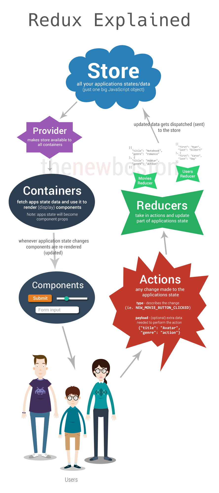

Web 开发者面试题集第五篇，关于 React。

<!--more-->


秋招提前批已经基本结束了，即将进入金九银十，正式的号角已经打响。春招，以及秋招提前批一路过来，断断续续也面了一些公司，自己在笔记上也有总结，甚至自己进行过一些猜题。发现基本问到的问题八九不离十，但是有些知识，特别是偏工程的知识点，如果没遇到过，很难产生深刻的印象。结合自己之前的笔记，也想在正式进入 9 月之前，整理一个面试题集系列，加深理解。

这是这个系列的第五篇，关于 React。

React 作为一个火爆的前端框架，面试时被问到的基本原理题还是有点，现在我们越来越喜欢直接上手一个框架，而往往忽略一些基础，这篇文章也当做复习 React 基础知识了。


## React 的生命周期

React 组件有三个生命周期，每种生命周期有一些函数可以调用，完成某些功能。其中以**will**作为前缀的方法在经历周期之前调用，以**did**作为前缀的方法在经历周期之后调用

1. **Mount**，React 组件初始化之后需要**挂载**到真实 DOM，需要经历挂载这个生命周期，其中有几个重要的方法

   **constructor()**，这个构造函数方法一般做两件事，首先是初始化组件状态；其次是组件中方法的作用域绑定。一般如果无需这两个操作，可以不定义 constructor()方法，React.Component 会默认实现

```jsx
class foo extends React.Component {
  constructor() {
    super();
    this.state = {
      name: "foo"
    }
  }
  setName(name) {
    this.setState({name});
  }
}

// React.Component默认实现的constructor()
constructor(props) {
  super(props);
  this.state = {
    color: props.initialColor
  };
}
```

**render()**，React 使用该方法生成一颗 Virtual DOM 树

**componentDidMount()**，React 组件被加载进入真实 DOM 后执行该函数，在该函数中可以发 Ajax 请求，绑定事件处理函数，添加计时器，操作真实 DOM 等等

2. **Update**，当 React 组件的 state 或者 props 发生变化时，需要经历更新这个生命周期，其中有几个重要的方法

   **static getDerivedStateFromProps(nextProps, prevState)**，组件 props 改变，或者父组件引发的渲染会调用该方法，该方法根据组件 props 决定是否更新组件 state，返回一个 state 对象用于更新 state，或返回 null 表示无需更新。该方法也可以在**挂载**生命周期中使用

   **shouldComponentUpdate(nextProps, nextState)**，React 默认是 props 或 state 发生改变默认更新，如果我们需要自行决定是否更新，则需要自己实现这个方法。该方法返回 false，则组件会停止更新，周期后面的方法不会调用
   **componentDidUpdate(prevProps, prevState)**，更新发生之后调用该方法，可以实现 DOM 操作

3. **Unmount**，当关闭一个网页，或者 Virtual DOM 树的根节点元素完全改变时，组件会经历**卸载**这个生命周期，其中只有一个比较重要的方法

   **componentWillUnmount()**，该方法一般用来解除事件绑定，取消定时器等等，防止内存泄漏

## State VS Props

先说说它们的相同点

- 两者都是 JavaScript 对象
- 两者的改变都会引起 React 组件的更新

两者何时可以发生改变

|                                     | _props_ | _state_ |
| ----------------------------------- | ------- | ------- |
| 能否从父组件获取初始值              | 能      | 能      |
| 值能否被父组件改变                  | 能      | 不能    |
| 能否设置默认值                      | 能      | 能      |
| 能否在组件内发生改变                | 不能    | 能      |
| 能否用来设置子组件的 Props 或 State | 能      | 能      |
| 能否在子组件中被改变                | 不能    | 能      |

总结来说

- state 用于实现组件内部的逻辑，props 定义了一个外部的接口
- props 的初始化赋值在父组件中，state 则在自身组件中
- 父组件可以通过传值给子组件，作为子组件的 props，子组件再使用 props 初始化 state
- 父组件也可以通过传递回调函数给子组件，从而在子组件中调用回调函数修改父组件 state

### 参考

1. https://github.com/uberVU/react-guide/blob/master/props-vs-state.md

## React Element VS React Component

- React Element 是构建 React 应用的基本单元，描述了我们在屏幕上看到的东西，具有不可变性(immutable)，也就是每次`render()`方法返回的都是全新的 React Element
- React Element 只是一个对象，并不是真实的 DOM 节点，最终要由 ReactDOM 根据该对象生成真实的节点(`ReactDOM.render()`)。通常我们不直接使用 React Element，而是从 React Component 的 render 函数中返回
- React Component 是一个抽象概念，是 React 中可重用的代码块，它可以返回 React Element 用于渲染真实 DOM
- 如果页面的一部分经常被重复使用，或者逻辑复杂，就可以考虑将其包装为 Component
- Component 是用户自定义的，Component 也可以返回 Component，而 React Element 是本来就存在的纯对象

## 类组件(Class Components) VS 函数组件(Functional Components)

```jsx
// 函数组件
function Welcome(props) {
  return <h1>Hello, {props.name}</h1>;
}

// 类组件
class Welcome extends React.Component {
  render() {
    return <h1>Hello, {this.props.name}</h1>;
  }
}
```

上面的代码中，两者对于 React 来说没有区别，因为函数返回的也是一个 React Element

但是函数组件功能单一，如果只需要返回一个 React Element 或者 React Component 的时候，使用功能组件即可

如果组件有状态或者需要使用一些生命周期函数，则需要使用类组件

## 受控组件(Controled Component) VS 非受控组件(Uncontroled Component)

- 对于受控组件，所有的组件数据托管在组件中，不为真实 DOM 所有
- 对于非受控组件，通过*ref*绑定真实 DOM 元素，组件数据可以从真实 DOM 元素中获得

关于受控组件和非受控组件的一个最好的例子就是如果需要获取`<input>`元素的值，是否需要对其绑定`onChange`事件

- 如果不绑定事件，则直接从元素中获取 value，需要使用*ref*绑定真实 DOM，之后便可以直接访问`value`，此时作为非受控组件
- 如果绑定`onChange`事件，每一次事件调用时便可以通过`setState()`设置组件的 state，值可以通过`onChange`方法的默认参数：事件对象`e.target.value`中获得，此时为受控组件

## 显示组件(Presentational Component) VS 容器组件(Container Component)

关于这两种组件，还有哑组件(Dumb Coponent)和聪明组件(Smart Component)的说法

顾名思义，显示组件做的工作就是只展示页面元素，而容器组件要实现的就是页面的业务逻辑

两者有下面的区别

|              | 显示组件                   | 容器组件                           |
| ------------ | -------------------------- | ---------------------------------- |
| 目的         | 展示页面                   | 实现页面交互逻辑                   |
| 数据来源     | 自身 props                 | 与其他组件通信得到或者发出请求得到 |
| 响应交互操作 | 使用容器组件提供的回调函数 | 触发真正的操作                     |

关于这两者的概念，诠释得最清晰的是 Redux，Redux 的`connect()`方法可以将一个显示组件包装成为一个容器组件，并且将容器组件获得的数据通过 props 传给显示组件进行显示，同时，将修改状态的回调方法也通过 props 传给显示组件，让其可以调用回调方法完成交互

看下面一幅图就明白了


<span>Redux Flow by <a href="https://github.com/buckyroberts">buckyroberts</a></span>

## React 高阶组件(HOC)

React High Order Component (HOC) 是 React 用来复用组件逻辑的一种技术。本质上来说，高阶组件就是一个函数，函数接收一个组件作为参数，在此基础上增加一些新的功能，最后返回一个新的组件，例如

```jsx
function logProps(WrappedComponent) {
  return class extends React.Component {
    componentWillReceiveProps(nextProps) {
      console.log("Current props: ", this.props);
      console.log("Next props: ", nextProps);
    }
    render() {
      return <WrappedComponent {...this.props} />;
    }
  };
}
```

高阶组件在 React 第三方库中出现得比较多，其中最为常见的是 React-Redux 中的`connect()`，该方法的返回值就是一个高阶组件，下面是该函数的模型

```jsx
function connect(mapStateToProps, mapDispatchToProps) {
  return function (WrappedComponent) {
    // we return a Wrapper component:
    return class extends React.Component {
      render() {
        return <WrappedComponent {...this.props} />;
      }
    };
  };
}
```

还有一点需要注意，HOC 看起来和前面提到的*Container Component*非常相似，下面是 React 官网给出的解释

> You may have noticed similarities between HOCs and a pattern called **container components**. Container components are part of a strategy of separating responsibility between high-level and low-level concerns. Containers manage things like subscriptions and state, and pass props to components that handle things like rendering UI. HOCs use containers as part of their implementation. You can think of HOCs as parameterized container component definitions.

其实大致意思就是，HOC 实现了 Container Component，它的返回值就是这个，只不过它作为一个函数，可以传递额外的参数来增强 Container Component 的功能

使用 HOC 有如下几个好处

- HOC 可以使用同一个 Component，返回不同的 Container Component，可以复用组件，减少代码
- HOC 可以传递不同的数据源作为参数，方便我们使用不同的数据源
