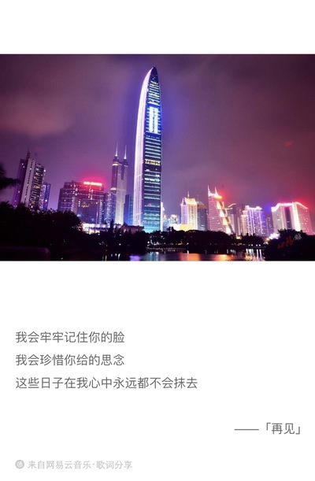

初入社会第一课，是一笔宝贵的财富。

<!--more-->

## 毫无准备，春招开始

互联网的招聘时间，从来不按套路出牌，总是越早机会越多

寒假还有在做学长的项目，但是基本已经进入收尾阶段，学完车之后便是咸鱼状态，以为暑期前 5，6 月份开始找实习就好。3 月来到学校，马上就收到俱乐部的各种学长内推，一点准备也没有，就开始了面试

结果无疑是很惨的，第一面就是阿里，当时阿里实习招聘已经接近尾声，面试官电话不能推到周末，只能当天抽空面试。面试官只用简单的几个问题便把我问到哑口无言

1. Q: 为什么选择前端？

   A: 前端变化日新月异，可以不断充电学习...

2. Q: 那学习了啥？

   A: 懂点 jQuery...（当时 jQuery 就会查 API 解决问题）

3. Q: 打游戏吗？

   A: 不怎么打...

4. Q: 那你不怎么打游戏，好像也没学到多少啊？真不打游戏？疑问脸 ):

   A: 真不打游戏...好吧确实没学到啥

5. Q: JS 里 0.1 + 0.2 !== 0.3 解释一下吧

   A: 嗯，应该浮点数精度取整的问题

6. Q: 这谁都知道啊，你说具体点

   A: ...好吧当时确实说不清楚

7. Q: 再问你一个吧，移动端点击事件 300ms 延迟怎么解决

   A: emmm...这个也不会

8. Q: 有什么想问我的吗？

   我: 实习生培养政策是怎么样的？有 mentor 吗？

   面试官: 其实学东西还是要靠自己的

   我: 欧，好吧~

这次面试答得比较糟糕，其实第一个问题没答好，而且由于自己确实没学到什么，面试官对我第一印象就不太好，觉得我是个容易夸大自我的人吧，全程面试 15min，可以说很凉了...

第二次面试是头条，问了有 20 个题目左右，有 4 个左右没答上来，还有一个算法题压根没懂。当时还觉得应该有机会进下一轮，结果第二条就收到拒信，自己还是 naive，不过宇宙条效率真的没得说

3，4 月份主要集中为一些大厂的面试，主要是老师或者俱乐部学长的内推，这期间自己也逐渐开始从 0 准备，并开始深挖自己的项目，前端也不止停留在用 jQuery 开发上，而是开始复习基础，React 也开始跟了一个小小的项目，看官网的博客

5 月份开始，自己也在网上找合适的投递，那个时候就想找一个能学习 React 的公司，巧合下看到了 Insta360 的招聘，地点在深圳，使用 React 开发，一开始以为和 360 有什么联系，去查了下，发现公司的产品在国外市场做得很牛，便投递了

约面试也很快，一面的时候有两个面试官，一个问了我 JS 基础，以及一些 ES6 的知识，答得不错，另外一个看了我项目跟我细聊，发现我还玩过 Docker 和 Kubernetes，由于我对简历项目进行了深挖，基本原理都能说个一二，聊得还是挺满意的，而我自己对于愿意和你细聊项目，挖掘你长处的面试官也是挺有好感，包括秋招，拿到的几个 offer，除了华为玄学点之外，其他几个面试时聊得都挺不错的

没有意外，我收到了 Insta360 的实习 offer，人生第一次看到 offer letter，还是挺开心的

## 活力深圳，充满希望

选择深圳作为人生第一站，家人也挺满意，因为真的很近啊，上大学 35 小时的火车，如今 4 小时左右的高铁

一个没去过大城市的小子，提着行李箱来到高楼遍地的城市，满是诧异，刚下地铁我就开始拿高德导航，显示公司所在大楼只有 200m，想想也有意思，当时自己开着导航，绕着公司大楼转悠一圈还没找到入口，而最无语的事情是，手机竟然被太阳晒花屏了 Orz…便找了一个人问了下路，他给我指了下我面前这栋楼，说这栋就是啊。我也是苦笑不得

由于手机花屏，不能联系上 hr，只能登记后上了楼。当时自己还以为公司有自己的一栋楼，结果是两层，还好当时 hr 提前跟人打好招呼，我进去就被认了出来，见了下老大，找了个位置坐了下来

第一次看互联网公司，原来真的和俱乐部的工位差不多，自己还以为会有一栋楼呢 hhh

hr 找到我之后，先说了手机的事，她也无奈的笑了，联系我好久没联系上....

那天下午我就坐在位置上，等待室友下班一起回去，安顿好行李，实习生活就要开始了

## 不断学习，不断充电

Insta360 我们组还是相对来说轻松的，公司也是 6 点下班，大小周这种。组里边基本没加过班，活儿也不算多

刚入职的时候还是 7 月份，虽然秋招已经开始了，但是只是少部分公司的提前批，而且投递跨度也比较长，这个月我基本没投递公司，属于准备阶段，因此时间还是比较自由的，正好有一个室友办了健身卡，便邀约一起去健身了

7 月以及 8 月上旬白天工作，晚上健身房，还是安排得很舒服的，8 月下旬以及 9 月之后，各种笔试面试安排就来了。那段时间作息也发生了改变，由于早上起得可以比较晚，晚上便也睡得晚，基本到凌晨 2 点以后，2 点半左右了，最甚可以到 3 点。说起来也奇怪，根本没有睡意，不过做的都是自己的东西，兴趣爱好使然，还能满足成就感。唯一不能坚持的就是健身了，那个时候晚上 7 点左右约面试，一小时左右，面完 8 点才下去吃个饭，回来做做总结，已经没有去健身房的精力，而周末在宿舍独处就感觉很满足很惬意

自己有个小毛病，也算一个缺点，一直很难克服，就是当有一个急切重要的目标没有完成时，便分散不出精力做其他的事了，哪怕是一直坚持的健身，可能也会放弃。在这里来看这件大事就是找工作，找不到工作时是焦虑的，拿到 offer 了，又还总想试试更好的，毕竟不像大佬们随随便便就是 BAT，所以还是焦虑与期待并存的，精力过于集中便无法分散了。好在公司的事确实不算多，自己还有额外的时间学习新知识，不断充电，准备秋招

下面回顾一下自己实习期间充的“电”

在公司里一共做了三件工作

1. 部分商城活动页
2. Chrome 数据采集插件
3. 内部系统后台部分模块

自己做了以下几件事

1. 搭建了博客系统
2. 产出 10 篇技术文章
3. 写了两个 React 开源小项目

但是也有没做好的事

1. Node 没有花上时间学习
2. 算法题没有坚持刷到预期数目
3. 深入理解计算机系统和算法导论没有好好阅读
4. 两个小项目后期没有完善得很完美
5. 文章产出不算多（我的预期当时一周应该有 2 篇，远没达到）

十月是一个艰苦的过程，倒不是面试，而是等待的过程，还好最终的结果算是满意。可能也是累了，已经咸鱼了这么久，接下来也要继续努力鸭~

## 脚踏实地，继续前行

如今可以算是一个社会人了，经过了深圳的实习，虽然自己很爱这座城市，但是最终经过选择还是没有留下来，也许将来会有机会回来看看

Insta360 确实是一家充满活力的公司，leader 和周围同事的学识都给我留下了深刻的印象。当然最深的一起工作生活的室友，每天晚上一起熬夜，一起健身，一起吃饭。楼下常去的湖南粉馆，每天早上都要打个招呼买包子的老板。都是一笔珍贵的财富，我爱这的一切 ❤️

网易云今天给我分享了一首歌，留在这里

脚踏实地，继续前行 🏃
