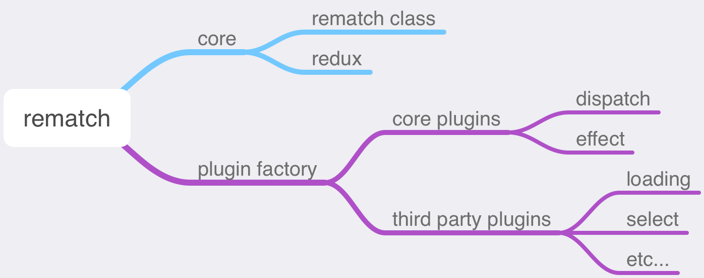

This is a part of the Rematch Code Deep Dive Series, focusing on the plugin system and core plugins of Rematch.

<!--more-->

> Unless specified otherwise, the code version in this column is `@rematch/core: 1.4.0`.

The [previous article](https://tianzhich.com/en/rematch-series-rematch-core/) introduced the related code of Rematch core, and it overlooked the plugin. The plugin is also a highlight of Rematch, which I will elaborate on in this article.

Additionally, I will introduce two core plugins of Rematch. They are called core plugins because they are essential for Rematch to function fully. In the next article, I will introduce a few third-party plugins developed by the Rematch team, which developers can choose to use or not.

Before explaining, let's first review the code structure and components of Rematch:

```
...
plugins
|—— ...
|—— loading
|—— immer
|—— select
src
|—— plugins
|  |—— dispatch.ts
|  |—— effects.ts
|—— typings
|  |—— index.ts
|—— utils
|  |—— deprecate.ts
|  |—— isListener.ts
|  |—— mergeConfig.ts
|  |—— validate.ts
|—— index.ts
|—— pluginFactory.ts
|—— redux.ts
|—— rematch.ts
```



## Plugin Factory

Firstly, there is a Plugin Factory function, which takes the Rematch Store initialization parameters and returns a factory object. Its key method and properties are `create`:

```ts
export default (config: R.Config) => ({
  // ...
  create(plugin: R.Plugin): R.Plugin {
    // ... do some validations

    if (plugin.onInit) {
      plugin.onInit.call(this);
    }

    const result: R.Plugin | any = {};

    if (plugin.exposed) {
      for (const key of Object.keys(plugin.exposed)) {
        this[key] =
          typeof plugin.exposed[key] === "function"
            ? plugin.exposed[key].bind(this) // bind functions to plugin class
            : Object.create(plugin.exposed[key]); // add exposed to plugin class
      }
    }
    for (const method of ["onModel", "middleware", "onStoreCreated"]) {
      if (plugin[method]) {
        result[method] = plugin[method].bind(this);
      }
    }
    return result;
  },
});
```

Mainly, it binds some function properties of the plugin to the `this` context of the pluginFactory. If the plugin contains an `exposed` attribute, they are added to the pluginFactory for shared use across plugins. (In the upgrade and transformation of Rematch v2 source code, there was a misunderstanding of the role of the `exposed` attribute, leading to some ambiguous behavior, which I will mention in later articles.) Finally, it returns an object containing the plugin hooks.

The pluginFactory is called in the Rematch class mentioned in the [previous article](https://tianzhich.com/en/rematch-series-rematch-core/#rematch-class):

```ts
export default class Rematch {
  protected config: R.Config;
  protected models: R.Model[];
  private plugins: R.Plugin[] = [];
  private pluginFactory: R.PluginFactory;

  constructor(config: R.Config) {
    this.config = config;
    this.pluginFactory = pluginFactory(config);
    for (const plugin of corePlugins.concat(this.config.plugins)) {
      this.plugins.push(this.pluginFactory.create(plugin));
    }
    // preStore: middleware, model hooks
    this.forEachPlugin("middleware", (middleware) => {
      this.config.redux.middlewares.push(middleware);
    });
  }
  public forEachPlugin(method: string, fn: (content: any) => void) {
    for (const plugin of this.plugins) {
      if (plugin[method]) {
        fn(plugin[method]);
      }
    }
  }

  // ...
}
```

In the constructor, the pluginFactory is created as a private property of the Rematch class, and the created plugins are then placed into an array. Finally, the middleware hooks of the plugin are configured into the Redux middleware.

Besides middleware hooks, it is also necessary to sequentially execute the `onModel` and `onStoreCreated` hooks:

```ts
export default class Rematch {
  // ...

  public addModel(model: R.Model) {
    // ...

    // run plugin model subscriptions
    this.forEachPlugin("onModel", (onModel) => onModel(model));
  }

  public init() {
    // collect all models
    this.models = this.getModels(this.config.models);
    for (const model of this.models) {
      this.addModel(model);
    }

    // ...

    this.forEachPlugin("onStoreCreated", (onStoreCreated) => {
      const returned = onStoreCreated(rematchStore);
      // if onStoreCreated returns an object value
      // merge its returned value onto the store
      if (returned) {
        Object.keys(returned || {}).forEach((key) => {
          rematchStore[key] = returned[key];
        });
      }
    });

    return rematchStore;
  }
  // ...
}
```

`onModel` is executed when traversing and adding models, and `onStoreCreated` is executed before the store is created and returned. The former is usually used for reading, adding, or modifying the configuration of models, while the latter is used to add new properties to the store. If the return value is an object, its properties are added to the store. Below we will look at two specific plugins and how they make use of these hooks.

## Core Plugins

In the design of Rematch v1, there are two core plugins, which are referenced in the constructor of the Rematch class. You can see the following code snippet:

```ts
export default class Rematch {
  // ...

  constructor(config: R.Config) {
    // ...

    for (const plugin of corePlugins.concat(this.config.plugins)) {
      this.plugins.push(this.pluginFactory.create(plugin));
    }

    // ...
  }

  // ...
}
```

These two core plugins are dispatch and effects. The dispatch plugin is used to enhance the Redux store's dispatch, supporting chained calls such as `dispatch.modelName.reducerName`, which is one of the features of Rematch. The effects plugin is used to support asynchronous operations and side effects, and is implemented through calls like `dispatch.modelName.effectName`.

### Dispatch plugin

Let's first look at the entire code of the dispatch plugin, and then I will explain it in two parts:

```ts
const dispatchPlugin: R.Plugin = {
  exposed: {
    // required as a placeholder for store.dispatch
    storeDispatch(action: R.Action, state: any) {
      console.warn("Warning: store not yet loaded");
    },

    storeGetState() {
      console.warn("Warning: store not yet loaded");
    },

    /**
     * dispatch
     *
     * both a function (dispatch) and an object (dispatch[modelName][actionName])
     * @param action R.Action
     */
    dispatch(action: R.Action) {
      return this.storeDispatch(action);
    },

    /**
     * createDispatcher
     *
     * genereates an action creator for a given model & reducer
     * @param modelName string
     * @param reducerName string
     */
    createDispatcher(modelName: string, reducerName: string) {
      return async (payload?: any, meta?: any): Promise<any> => {
        const action: R.Action = { type: `${modelName}/${reducerName}` };
        if (typeof payload !== "undefined") {
          action.payload = payload;
        }
        if (typeof meta !== "undefined") {
          action.meta = meta;
        }
        return this.dispatch(action);
      };
    },
  },

  // access store.dispatch after store is created
  onStoreCreated(store: any) {
    this.storeDispatch = store.dispatch;
    this.storeGetState = store.getState;
    return { dispatch: this.dispatch };
  },

  // generate action creators for all model.reducers
  onModel(model: R.Model) {
    this.dispatch[model.name] = {};
    if (!model.reducers) {
      return;
    }
    for (const reducerName of Object.keys(model.reducers)) {
      this.validate([
        [
          !!reducerName.match(/\/.+\//),
          `Invalid reducer name (${model.name}/${reducerName})`,
        ],
        [
          typeof model.reducers[reducerName] !== "function",
          `Invalid reducer (${model.name}/${reducerName}). Must be a function`,
        ],
      ]);
      this.dispatch[model.name][reducerName] = this.createDispatcher.apply(
        this,
        [model.name, reducerName]
      );
    }
  },
};
```

#### onModel hook

As mentioned earlier, `onModel` is executed before `onStoreCreated`, so let's look at `onModel`:

```ts
const dispatchPlugin: R.Plugin = {
  exposed: {
    // ...

    storeDispatch(action: R.Action, state: any) {
      console.warn("Warning: store not yet loaded");
    },
    dispatch(action: R.Action) {
      return this.storeDispatch(action);
    },
    createDispatcher(modelName: string, reducerName: string) {
      return async (payload?: any, meta?: any): Promise<any> => {
        const action: R.Action = { type: `${modelName}/${reducerName}` };
        if (typeof payload !== "undefined") {
          action.payload = payload;
        }
        if (typeof meta !== "undefined") {
          action.meta = meta;
        }
        return this.dispatch(action);
      };
    },
  },

  // ...

  // generate action creators for all model.reducers
  onModel(model: R.Model) {
    this.dispatch[model.name] = {};
    if (!model.reducers) {
      return;
    }
    for (const reducerName of Object.keys(model.reducers)) {
      // ... some validations

      this.dispatch[model.name][reducerName] = this.createDispatcher.apply(
        this,
        [model.name, reducerName]
      );
    }
  },
};
```

In the `onModel` hook, for each model, an empty object is created on `this.dispatch` (as mentioned earlier, properties in `exposed` are added to the pluginFactory, and the `this` context in hook functions is bound to this pluginFactory, hence `this.dispatch` is the dispatch function mentioned in `exposed`). Then, for each reducer, an actionCreator is added to the previously created empty object with the reducer's name as the property name. This supports the chained calling of reducers.

`createDispatcher` function is used to generate actionCreators, using `${model name}/${reducer name}` as the action type, and finally assembling the payload and meta passed during the call using `this.dispatch` (which is also a function).

After the action is dispatched, it will enter the correct reducer to execute. The code about constructing reducers was discussed in the [previous article on creating Model reducers](https://tianzhich.com/en/rematch-series-rematch-core/#create-model-reducers), so let's review the relevant code:

```ts
this.createModelReducer = (model: R.Model) => {
  const modelBaseReducer = model.baseReducer;
  const modelReducers = {};
  for (const modelReducer of Object.keys(model.reducers || {})) {
    const action = isListener(modelReducer)
      ? modelReducer
      : `${model.name}/${modelReducer}`;
    modelReducers[action] = model.reducers[modelReducer];
  }
  const combinedReducer = (state: any = model.state, action: R.Action) => {
    // handle effects
    if (typeof modelReducers[action.type] === "function") {
      return modelReducers[action.type](state, action.payload, action.meta);
    }
    return state;
  };

  this.reducers[model.name] = !modelBaseReducer
    ? combinedReducer
    : (state: any, action: R.Action) =>
        combinedReducer(modelBaseReducer(state, action), action);
};
```

In the combinedReducer, the correct reducer for the action is allocated through `action.type`, and here `action.type` is composed of `${model name}/${reducer name}`, thus completing the match.

#### onStoreCreated hook

Now let's look at the last `onStoreCreated` hook:

```ts
const dispatchPlugin: R.Plugin = {
  exposed: {
    // required as a placeholder for store.dispatch
    storeDispatch(action: R.Action, state: any) {
      console.warn("Warning: store not yet loaded");
    },

    storeGetState() {
      console.warn("Warning: store not yet loaded");
    },

    /**
     * dispatch
     *
     * both a function (dispatch) and an object (dispatch[modelName][actionName])
     * @param action R.Action
     */
    dispatch(action: R.Action) {
      return this.storeDispatch(action);
    },
  },

  // access store.dispatch after store is created
  onStoreCreated(store: any) {
    this.storeDispatch = store.dispatch;
    this.storeGetState = store.getState;
    return { dispatch: this.dispatch };
  },
};
```

Since the Rematch store is an enhancement of the Redux store and depends on the Redux store, `storeDispatch`, `storeGetState`, and `dispatch` cannot be accessed before the Redux store is created. After creation, the first step is to override `storeDispatch` and `storeGetState`, and then return an enhanced `dispatch`, replacing the original dispatch of the Redux store.

### Effect plugin

The effect plugin is used to support side effects:

```ts
const effectsPlugin: R.Plugin = {
  exposed: {
    // expose effects for access from dispatch plugin
    effects: {},
  },

  // add effects to dispatch so that dispatch[modelName][effectName] calls an effect
  onModel(model: R.Model): void {
    if (!model.effects) {
      return;
    }

    const effects =
      typeof model.effects === "function"
        ? model.effects(this.dispatch)
        : model.effects;

    for (const effectName of Object.keys(effects)) {
      // ... some validations

      this.effects[`${model.name}/${effectName}`] = effects[effectName].bind(
        this.dispatch[model.name]
      );
      // add effect to dispatch
      // is assuming dispatch is available already... that the dispatch plugin is in there
      this.dispatch[model.name][effectName] = this.createDispatcher.apply(
        this,
        [model.name, effectName]
      );
      // tag effects so they can be differentiated from normal actions
      this.dispatch[model.name][effectName].isEffect = true;
    }
  },

  // process async/await actions
  middleware(store) {
    return (next) => async (action: R.Action) => {
      // async/await acts as promise middleware
      if (action.type in this.effects) {
        await next(action);
        return this.effects[action.type](
          action.payload,
          store.getState(),
          action.meta
        );
      }
      return next(action);
    };
  },
};
```

The onModel hook in the effects plugin does something similar to what the dispatch plugin does for reducers, but there are a few differences:

1. The `effect` parameter in the model configuration supports a function form, which is called with the enhanced dispatch function object as a parameter, and the return value is the actual effects object. This way, in the effect, all model effects and reducers can be called through dispatch.
2. The `this` context of the individual effect function in the model is bound to `this.dispatch[model.name]`, which is the dispatch of the current model. Therefore, this can be used internally to call the reducers and effects of the current model.
3. An `isEffect` identifier is added to the effect with a value of `true`, used to differentiate it from regular reducers.

Finally, the core part of the effect plugin is essentially a self-implemented Redux asynchronous middleware. As mentioned earlier, effect actions can also be dispatched through rematchStore.dispatch. After passing through this asynchronous middleware, it first determines whether it is in `this.effects`. If so, the action is processed first, followed by the execution of the corresponding effect, with the three parameters being payload, global state, and meta (since meta is rarely used and payload is the most common, this order is adopted). If not, it is processed further.

> Note: Further processing means being handled by subsequent middleware (if any) and finally reaching the reducer. Here's a confusing point: by such design, if a model and effect have the same name, it leads to the execution of the reducer before the effect. Both will be executed, which also caused [difficulty in the TS design part of Rematch v2](https://github.com/rematch/rematch/pull/913) (I will explain in detail in a later article).

## Summary

After detailing Rematch's plugin mechanism and its two core plugins, do you appreciate the clever design of Rematch. In the next article, I will continue to introduce a few third-party plugins, which we can choose to use to improve development efficiency. Stay tuned!
