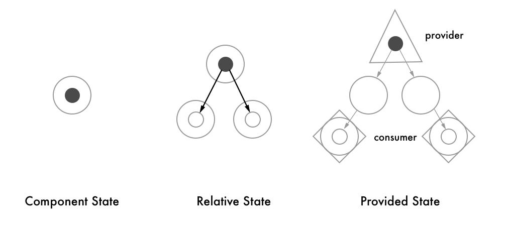
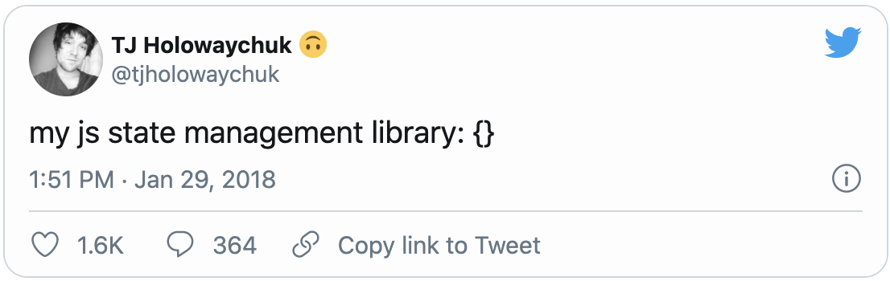
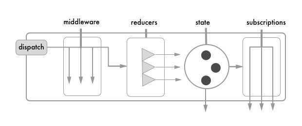
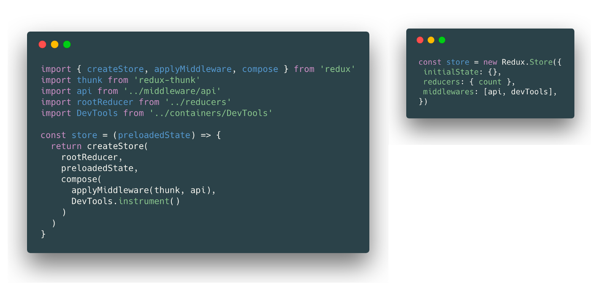
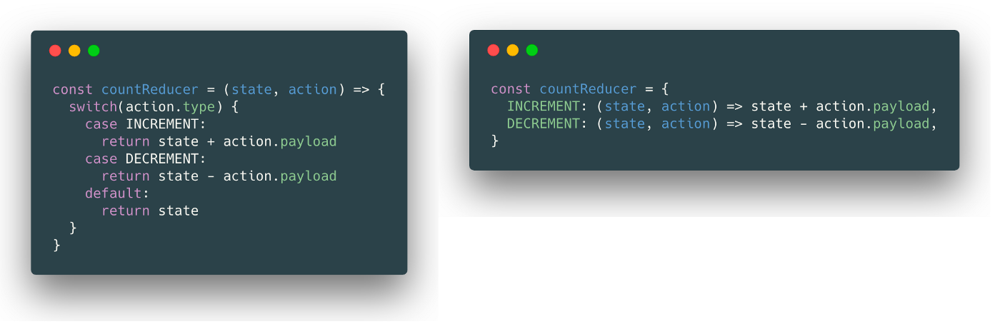
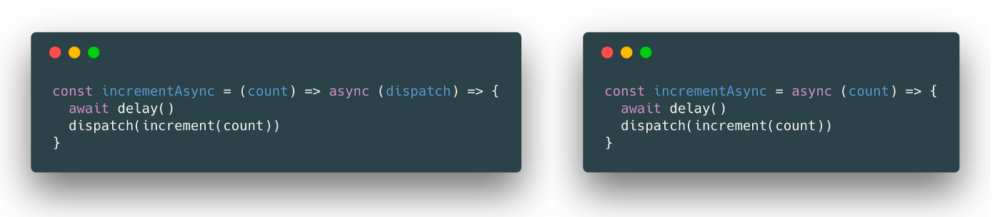
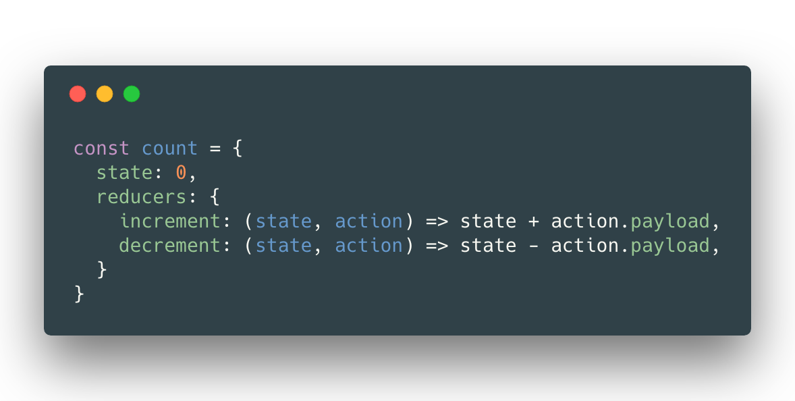
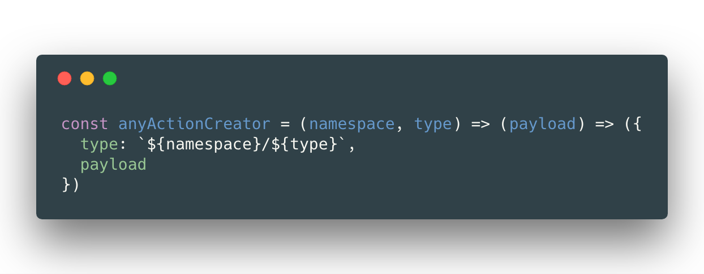
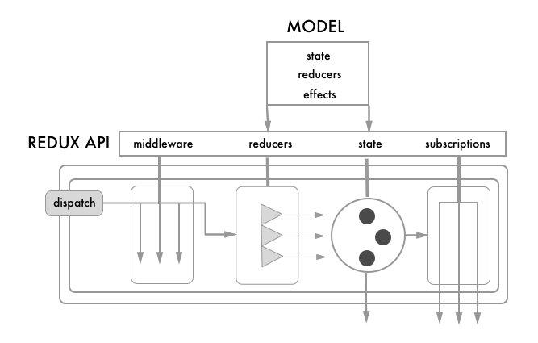
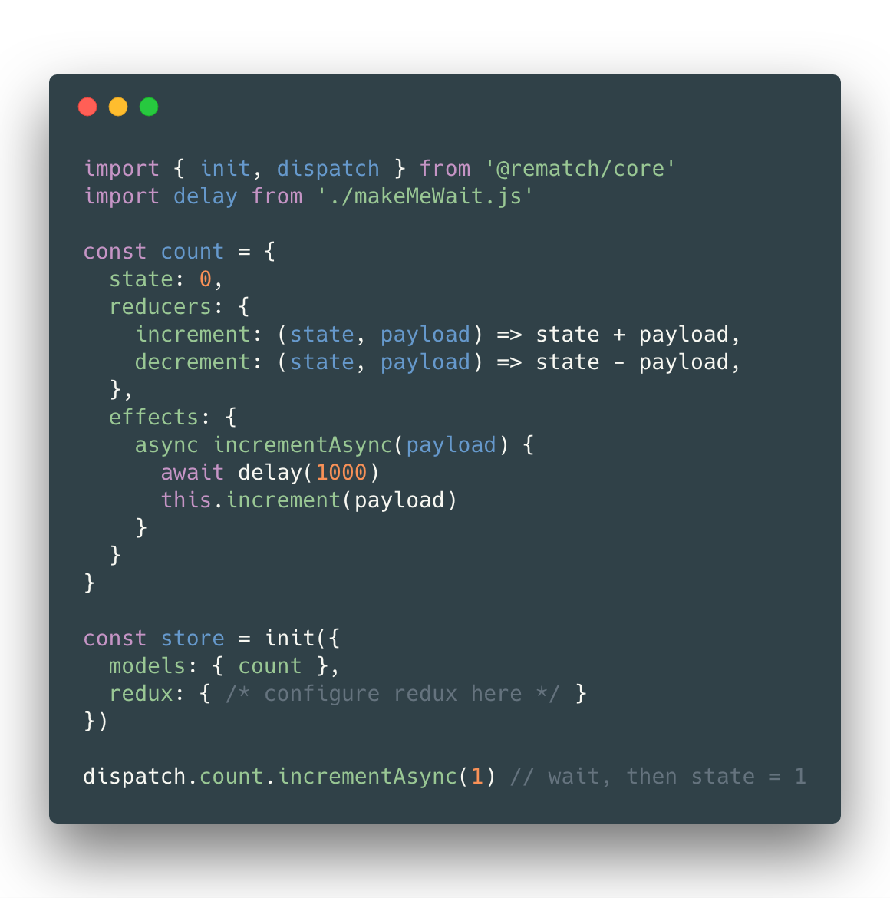

Rematch 源码解读系列的第 0️⃣ 篇，翻译自 Rematch 作者的「重新设计 Redux」。

<!--more-->

到目前为止，如何做状态管理难道不是一个已解决的问题吗？直觉上，开发者似乎知道：状态管理本应简单，实际却更难了。在这篇文章中，我们会探索下面几个问题，也许你也问过自己这几个问题：

- 你需要一个第三方库用来做状态管理吗？
- Redux 值得这么受欢迎吗？为什么值得？（或为什么不值得？）
- 我们可以开发一个更好的状态管理方案吗？如果可以，该怎么做？

## 状态管理需要额外使用第三方库吗？

作为一名前端工程师，不只是需要和屏幕的像素打交道，开发真正的艺术是知道如何存储管理数据。简而言之：这比较复杂，但又没那么复杂。

让我们看看当使用基于组件的视图框架，例如 React 时，我们是怎么做的：

### 1. 组件状态（Component State）

存在于组件自身的状态。在 React 中，想象下用`setState`更新的`state`。

### 2. 相对状态（Relative State）

由父组件传递给子组件的状态。在 React 中，想象下传递给子组件的`props`。

### 3. 额外提供的状态（Provided State）

根 **提供者（Provider）** 提供的状态，除了邻接组件节点，组件树中任何的 **消费者（Consumer）** 节点都可以访问。在 React 中，想象下`Context API`。

大部分状态都属于视图层，决定着 UI 展示。但是如果部分状态的代码影响了基础数据和逻辑，该如何处理？

将所有状态数据放在视图层可能违背 **_关注点分离（separation of concerns）_** 原则：这样数据和 JavaScript 的一些视图库耦合，代码变得难以调试，甚至引发更大的烦恼：你必须持续地思考和调整在哪存放数据。

随着设计改变，状态管理会变得更复杂，而且很难确认哪个组件需要哪个状态数据。一个最直接的方法是将所有数据放在根组件，如果这样的话，使用下面的方案会更好。

### 4. 外部状态（External State）

状态数据可以移到视图库的外部。这样视图层可以使用提供者/消费者模式”连接（Connect）“与数据保持同步。

也许以这种方式做状态管理中最出名的状态库就是 Redux 了，过去两年时间里（译者注：本文发布自 2018 年 2 月）它获得了极大的追捧，为什么一个简单的库能获得这么多喜欢？

_Redux 拥有更好的性能吗？_ 并非如此，处理 action 时，它执行也会轻微变慢。

_Redux 使用很简单吗？_ 当然不是。

最简单的当然是纯 JS（Pure JavaScript）（译者注：Twitter 原文链接[点我](https://twitter.com/tjholowaychuk/status/957853652483416064?ref_src=twsrc%5Etfw%7Ctwcamp%5Etweetembed%7Ctwterm%5E957853652483416064%7Ctwgr%5E%7Ctwcon%5Es1_c10&ref_url=https%3A%2F%2Fcdn.embedly.com%2Fwidgets%2Fmedia.html%3Ftype%3Dtext2Fhtmlkey%3Da19fcc184b9711e1b4764040d3dc5c07schema%3Dtwitterurl%3Dhttps3A%2F%2Ftwitter.com%2Ftjholowaychuk%2Fstatus%2F957853652483416064image%3Dhttps3A%2F%2Fi.embed.ly%2F1%2Fimage3Furl3Dhttps253A252F252Fpbs.twimg.com252Fprofile_images252F909953369694859265252FBOakwKQY_400x400.jpg26key3Da19fcc184b9711e1b4764040d3dc5c07)）：

那么为什么大家不使用`global.state = {}`呢？

---

## 为什么选择 Redux？

Redux 底层其实就是上面提到的全局空对象，只是外面涵盖了一些操作流：

在 Redux 中，你不能直接修改状态数据。修改的方法只有一个：派发（dispatch）一个动作（action）到上述流水线中，最终数据得到更新。

流水线中包含着两种监听方式：中间件（middleware）和订阅（subscriptions），中间件是一些函数，它们可以监听动作派发，然后使用一些工具例如”日志打印（logger）“，”开发包工具（devtools）“，又或者是调用一个”syncWithServer“的监听者函数。订阅也是一些函数，用来广播状态变更事件。

最后，用于更新的**reducers**函数将整个状态的变更分成更小、更模块化以及更易于管理的块。（译者注：原文为*reducers update functions that can break down state changes into smaller, more modular and manageable chunks.*）

> 在开发上，使用 Redux 或许比使用全局对象做状态管理确实更简单。

可以把 Redux 看成由一个全局对象，加上用于更新该对象的”reducer“方法，以及一些更新该对象前后的钩子（hook）组成的库。

---

## 但是 Redux 会不会太复杂了？

Redux 确实比较复杂。可以根据几个不可否认的标志来衡量一个 API 是否值得改进，总结为如下等式：

$$
\frac{time\_saved}{time\_invested} = quality\_of\_api
$$

`time_saved`表示使用了该 API 所节省的开发时间，而`time_invested`表示为了使用该 API 所花时间，包括阅读文档，学习教程以及搜索一些不熟悉的概念。

Redux 本质上是一个简单轻量的库，但是学习起来比较复杂。对于那些熟悉函数式编程的开发者来说，他们已经克服了复杂的学习过程，并从 Redux 中受益。但是也可能会有一些开发者迷失在学习中，他们会想：”这不适合我，还是用 jQuery 吧“。

使用 jQuery 时无需了解”comonad“，而且对于状态管理，其实也不一定需要理解函数组合（functional composition）。

_任何一个库，都应该是通过抽象（abstraction）来封装复杂的逻辑，使得使用变得简单_。

我并非想挑衅 Dan Abramov（译者注：Dan 为 React 和 Redux 作者）。我只是觉得 Redux 太早变得流行了，此刻的它并未成熟。

- 如果一个库已被许多开发者使用，你如何对他进行重构？
- 如果发布破坏性的变更（译者注：_breaking change_）会影响全世界无数的项目，你怎样证明这样做的合理性？

上述两点你都没法做到。但是你可以提供丰富的文档、易懂的视频以及一个活跃的社区来更好地支持已有项目。Dan 在这点上做得非常好。

或者，还有更好的方案。

---

## 重新设计 Redux

我认为 Redux 应该被重写。我会从以下 7 个方面进行说明：

### 1. 初始化（Setup）

让我们看下图，其中左边是一个 Redux 项目的基础配置：

许多开发者可能都卡在这儿了，仅仅是第一步初始化，仿佛茫然凝望着深渊。什么是 **_thunk_**？什么是 **_compose_**？函数还能这么用？

试想一下，如果 Redux 用配置取代函数组合，初始化过程可能会变得像上图右边那样。

### 2. 简化的 Reducers

Redux 中的 Reducer 可以换一种方式，脱离我们已经习惯的繁琐写法（使用 switch 语句）。

假设一个 reducer 的`case`分支匹配上了`action.type`，我们可以对参数进行反转，让每一个 reducer 成为一个纯函数（接收`state`和`action`）。甚至可以更简单，让`action`标准化，只保留`state`和`payload`参数。

> 译者注：作者原文也遗漏了第三部分，这里与其保持一致 ==

### 4. 使用 Async/Await 替代 Thunks

**Thunks** 被广泛用于在 Redux 中创建异步 action。在众多异步方案中，thunk 的方案更像是一个聪明的 hack 而不是官方推荐方案。thunk 工作流如下：

1. 你派发了一个 action，这个 action 是一个函数而非期望的对象。
2. Thunk 中间件检查每一个 action 是否为函数。
3. 如果是函数，中间件调用该函数，并传入可以访问 store 的两个方法：`dispatch` 和 `getState`。

认真的吗？将一个简单的 action 动态地视为一个对象，一个函数，甚至是一个 Promise，这难道不是一个坏习惯吗？

看看上面右边例子，我们难道不能就使用 async/await 吗？

### 5. 两类 Action

当想到这里后，本质上来说，有两种 action：

1. **_Reducer action_**：触发 reducer，更新 state
2. **_Effect action_**：触发异步 action。这个 action 中可能会派发一个 Reducer action，但是异步函数中不直接更新任何状态

区分上述两种 action 很有帮助，也能避免使用 thunk 时的困惑。

### 6. 无需再定义冗余的 action types

为什么要将 action creators 和 reducers 区分对待呢？可以只需要一个吗？改变其中一个可以不影响另一个吗？

> Action creators 和 reducers 是一个硬币的两面

`const ACTION_ONE = 'ACTION_ONE'`定义是冗余的，原因正是将 action creators 和 reducers 区分对待。将他们俩看成一个东西，就不用再创建大量的文件专门用于导出这些 action 类型的字符串常量了。

### 7. Reducers 就是 Action Creators

根据不同的用途将 reducer 进行分类，可以有如下更简单的代码：

现在可以自动地从 reducer 中确定对应的 action creator，在这个场景中，reducer 甚至就可以成为 action creator。

遵循基础的命名规范，可以得出以下结论：

1. 如果一个 reducer 的名字为”increment“，那么 action type 就是”increment“。或者我们最好加一层命名空间（namespace）：”count/increment“。
2. 每一个 action 通过”payload“传递数据。

现在，从`count.increment`这类 reducer 中，我们便能生成 action creator。

---

## 好消息：我们可以有一个更好的 redux 方案

正是因为上面提到的问题，我们打造了[Rematch](https://github.com/rematch/rematch)。



Rematch 是对 Redux 的封装，在不减少 Redux 配置能力的基础上，提供了更简单的 API。

来看一个完整的 Rematch 使用范例：

过去的几个月中我已经在生产环境使用 Rematch 了，作为推荐，我会说：

> 我从来没有花这么少的时间去思考如何做状态管理。

Redux 不会消失，而且也不应该消失。让我们以更平缓的学习曲线、更少的模板配置以及更少的心智损耗来拥抱 Redux 背后的简单设计模式吧。

试试[Rematch](https://github.com/rematch/rematch)，看看您是否喜欢它。

如果喜欢，欢迎在 GitHub 给我们点个赞，让更多人知道。
