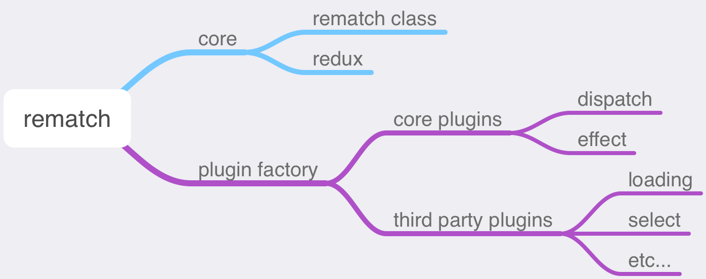

Rematch 源码解读系列的第 2️⃣ 篇，关于 Rematch 的核心代码。

<!--more-->

> 如无特殊说明，本专栏文章的代码版本均为 `@rematch/core: 1.4.0`

在讲解 rematch core 之前，先回顾一下 rematch 的代码结构：

```
...
plugins
|—— ...
|—— loading
|—— immer
|—— select
src
|—— plugins
|  |—— dispatch.ts
|  |—— effects.ts
|—— typings
|  |—— index.ts
|—— utils
|  |—— deprecate.ts
|  |—— isListener.ts
|  |—— mergeConfig.ts
|  |—— validate.ts
|—— index.ts
|—— pluginFactory.ts
|—— redux.ts
|—— rematch.ts
```

根据以上结构，我将 rematch 拆分为如下几个组成部分：



再回想一下 rematch 的引用语句 `import { init } from '@rematch/core'`，其中的 `core` 表示的就是 rematch 的核心源码，我将其归为两个文件：

1. `/src/rematch.ts` 包含 rematch 类，其中包含 rematch 的初始化方法以及 model 构建的方法等等
2. `/src/redux.ts` 包含从 rematch 到 redux 代码逻辑的一些转换，主要是 reducer 的生成

接下来分别讲讲这两个部分

## rematch class

### 全局 init 方法

在了解 rematch 类之前，先来看看 rematch 的导出方法 `init`，这是实例化 rematch 类的唯一地方：

```ts
export interface InitConfig<M extends object = Models> {
  name?: string;
  models?: M;
  plugins?: Plugin[];
  redux?: InitConfigRedux;
}

// incrementer used to provide a store name if none exists
let count = 0;

/**
 * init
 *
 * generates a Rematch store
 * with a set configuration
 * @param config
 */
export const init = (initConfig: R.InitConfig = {}): R.RematchStore => {
  const name = initConfig.name || count.toString();
  count += 1;
  const config: R.Config = mergeConfig({ ...initConfig, name });
  return new Rematch(config).init();
};
```

`init()` 函数接受一个配置对象作为参数，返回一个创建好的 rematch store。在函数内部，由于 `initConfig` 支持属性缺省，首先调用 `mergeConfig()` 函数来填充缺省的参数，同时，`plugins` 属性表示导出的一些插件配置（在后面会专门讲 rematch 插件），插件配置中也可以有这里的初始化配置项，因此要将它们进行合并：

`/src/utils/mergeConfig.ts`：

```ts
/**
 * mergeConfig
 *
 * merge init configs together
 */
export default (initConfig: R.InitConfig & { name: string }): R.Config => {
  const config: R.Config = {
    name: initConfig.name,
    models: {},
    plugins: [],
    ...initConfig,
    redux: {
      reducers: {},
      rootReducers: {},
      enhancers: [],
      middlewares: [],
      ...initConfig.redux,
      devtoolOptions: {
        name: initConfig.name,
        ...(initConfig.redux && initConfig.redux.devtoolOptions
          ? initConfig.redux.devtoolOptions
          : {}),
      },
    },
  };

  // ...

  // defaults
  for (const plugin of config.plugins) {
    if (plugin.config) {
      // models
      const models: R.Models = merge(config.models, plugin.config.models);
      config.models = models;

      // plugins
      config.plugins = [...config.plugins, ...(plugin.config.plugins || [])];

      // redux
      if (plugin.config.redux) {
        config.redux.initialState = merge(
          config.redux.initialState,
          plugin.config.redux.initialState
        );
        config.redux.reducers = merge(
          config.redux.reducers,
          plugin.config.redux.reducers
        );
        // ...
      }
    }
  }
  return config;
};
```

### rematch 类构造函数

`init()` 方法最后会实例化 rematch，先来看看其构造函数：

```ts
/**
 * Rematch class
 *
 * an instance of Rematch generated by "init"
 */
export default class Rematch {
  protected config: R.Config;
  protected models: R.Model[];
  private plugins: R.Plugin[] = [];
  private pluginFactory: R.PluginFactory;

  constructor(config: R.Config) {
    this.config = config;
    this.pluginFactory = pluginFactory(config);
    for (const plugin of corePlugins.concat(this.config.plugins)) {
      this.plugins.push(this.pluginFactory.create(plugin));
    }
    // preStore: middleware, model hooks
    this.forEachPlugin("middleware", (middleware) => {
      this.config.redux.middlewares.push(middleware);
    });
  }
  public forEachPlugin(method: string, fn: (content: any) => void) {
    for (const plugin of this.plugins) {
      if (plugin[method]) {
        fn(plugin[method]);
      }
    }
  }

  // ...
}
```

在构造函数中，主要是将 `config`，`pluginFactory` 以及 `plugins` 绑定到 rematch 实例上，关于 plugin 这部分暂时略过。

这里简单讲一下 `forEachPlugin()` 这个方法，用于遍历所有 plugin，如果 plugin 上存在对应的钩子（通过第一个参数 `method` 进行匹配），则调用第二个参数（一个回调函数），并将该钩子作为参数回传过去。例如，构造函数中，最后会收集所有插件的 `middleware` 钩子，并将其合并到 `redux.middleware` 配置中。

### rematch 实例的 init 方法

rematch 类实例化完成后，会调用其 `init()` 方法：

```ts
export default class Rematch {
  // ...
  protected config: R.Config;
  protected models: R.Model[];

  // ...

  public getModels(models: R.Models): R.Model[] {
    return Object.keys(models).map((name: string) => ({
      name,
      ...models[name],
      reducers: models[name].reducers || {},
    }));
  }

  public addModel(model: R.Model) {
    // ... some validation

    // run plugin model subscriptions
    this.forEachPlugin("onModel", (onModel) => onModel(model));
  }

  public init() {
    // collect all models
    this.models = this.getModels(this.config.models);
    for (const model of this.models) {
      this.addModel(model);
    }
    // create a redux store with initialState
    // merge in additional extra reducers
    const redux = createRedux.call(this, {
      redux: this.config.redux,
      models: this.models,
    });

    const rematchStore = {
      name: this.config.name,
      ...redux.store,
      // dynamic loading of models with `replaceReducer`
      model: (model: R.Model) => {
        this.addModel(model);
        redux.mergeReducers(redux.createModelReducer(model));
        redux.store.replaceReducer(
          redux.createRootReducer(this.config.redux.rootReducers)
        );
        redux.store.dispatch({ type: "@@redux/REPLACE " });
      },
    };

    this.forEachPlugin("onStoreCreated", (onStoreCreated) => {
      const returned = onStoreCreated(rematchStore);
      // if onStoreCreated returns an object value
      // merge its returned value onto the store
      if (returned) {
        Object.keys(returned || {}).forEach((key) => {
          rematchStore[key] = returned[key];
        });
      }
    });

    return rematchStore;
  }
}
```

在 `init()` 中，首先会初始化并绑定 `models`，如果 plugin 注册有 `onModel` 的钩子，则调用它。然后，生成一个原生的 redux store，在此基础上包装一个 rematch store。最后，如果 plugin 注册有 `onStoreCreated` 的钩子，则调用它，当钩子返回结果是对象，则将对象上的属性并入到 rematch store 上。

上面这个过程，主要讲讲如何使用 `createRedux()` 函数生成原生的 redux store，也就是 rematch core 的第二部分，关于 redux。

## redux store

redux 部分主要是将 rematch 配置的 models 转化成 redux reducers，最终生成一个 redux store。

文件位于 `/src/redux.ts`，里面仅包含一个默认导出函数：

```ts
export default function ({
  redux,
  models,
}: {
  redux: R.ConfigRedux;
  models: R.Model[];
}) {
  const combineReducers = redux.combineReducers || Redux.combineReducers;
  const createStore: Redux.StoreCreator =
    redux.createStore || Redux.createStore;
  const initialState: any =
    typeof redux.initialState !== "undefined" ? redux.initialState : {};

  this.reducers = redux.reducers;

  // combine models to generate reducers
  this.mergeReducers = (nextReducers: R.ModelReducers = {}) => {
    // merge new reducers with existing reducers
    this.reducers = { ...this.reducers, ...nextReducers };
    if (!Object.keys(this.reducers).length) {
      // no reducers, just return state
      return (state: any) => state;
    }
    return combineReducers(this.reducers);
  };

  this.createModelReducer = (model: R.Model) => {
    const modelBaseReducer = model.baseReducer;
    const modelReducers = {};
    for (const modelReducer of Object.keys(model.reducers || {})) {
      const action = isListener(modelReducer)
        ? modelReducer
        : `${model.name}/${modelReducer}`;
      modelReducers[action] = model.reducers[modelReducer];
    }
    const combinedReducer = (state: any = model.state, action: R.Action) => {
      // handle effects
      if (typeof modelReducers[action.type] === "function") {
        return modelReducers[action.type](state, action.payload, action.meta);
      }
      return state;
    };

    this.reducers[model.name] = !modelBaseReducer
      ? combinedReducer
      : (state: any, action: R.Action) =>
          combinedReducer(modelBaseReducer(state, action), action);
  };
  // initialize model reducers
  for (const model of models) {
    this.createModelReducer(model);
  }

  this.createRootReducer = (
    rootReducers: R.RootReducers = {}
  ): Redux.Reducer<any, R.Action> => {
    const mergedReducers: Redux.Reducer<any> = this.mergeReducers();
    if (Object.keys(rootReducers).length) {
      return (state, action) => {
        const rootReducerAction = rootReducers[action.type];
        if (rootReducers[action.type]) {
          return mergedReducers(rootReducerAction(state, action), action);
        }
        return mergedReducers(state, action);
      };
    }
    return mergedReducers;
  };

  const rootReducer = this.createRootReducer(redux.rootReducers);

  const middlewares = Redux.applyMiddleware(...redux.middlewares);
  const enhancers = composeEnhancersWithDevtools(redux.devtoolOptions)(
    ...redux.enhancers,
    middlewares
  );

  this.store = createStore(rootReducer, initialState, enhancers);

  return this;
}
```

看着可能有点乱，下面我拆分一下，分步骤讲解。

### 创建 Model reducers

首先是为单个 Model 创建一个统一的 reducer。由于每一个 Model 里存在多个 reducers，这一步就是创建一个统一的，然后分发到对应的单个 reducer 上去。

```ts
/**
 * isListener
 *
 * determines if an action is a listener on another model
 */
const isListener = (reducer: string): boolean => reducer.indexOf("/") > -1;

export default function ({
  redux,
  models,
}: {
  redux: R.ConfigRedux;
  models: R.Model[];
}) {
  const combineReducers = redux.combineReducers || Redux.combineReducers;
  const createStore: Redux.StoreCreator =
    redux.createStore || Redux.createStore;
  const initialState: any =
    typeof redux.initialState !== "undefined" ? redux.initialState : {};

  this.reducers = redux.reducers;

  this.createModelReducer = (model: R.Model) => {
    const modelBaseReducer = model.baseReducer;
    const modelReducers = {};
    for (const modelReducer of Object.keys(model.reducers || {})) {
      const action = isListener(modelReducer)
        ? modelReducer
        : `${model.name}/${modelReducer}`;
      modelReducers[action] = model.reducers[modelReducer];
    }
    const combinedReducer = (state: any = model.state, action: R.Action) => {
      // handle effects
      if (typeof modelReducers[action.type] === "function") {
        return modelReducers[action.type](state, action.payload, action.meta);
      }
      return state;
    };

    this.reducers[model.name] = !modelBaseReducer
      ? combinedReducer
      : (state: any, action: R.Action) =>
          combinedReducer(modelBaseReducer(state, action), action);
  };

  // initialize model reducers
  for (const model of models) {
    this.createModelReducer(model);
  }

  // ...
}
```

最开始还是先填充一些缺省值，包括 `createStore`，`combineReducers` 方法， 初始的 `initialState` 以及 `reducers`。然后遍历每一个 model，生成一个 model 级别的 reducer，以 `model.name` 作为 key，填充 `this.reducers` 对象。

这里主要注意 2 点：

- `action.type` 的生成，如果 reducer 方法名包含 `/`，则 rematch 认为其是一个用于监听的 reducer（例如有两个 Model，`modelA` 和 `modelB`，`modelA` 中有一个 reducer 叫做 `foo`，则可以在 `modelB` 中定义一个监听 reducer `modelA/foo`，这样当派发的 action 为 `modelA/foo` 时，这两个 reducer 都会执行），对应的 action type 为该 reducer 名；否则为 `${model.name}/${modelReducerName}`。

- 可以为每一个 model 定义一个 `baseReducer`，如果有 `baseReducer`，则每个 model 先经过对应的 `baseReducer` 后才到对应的 reducer。

创建完每个 Model 的 reducer 后，接下来创建 `rootReducer`。

### 创建 Root reducer

Root reducer 创建完成后，才可以生成 redux store，我们来看看接下来的代码：

```ts
export default function ({
  redux,
  models,
}: {
  redux: R.ConfigRedux;
  models: R.Model[];
}) {
  // ...

  const combineReducers = redux.combineReducers || Redux.combineReducers;
  this.reducers = redux.reducers;

  // ...

  // combine models to generate reducers
  this.mergeReducers = (nextReducers: R.ModelReducers = {}) => {
    // merge new reducers with existing reducers
    this.reducers = { ...this.reducers, ...nextReducers };
    if (!Object.keys(this.reducers).length) {
      // no reducers, just return state
      return (state: any) => state;
    }
    return combineReducers(this.reducers);
  };

  this.createRootReducer = (
    rootReducers: R.RootReducers = {}
  ): Redux.Reducer<any, R.Action> => {
    const mergedReducers: Redux.Reducer<any> = this.mergeReducers();
    if (Object.keys(rootReducers).length) {
      return (state, action) => {
        const rootReducerAction = rootReducers[action.type];
        if (rootReducers[action.type]) {
          return mergedReducers(rootReducerAction(state, action), action);
        }
        return mergedReducers(state, action);
      };
    }
    return mergedReducers;
  };

  const rootReducer = this.createRootReducer(redux.rootReducers);

  // ...
}
```

来看看 `this.createRootReducer()` 函数，它首先调用 `this.mergeReducers()` 来合并 reducers。经过上面的步骤，每个 model 对应的 reducers 已经汇总到了一个 `reducerMapObject`（`this.reducers`）中，在 `this.mergeReducers()` 里调用 [`combineReducers`](https://redux.js.org/api/combinereducers)来将其合并成最终的 rootReducer。

需要注意的是，和每个 Model 可以配置一个 `baseReducer` 类似，rematch 还允许你在全局配置一个 `redux.rootReducers`，当派发一个 action 时，先寻找 `redux.rootReducers` 中是否有匹配的 reducer，如果有，则先经过其处理，再由最终的 rootReducer 分发到具体的 reducer 处理。

### 创建 redux store

最后是创建并返回一个 redux store：

```ts
const composeEnhancersWithDevtools = (
  devtoolOptions: R.DevtoolOptions = {}
): any => {
  const { disabled, ...options } = devtoolOptions;
  /* istanbul ignore next */
  return !disabled &&
    typeof window === "object" &&
    window.__REDUX_DEVTOOLS_EXTENSION_COMPOSE__
    ? window.__REDUX_DEVTOOLS_EXTENSION_COMPOSE__(options)
    : Redux.compose;
};

export default function ({
  redux,
  models,
}: {
  redux: R.ConfigRedux;
  models: R.Model[];
}) {
  // ...

  const rootReducer = this.createRootReducer(redux.rootReducers);

  const middlewares = Redux.applyMiddleware(...redux.middlewares);
  const enhancers = composeEnhancersWithDevtools(redux.devtoolOptions)(
    ...redux.enhancers,
    middlewares
  );

  this.store = createStore(rootReducer, initialState, enhancers);

  return this;
}
```

这部分和 redux 类似，只不过 rematch 完全封装了，因此不再赘述。

## rematch store

最后来看看 rematch store 的创建，回顾一下之前的代码：

```ts
export default class Rematch {
  // ...

  public init() {
    // ...

    // create a redux store with initialState
    // merge in additional extra reducers
    const redux = createRedux.call(this, {
      redux: this.config.redux,
      models: this.models,
    });

    const rematchStore = {
      name: this.config.name,
      ...redux.store,
      // dynamic loading of models with `replaceReducer`
      model: (model: R.Model) => {
        this.addModel(model);
        redux.mergeReducers(redux.createModelReducer(model));
        redux.store.replaceReducer(
          redux.createRootReducer(this.config.redux.rootReducers)
        );
        redux.store.dispatch({ type: "@@redux/REPLACE " });
      },
    };

    // ...

    return rematchStore;
  }
}
```

可以看到，rematch store 在 redux store 的基础之上，增加了一个 `name` 属性和 `model` 方法，前者我猜测用于多个 rematch store 时的区分，而后者用于动态增加 model。主要看一下如何动态增加 model：

1. 首先将 model 关联到 rematch 实例
2. 然后创建一个 model 的 reducer
3. 最后重新创建一个 rootReducer，并使用 [redux 的 `replaceReducer()` 方法](https://redux.js.org/api/store#replacereducernextreducer)进行替换。并派发一个特殊的 action 标识。

> 这里需要注意，上面的代码 `redux.mergeReducers(redux.createModelReducer(model))` 中，`redux.mergeReducers` 的调用其实是多余的，而且不起任何作用，因为其返回值没有被使用，而在下面的 `redux.createRootReducer(this.config.redux.rootReducers)` 方法内，还会再次调用 `redux.mergeReducers`，此时才真正生效。

**rematch v1 中由于使用 rematch 实例，很多变量对象直接关联到实例 `this` 上，都是直接 mutate 进行更新，因此有不少类似这样冗余或者”奇怪“的地方。在 v2 中，替代了 rematch 实例，改为使用函数式编程，但是没有完全移除 `this` 有关的一些变量绑定，因此代码中还存在一些这样的问题，我会在后面写 v1 升级 v2 的时候单独进行说明。**

---

到此为止，关于 rematch core 的介绍就结束了，接下来我会讲解 rematch 的 plugin 机制，分为 2 篇，第 1 篇介绍 pluginFactory 以及 rematch 的两个 core plugins，第 2 篇介绍 rematch 团队开发的几个第三方 plugin，来更深入的了解这个机制。最后，我还会写 2 篇文章，其中 1 篇为 rematch v1 到 v2 升级的变化，另一篇介绍 rematch 类型系统（这是升级到 v2 带来的最大变化）以及这个类型系统残留的一些问题和难点，与大家探讨。

敬请期待！
