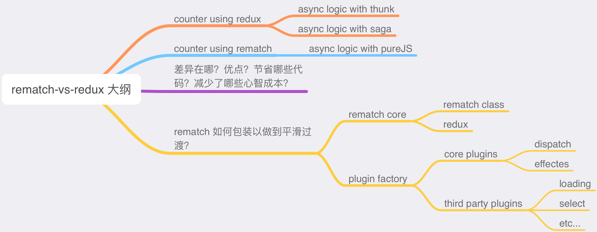
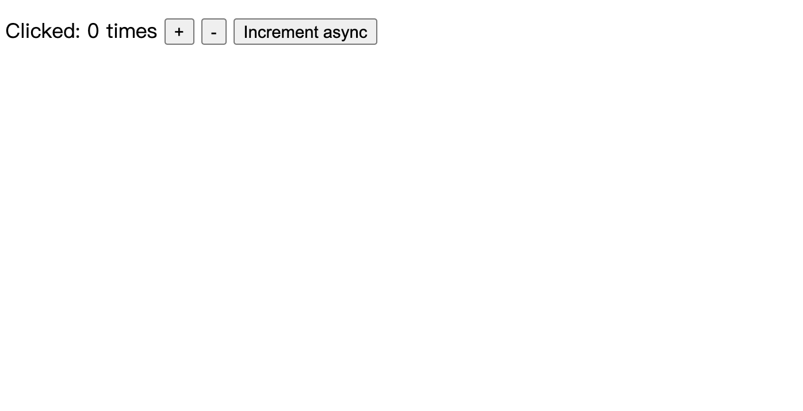
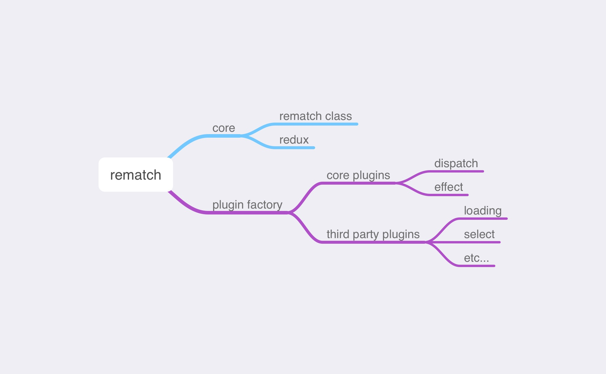

Rematch 源码解读系列的第 1️⃣ 篇，对比 Rematch 和 Redux。

<!--more-->

看完 [【译】重新设计 Redux ](https://juejin.cn/post/6961006341347344421)后，这篇文章会继续聊聊 Rematch 和 Redux 的区别。我将分别用 Redux 和 Rematch 实现一个简易的计数器（Counter），其中 Redux 实现版本中对异步的处理分别使用 [redux-thunk](https://github.com/reduxjs/redux-thunk) 和 [redux-saga](https://github.com/redux-saga/redux-saga)。通过这个例子，我们来比较 Rematch 和 Redux 的差异，以及 Rematch 的优点在哪（减少了哪些学习成本，减少了哪些代码等等），最后，来讲讲 Rematch 如何包装 Redux，来做到平滑过渡的，这将涉及到 Rematch 的代码架构，我把它分成了几个部分，在后面的文章中会逐一讲解。

## 文章大纲



## 简易计数器（Counter）案例

下面我会用 Redux 和 Rematch 分别实现一个 React 版本的简易计数器，计数器包含增加、减少和异步增加功能。

页面截图如下：



### Redux 实现

纯 Redux 实现版本中，对于异步增加功能的实现，一种方案使用了 [redux-thunk](https://github.com/reduxjs/redux-thunk)，另一种使用了 [redux-saga](https://github.com/redux-saga/redux-saga)。

目录结构很简单：

```
src
|—— components
|  |—— Counter.js
|—— reducers
|	 |—— index.js
|—— index.js
```

其中 `components/Counter.js` 代码如下：

```js
import React, { Component } from "react";
import PropTypes from "prop-types";

class Counter extends Component {
  render() {
    const { value, onIncrement, onDecrement, onIncrementAsync } = this.props;
    return (
      <p>
        Clicked: {value} times <button onClick={onIncrement}>+</button>{" "}
        <button onClick={onDecrement}>-</button>{" "}
        <button onClick={onIncrementAsync}>Increment async</button>
      </p>
    );
  }
}

Counter.propTypes = {
  value: PropTypes.number.isRequired,
  onIncrement: PropTypes.func.isRequired,
  onDecrement: PropTypes.func.isRequired,
  onIncrementAsync: PropTypes.func.isRequired,
};

export default Counter;
```

`reducers/index.js` 代码如下：

```js
export default (state = 0, action) => {
  switch (action.type) {
    case "INCREMENT":
      return state + 1;
    case "DECREMENT":
      return state - 1;
    default:
      return state;
  }
};
```

而 `index.js` 中的代码，由于包含异步逻辑，因此按使用的方案不同，代码也有差异，下面分别说明。

#### 异步基于 redux-thunk

[完整代码请点击](https://codesandbox.io/s/counter-demo-using-redux-thunk-257hc)

如果异步使用 redux-thunk，`index.js` 中代码如下：

```js
import React from "react";
import ReactDOM from "react-dom";
import { applyMiddleware, createStore } from "redux";
import Counter from "./components/Counter";
import counter from "./reducers";
import thunk from "redux-thunk";

const store = createStore(counter, applyMiddleware(thunk));
const rootEl = document.getElementById("root");

function fakeAsyncLogic() {
  return new Promise(function (rs) {
    setTimeout(rs, 1000);
  });
}

function makeAsyncIncrementAction() {
  return async function (dispatch) {
    await fakeAsyncLogic();
    dispatch({ type: "INCREMENT" });
  };
}

const render = () =>
  ReactDOM.render(
    <Counter
      value={store.getState()}
      onIncrement={() => store.dispatch({ type: "INCREMENT" })}
      onDecrement={() => store.dispatch({ type: "DECREMENT" })}
      onIncrementAsync={() => store.dispatch(makeAsyncIncrementAction())}
    />,
    rootEl
  );

render();
store.subscribe(render);
```

使用了 thunk 中间件以后，`dispatch()` 可以接收函数作为参数，然后 redux store 会将 `dispatch` 和 `getState` 作为参数传入该函数中，这样一来，如果该函数是异步函数，则可以实现异步派发 action。

#### 异步基于 redux-saga

[完整代码请点击](https://codesandbox.io/s/counter-demo-using-redux-saga-5c6uu)

如果异步使用 redux-saga，`index.js` 中代码如下：

```js
import React from "react";
import ReactDOM from "react-dom";
import { createStore, applyMiddleware } from "redux";
import createSagaMiddleware from "redux-saga";
import Counter from "./components/Counter";
import counter from "./reducers";
import defaultSaga from "./reducers/saga";

const sagaMiddleware = createSagaMiddleware();

const store = createStore(counter, applyMiddleware(sagaMiddleware));
const rootEl = document.getElementById("root");

sagaMiddleware.run(defaultSaga);

const render = () =>
  ReactDOM.render(
    <Counter
      value={store.getState()}
      onIncrement={() => store.dispatch({ type: "INCREMENT" })}
      onDecrement={() => store.dispatch({ type: "DECREMENT" })}
      onIncrementAsync={() => store.dispatch({ type: "INCREMENT_ASYNC" })}
    />,
    rootEl
  );

render();
store.subscribe(render);
```

除了中间件配置代码那里的不同，saga 不是像 redux-thunk 那样派发一个函数作为 action，而是需要定义一些 saga 的异步逻辑（使用 saga 自带的一些异步 API），因此，`src/reducers` 目录下增加一个 `saga.js`：

```js
import { takeEvery, call, put } from "redux-saga/effects";

async function fakeAsyncLogic() {
  return new Promise((rs) => setTimeout(rs, 1000));
}

function* increamentAsync() {
  yield call(fakeAsyncLogic);
  yield put({ type: "INCREMENT" });
}

export default function* defaultSaga() {
  yield takeEvery("INCREMENT_ASYNC", increamentAsync);
}
```

saga 使用[迭代器函数（generator）](https://developer.mozilla.org/en-US/docs/Web/JavaScript/Reference/Global_Objects/Generator)来更加精细地控制异步流。上面代码导出了一个默认 saga 函数，`takeEvery("INCREMENT_ASYNC", increamentAsync)` 表示监听所有 `action.type` 为 `INCREMENT_ASYNC` 的 action，一旦监听到，执行 `increamentAsync()` 函数，在该函数中，使用 `call(fakeAsyncLogic)` 模拟异步调用，然后使用 `put({ type: "INCREMENT" })` 来派发一个 action，最终这个 action 会使得 reducer 执行。

### Rematch 实现

[完整代码请点击](https://codesandbox.io/s/counter-demo-using-rematch-3u2nf)

Rematch 中没有单独的 reducers，reducer 都归属于一个数据结构叫做 model，因此目录结构稍有不同（将 `reducers` 换为 `models`）：

```
src
|—— components
|  |—— Counter.js
|—— models
|  |—— index.js
|—— index.js
```

`Counter.js` 中代码不变，`models/index.js` 中代码如下：

```js
async function fakeAsyncLogic() {
  return new Promise((rs) => {
    setTimeout(rs, 1000);
  });
}

export const count = {
  state: 0,
  reducers: {
    increment: (state) => {
      return state + 1;
    },
    decrement: (state) => {
      return state - 1;
    },
  },
  effects: (dispatch) => ({
    async incrementAsync() {
      await fakeAsyncLogic();
      dispatch.count.increment();
    },
  }),
};
```

可以看到，我们定义了一个叫做 `count` 的 model，其中包含了 `state`，`reducers` 以及 `effectes`，`state` 是归属于该 model 的数据，相当于 redux 中 reducer 函数的第一个参数（或者其返回值）。`reducers` 等同于 redux reducer，而最后的 `effects` 则是一些有副作用的逻辑（例如异步的接口调用等等）。

最后是 `index.js`：

```js
import { init } from "@rematch/core";
import React from "react";
import ReactDOM from "react-dom";
import Counter from "./components/Counter";
import * as models from "./models";

const store = init({ models });
// const store = createStore(counter, applyMiddleware(thunk));
const rootEl = document.getElementById("root");

const render = () =>
  ReactDOM.render(
    <Counter
      value={store.getState().count}
      onIncrement={store.dispatch.count.increment}
      onDecrement={() => store.dispatch({ type: "count/decrement" })}
      onIncrementAsync={() => store.dispatch({ type: "count/incrementAsync" })}
    />,
    rootEl
  );

render();
store.subscribe(render);
```

此时 `store` 不再需要用 redux 的 API `createStore` 创建，而是使用 rematch 的 `init`。这里还需要注意 2 点：

1. 此时 `store.getState()` 返回的不再是一个数值，而是 `{ count: number }`
2. `store.dispatch` 不仅仅是一个函数（维持 redux 调用方式），同时支持了 `dispatch.modelName.xxx` 这样调用一个 reducer 或者 effect。不过需要注意的是，`action.type` 此时为 `modelName/reducerName` 或者 `modelName/effectName` 这种形式

前面提到过，rematch 中的最小组成单元就是一个 model。因此上述的改动也是为了兼容 model 这种形式。

## rematch vs redux

通过上面的例子，可以看出两者有如下几点不同：

1. 如果使用 redux，异步需要单独使用中间件，例如 thunk 或 saga。而 rematch 中可以直接使用 ES 的 `async/await` 异步语法来实现异步派发 action。
2. redux 中没有 model 的概念，如果 state 结构复杂，可以使用 [combineReducers](https://redux.js.org/recipes/structuring-reducers/initializing-state#combined-reducers) 来合并不同的 reducer，同时形成一个类似的 state 结构。而 rematch 原生支持。
3. redux 的 `store.dispatch` 就是一个函数。但 rematch 中保留了函数功能，同时提供了链式调用的方式。

由于上面例子比较简单，因此差异不多。更多差异可以参考[【Rematch 源码系列】零、重新设计 Redux](../rematch-series-redesigning-redux/)。这里再提两点比较常见的差异：

1. redux 更多的使用了函数式编程的思想，例如 store 初始化时，其提供了一个工具函数 [`compose`](https://redux.js.org/api/compose) 用于组合 store enhancer。
2. 简化的 reducer，主要包括省略了 `action.type` 常量定义，省略了 reducer 中的 `switch/case` 分支判断，因此 rematch 中的 model 的一个 reducer 就相当于一个 `case` 分支，其 name 就相当于 `action.type`。

个人觉得，rematch 优于 redux 的主要在于三个地方：

1. 更”合理“的数据结构设计，rematch 使用 model 的概念，整合了 state, reducer 以及 effect，这种整合在前端开发中非常实用，例如可以针对不同的页面路由设计不同的 model。
2. 更简洁的 API 设计，redux 中使用的函数组合配置方法，对于不熟悉函数式编程的开发者来说，一开始可能比较困惑，而 rematch 使用的是基于对象的配置项，更加易于上手。
3. 更少的代码。

- 移除了 redux 中大量的 `action.type` 常量以及分支判断
- 原生语法支持异步，无需使用中间件。使用 saga 有一定学习成本，使用 thunk，派发的 action 类型各异，也会产生一定困惑

除此之外，rematch 还提供了插件机制，除了社区开发的很多插件，我们还可以进行定制开发，关于插件会在后面文章中详细介绍。

## rematch 的代码结构

我们知道，rematch 其实只是基于 redux 的包装，它把 redux 复杂的语法变得简单化了：

> Rematch is Redux best practices without the boilerplate.

正因为如此，它顶层还是 redux，并没有减弱 redux 的功能。那么，rematch 是如何做到的，他是如何设计的？我接下来会基于 rematch v1.4.0（rematch v1 的最后一个版本）来讲解 rematch 核心代码结构。

> 注：译者参与推动了 rematch v2 的更新，会在后面专门写一篇文章介绍 rematch v1 到 v2 的变化。此处使用 v1，是因为代码逻辑并无根本变化，v1 更易于阅读和理解，而 v2 风格变化较大。

先来看看 rematch v1.4.0 的代码目录结构：

```
...
plugins
|—— ...
|—— loading
|—— immer
|—— select
src
|—— plugins
|  |—— dispatch.ts
|  |—— effects.ts
|—— typings
|  |—— index.ts
|—— utils
|  |—— deprecate.ts
|  |—— isListener.ts
|  |—— mergeConfig.ts
|  |—— validate.ts
|—— index.ts
|—— pluginFactory.ts
|—— redux.ts
|—— rematch.ts
```

我将 rematch 的代码拆分如下几个组成部分：



rematch 由 core 和 plugin 组成，其中 core 分为两部分，分别是 rematch 类和 `redux.ts` 这个文件，前者为 rematch 核心源码，后者主要包含 reducer 合并的一些代码，用于创建 redux store。

而 plugin 是 rematch 提供的插件机制，用于增强 rematch 的功能，主要代码定义在 plugin factory 中。rematch core 中包含了两个核心的 plugin，分别是 dispatch 和 effect，dispatch 插件可以增强 `store.dispatch` 功能，让其支持链式调用。而 effect 插件主要是用于支持 `async/await` 这种异步模式。除了这两个 plugin，rematch 团队还开发了其他的第三方插件，例如 loading, select 等等，集成了异步请求 loading 状态和 selector。

接下来，我会分别讲解这些部分，拆细一点，就是 rematch core，plugin factory && core plugins，3rd party plugins，一共 3 篇文章。3 篇文章结束后，我还会写 2 篇文章，其中一篇为 rematch v1 到 v2 升级的变化，另一篇介绍 rematch 类型系统（这是升级到 v2 带来的最大变化）以及这个类型系统残留的一些问题和难点，与大家探讨。

敬请期待！
