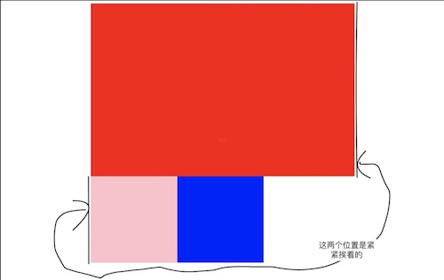

浮动流模型解析，及其相关的经典布局实现。

<!--more-->

## 写在前面

认识浮动元素已经很久了，但是最开始只用它来对齐文档，最近整理笔记又复习到双飞翼布局和圣杯布局。这两种布局的实现，恰恰也是借助了浮动流的魔力。在笔记中搜索‘’float‘’或者‘’浮动‘’，可以找到 10 个条目，结合着旧知识，今天再复习一波

## 什么是浮动元素

### CSS 定义

浮动元素，正如其名，它“浮”在文档表面，不占据正常文档流，我们让一个元素浮动很简单，只要设置 float 属性即可，可以让它浮动到父元素的最左边或者最右边

```css
img {
  float: left;
}
```

### 浮动布局的来源

浮动布局最开始是用来实现杂志上的图片和文字混排，主要是文字围绕图片的效果


<span>在 HTML5 以前，还可以使用``来实现这一功能</span>

后来，Web 开发者们发现使用 float 可以浮动任何元素，不仅仅是 images，而且由于浮动的特性，后一个浮动元素贴着前一个浮动元素（假设它们都向左浮动），所以浮动还可以用来布局，特别是多列布局

现在随着 Flex 布局，以及一些其他布局技巧的出现，Float 用来布局只能算作是过时的技术，但是正是由于它的魔力，我们实现了很多不可思议的布局。最为出名的，还是圣杯布局和双飞翼布局了

> **浮动元素不占据文档流，因此后面的元素会当它不存在，但是有以下几点需要注意：**
>
> **1. 如果其兄弟元素是块级元素，会当它不存在而覆盖它**
>
> **2. 如果是行内元素，则是会围绕它**
>
> **3. 如果兄弟是块级元素但是其内容是行内元素，那么这些行内元素还是会围绕浮动元素**

## 经典的三栏布局问题

有一个经典的三栏布局问题：左右边栏宽度固定，中间栏宽度自适应，但是中间部分内容较为重要，需要首先渲染（也就是先出现在 DOM 中），该如何实现？

如果单单提到三栏布局，不限制三栏在 DOM 中顺序的话，网上有很多方法，我记得比较深刻的是下面两种

> 1.  左右两栏相对父元素 container 进行绝对定位，中间一栏设置左右 margin 分别等于边栏宽度。这种做法中间一栏出现在 DOM 中的位置都 OK
> 2.  自身浮动布局：左右两边分别向左和向右浮动，中间一栏出现在 DOM 最后面，由于浮动元素脱离文档流，中间栏设置好左右 margin 等于边栏宽度即可

<iframe height='617' scrolling='no' title='三栏布局 - 绝对定位和自身浮动' src='//codepen.io/tianzhich/embed/JadRGY/?height=617&theme-id=dark&default-tab=css,result&embed-version=2' frameborder='no' allowtransparency='true' allowfullscreen='true' style='width: 100%;'>See the Pen <a href='https://codepen.io/tianzhich/pen/JadRGY/'>三栏布局 - 绝对定位和自身浮动</a> by Tian Zhi (<a href='https://codepen.io/tianzhich'>@tianzhich</a>) on <a href='https://codepen.io'>CodePen</a>.
</iframe>

当然，除了上面两种，还可以使用 Flex 布局，以及接下来提到的圣杯布局，双飞翼布局

## 圣杯布局

圣杯布局来源于 2006 年发表在 alistapart 的一篇文章[In Search of the Holy Grail](https://alistapart.com/article/holygrail)。圣杯有西方“渴求之物”的意思，可能也是想说明这个布局在当时的重要性

圣杯布局解决的是三栏布局问题：左右边栏宽度固定，中间栏宽度自适应，但是中间部分内容较为重要，需要首先渲染（也就是先出现在 DOM 中）

```html
<div id="container">
  <div id="center" class="column"></div>
  <div id="left" class="column"></div>
  <div id="right" class="column"></div>
</div>
```

圣杯布局采用的方法是让父元素 container 使用 padding 为左右两边预留出空间，然后中间占比 100%，三栏自然浮动，例如

```css
#container {
  padding: 0 200px;
}
#center {
  float: left;
  width: 100%;
  height: 400px;
  background-color: red;
}
#left {
  float: left;
  height: 200px;
  width: 200px;
  background-color: pink;
}
#right {
  float: left;
  height: 200px;
  background-color: blue;
  width: 200px;
}
```

效果图如下



此时我们只需要让左右两边分别上去，怎么上去呢？正常流来说是上不去的（设置负的 margin-left 很大只会让它从左边溢出文档）。而浮动流，却可以让它们上去。**这里我们先看圣杯和双飞翼的实现结果，浮动流的秘密最后再给出详细解释。**

这里我们让左边栏`margin-left: -100%`，右边栏`margin-right: -200px`（自身宽度）使它们的位置发生偏移


> **注意**
>
> - 之前看到一些解释都是左右两边都是相对布局，其实不然，包括圣杯布局那篇文章给出的也只是左边使用了相对布局，看上面的图也能明白，右边已经到了正确的位置
> - 如果右边一定要使用相对布局的话，则右边栏是设置为`margin-left: -200px`，然后相对布局，向右位移 200px，这里设置`margin-left`和`margin-right`在表现上有细微的不同，最后面给出了我的一些看法

最后设置左边`position: relative; right: 200px`即可


再来看看双飞翼

## 双飞翼布局

双飞翼布局解决的问题和圣杯布局一样，都是三栏布局，中间自适应，中间最先出现在 DOM 中，那为何还要出现双飞翼布局。**因为圣杯布局会出现坍塌**，因此据说淘宝 UED 发明了双飞翼布局，从名字来看，双飞翼比圣杯更能描述这种布局

### 圣杯布局的坍塌

圣杯布局在中间一栏宽度小于两边任意一栏时，会不起作用，还是刚才的例子，只不过把中间栏宽度缩小


为什么会这样，你可能会想，明明两边空白还足够啊？这也和浮动流有关，如果着急了解，你可以直接往下看。而这里先知道圣杯布局会失败，因此才有更好的双飞翼布局出现

### 双飞翼布局的优势

双飞翼布局相对于圣杯布局，不再让父元素给左右两边腾出位置，而中间一栏又不知道宽度。这样其实中间一栏居中只能设置`margin-left = margin-right`为左右两栏宽度，但是由于最终要把左右两栏位移上来（只能通过浮动流），但是浮动流必须设置宽度（width 或 padding 或 border），否则将不存在。与中间栏不知道宽度造成矛盾

双飞翼布局使用了一个 trick，多用了一个 div，在中间栏 div 下再使用一个 div 用来显示 content（这里我不再使用 container，可以认为 container 就是 body）

```html
<div class="main">
  <div class="main-content"></div>
</div>
<div class="left"></div>
<div class="right"></div>
```

这样做可以设定中间一栏的宽度为 100%，而真正的内容区域设置好左右 margin 给左右边栏留出位置即可，然后让外面这层父元素进行浮动

```css
.main {
  width: 100%;
  float: left;
}
.main-content {
  background-color: pink;
  margin: 0 200px;
  height: 300px;
}
.left {
  background-color: red;
  width: 200px;
  height: 150px;
  float: left;
}
.right {
  background-color: blue;
  width: 200px;
  height: 150px;
  float: left;
}
```


注意这里和圣杯的不一样，由于左右栏的直接父元素为 body（没有限制宽度），因此它们靠在了最左边

我们让左边`margin-left: -100%`，右边`margin-left:-200px`


直接一步到位而且不会坍塌

最后给出对浮动流流动的个人见解，以及对上面两个布局给出详细解释

## 浮动流到底是如何流动的

### 浮动流的基本常识

我们先看看 MDN 上对于浮动元素位置的基本解释

> when an element is floated, it is taken out of the normal flow of the document (though still remaining part of it). It is shifted to the left, or right, until it touches the edge of its containing box, *or another floated element*.

意思就是一个元素如果设置为浮动，会抽离文档流，以`float: left`为例，会向左移动，直到其碰到其父元素的左边距或者是其余的浮动元素

如果元素均向左浮动，浮动流从左向右。那么，当一行空间不足会怎么样呢？看一个例子

<iframe height='416' scrolling='no' title='浮动流如何流' src='//codepen.io/tianzhich/embed/aaZPEa/?height=416&theme-id=dark&default-tab=css,result&embed-version=2' frameborder='no' allowtransparency='true' allowfullscreen='true' style='width: 100%;'>See the Pen <a href='https://codepen.io/tianzhich/pen/aaZPEa/'>浮动流如何流</a> by Tian Zhi (<a href='https://codepen.io/tianzhich'>@tianzhich</a>) on <a href='https://codepen.io'>CodePen</a>.
</iframe>

以上元素均向左浮动，第三个元素没有空间了，此时它并非直接另起一行，而是在第二个元素下方向左移动，直到遇到第一个浮动元素边界

基于这个原则，我们可以知道浮动元素如果换行，是基于它原本位置并向左移（假设`float: left`）

### 左右边栏是怎么位移上去的

我们先来看圣杯布局和双飞翼布局中，左右边栏未上去的情况

- **双飞翼布局-左右边栏在下一行**


```html
<div class="main">
  <div class="main-content"></div>
</div>
<div class="left"></div>
<div class="right"></div>
```

双飞翼中父元素(body)宽度为 100%。左边栏紧靠中间栏`div.main-content`外层容器`div.main`的右边，见上图

由于**设置负的`margin-left`值，可以让元素回流**，100%则是相对于父元素的`width`而言的，因此双飞翼布局就很好解释了

- **双飞翼布局-左右边栏回流上去**


再来回过头看圣杯布局

- **圣杯布局-左右边栏在下一行**


```html
<div id="container">
  <div id="center" class="column"></div>
  <div id="left" class="column"></div>
  <div id="right" class="column"></div>
</div>
```

对于圣杯布局，父元素`div#container`宽度即为`div#center`宽度。左边栏的位移和双飞翼一样，**只不过上去之后再使用相对定位往左偏移**。而对于右边栏，位移上去使用的是负的`margin-right`，负的`margin-right`的作用是使文档流后面的元素回流，而且可能覆盖它自身，所以在这里换一种方式或许好理解一些

> 之前提到父元素宽度不够，所以左边栏会换到下一行，设置负的`margin-right`，可以用它抵消掉自身的`width`，在不考虑`border`的情况下，如果全部抵消(盒子宽度为 0)，就**仿佛自己不存在**。第一行自然可以容纳它，结果就会流回去。但是要记住，使用负的`margin-left`是使自身发生偏移，而负的`margin-right`抵消自身宽度，只是**假装自己不存在**，并不会发生位移，也就是说，哪怕`margin-right`绝对值再大，它也只能紧紧挨着前一个浮动元素边界

因此我们直接让右边栏**假装自己不存在**从而移到上一行

- **圣杯布局-左右边栏回流上去**


### 圣杯布局坍塌原因

再来看看刚才那张图


看完前面的解释，这里也不难理解为什么左右两边上不去了：

1. 对于左边栏，设置`margin-left: -100%`，并**不能完全抵消掉**自身宽度，因此上不去
2. 而对于右边栏，设置`margin-right`为负的自身宽度，即使抵消掉自身宽度，但是由于它的浮动位置位于左边栏之后，**不能跨过左边栏进行位移**，由于左边栏上不去，因此，右边栏也无法上去

而双飞翼则完全没有这个问题，因为父元素的 width 不受限，左右边栏完全只需要使用负的`margin-left`发生位移，移动到自己的位置上去即可

## 总结

其实通过对这两个布局的深入探讨，已经可以知道浮动流的秘密，特别是反向流动时的一些表现

当然，本文没有对负的 margin 值进行深入研究，关于这个的研究，网上也可以找到很多例子。其实弄懂了负 margin 和浮动流，不仅可以知道很多 CSS trick，而且对于使用浮动元素的布局也理解得更深（即使现在已经不常使用了）

## 参考

1. 本文的例子来自我的[CodePen](https://codepen.io/tianzhich/)，都是一些简单的代码，需要可以自行查看
2. [Float -- MDN](https://developer.mozilla.org/en-US/docs/Web/CSS/float)
3. [CSS 布局中圣杯布局与双飞翼布局的实现思路差异在哪里？-- 知乎](https://www.zhihu.com/question/21504052)
4. [CSS 布局奇淫巧计之-强大的负边距 -- 博客园(无双)](https://www.cnblogs.com/2050/archive/2012/08/13/2636467.html)
5. [margin 为负值产生的影响和常见布局应用 — 简书(琦乐无穷)](https://www.jianshu.com/p/549aaa5fabaa)
