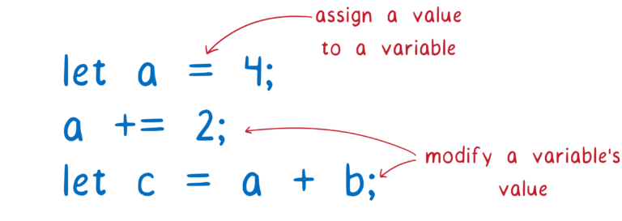

漫画下的 ECMAScript 模块系统。

<!--more-->

## 关于作者

作者名叫 [Lin Clark](https://twitter.com/linclark)，高级工程师，在 Mozilla，NPM 工作过，在 Mozilla 工作内容主要是 Rust 和 WebAssembly。译者也是从 [MDN（Mozilla Developer Network）](https://developer.mozilla.org/en-US/docs/Web/JavaScript/Guide/Modules#see_also) 中发现了[这篇优秀的文章](https://hacks.mozilla.org/2018/03/es-modules-a-cartoon-deep-dive/)，因此想翻译下来。

## 注意事项

这篇文章发布于 2018 年 3 月 28 日，因此文章中部分结论可能不准确，请理性看待。

本文翻译难度较大，部分术语无法直译，因此打算保持原文单词，在这里先汇总说明。

1. load：原文中的 load，有时指网络请求，有时则指模块从获取，解析到最终运行的全过程。都直译为**加载**有些不妥，因此译文中的**模块加载**均指后者，而网络请求部分则直接叫”请求“或”网络请求“。
2. ESM：ECMAScript 模块
3. CJS：CommonJS 模块
4. Module Record(s)：直译是模块记录，由于是术语，文中均保持原文

以下为正文：

---

ESM 规范为 JavaScript 带来了标准化的模块系统。不过，这一过程很漫长，标准的制定花了近 10 年时间。

等待终于快结束了。随着 18 年 5 月 Firefox 60 的发布，所有主要浏览器都将支持 ESM，且 NodeJS 的模块团队也在开发以支持这一模块系统。除此之外，[ES 模块对 WebAssembly 的支持也正在进行](https://www.youtube.com/watch?v=qR_b5gajwug)。

许多 JS 开发者知道 ESM 一经推出就争议不断，但却很少有人知道其工作原理。

让我们来看看 ESM 解决了什么问题，以及它与其他模块系统的不同之处。

## 模块化解决了哪些问题？

仔细想想，你使用 JavaScript 编程的时候，是不是都在管理变量？把值赋给一个变量，或者是组合两个变量的值，将其赋值给一个新的变量等等。

因为太多代码都是在更新变量，如何组织和管理这些变量，将会影响你能否写出良好且便于维护的代码。

如果一次只考虑代码中的一小部分变量，事情就简单多了。JavaScript 中可以使用作用域（scope），由于作用域的存在，一个函数不能访问其他函数中声明的变量。

这样很方便，当你编写函数时，只需要考虑该函数中定义的变量，不必担心其他函数可能更改它们。

但是，缺点是函数间的变量共享变得困难了。

如果你想在函数作用域外共享变量，一个通用的方法是将它放在外部作用域，也就是全局作用域。

你也许会想起使用 jQuery 的时候。在加载任何 jQuery 插件时，需要确保在全局作用域中能访问到 jQuery 实例。

这样看似 OK，但也造成了很多烦人的问题。

首先，你所有的 JavaScript 脚本需要以正确的顺序加载，且需要保证没有其他人破坏这个顺序。

如果顺序被破坏，程序运行会抛出错误。当一个函数运行需要访问全局作用域中的 jQuery 却没有找到时，它将会抛出错误，并停止执行。

这使得代码难以维护。移除旧代码（或者整个 JavaScript 脚本）就像玩轮盘游戏，你不知道会发生什么。脚本之间的依赖是隐含的。任何函数可以访问全局作用域的任何变量，所以你不知道哪个函数依赖了哪个脚本。

第二个问题是，由于这些变量位于全局作用域，作用域下的任何代码都可以更改这些变量，恶意代码可能会执行违背你本意的操作，即使是非恶意的代码，也可能会不小心破坏这些变量。

## 模块化是怎么解决这些问题的？

模块化提供了一个更好的办法用于组织这些变量和函数。有了模块，你可以将相关的变量和函数组合在一起。

这些变量和函数位于模块作用域，该作用域下的函数可以共享这些变量。

但与函数作用域不同的是，模块作用域提供了一种机制可以将内部的变量也共享给其他模块，且需要显示声明哪些可以被共享。

能被其他模块访问的变量，叫导出（export）的变量。一旦导出了变量，其他模块就可以显式导入（import）它们。

由于这是一种显式的关系，移除了一个模块后，哪些模块会被破坏也一目了然。

一旦可以在模块之间导入和导出变量，代码拆分也将变得容易，拆分后的代码可以独立使用，或自由组合，就像乐高积木一样，同一组模块能够创建出不同的应用。

由于模块化如此有用，已经有许多方案尝试将其引入 JavaScript。目前主流的方法有两种，CommonJS（CJS）是 Node.js 一直以来在用的，EcmaScript modules（ESM）则刚被加入到 JavaScript 语言规范。浏览器已经支持 ESM，Node.js 也在进行相关支持。

让我们深入地看看这个新的模块系统 ESM 是如何工作的。

## ESM 如何工作？

使用模块进行开发时，实际上是在构建一张模块依赖关系图。不同模块之间的联系取决于 `import` 声明语句。

`import` 声明语句告诉浏览器或者 Node 应该加载哪些代码。你还需要为依赖关系图定义一个入口文件（entry point），从这个文件开始，通过里面的 `import` 声明语句，找到所有它依赖的模块文件。

但浏览器并不能直接使用这些文件，而是需要将它们解析成一个叫做 **Module Record** 的数据结构后，才能知道这些文件是做什么的。

此后，Module Record 需要被转化成一个模块实例（ **Module Instance**），它包含两部分：代码（Code）和程序状态（State，译者注：其实就是程序运行中的数据变量）。

代码就是一组指令，就像一份食谱，教你如何做一道菜。但仅仅靠它还不够，你还需要原材料。

什么是程序状态？程序状态会为你提供上述所需原材料。程序状态就是程序运行中变量的值。当然，这些变量只是内存地址的别称，内存中存储着真正的值。

所以模块实例包含了代码（一组指令）和程序状态（所有变量的值）。

对于每个模块，我们需要的是一个模块实例。模块加载的过程就是从一个入口文件开始，建立起一张完整的模块实例关系图。

对于 ESM，这个过程分为以下三个步骤：

1. 构建（Construction），找到并下载所有文件，并将它们解析为 Module Record。
2. 实例化（Instantiation），分配内存地址，用于存放模块导出的值（此时值还没有被真正填充到内存）。然后让对应导出变量（exports）和导入变量（imports）指向该地址，这个过程称为链接（Linking）。
3. 执行（Evaluation），执行代码，将导出变量真实的值存储到第二步分配的内存中。

有人称 ESM 是异步的，你可以这么认为，因为模块加载被分为上面三个阶段，获取模块，初始化，最后执行它，这些过程可以分开进行。

这意味着 ESM 规范中确实提供了一种在 CJS 中没有的异步规范（这个我后面会具体解释）。在 CJS 中，模块及其依赖模块的下载、初始化到最后执行都在一起，各个过程之间没有分界线。

然而，这些步骤自身并非异步，它们可以同步执行，这取决于加载的方式。因为并非所有过程都归 ESM 规范定义。实际上上述步骤包含两个部分，它们分别来自不同的规范定义。

[ESM 规范](https://tc39.github.io/ecma262/#sec-modules)说明了如何将文件转化为模块记录，如何实例化模块，以及运行模块代码，然而没有说明首先如何获取模块文件。

负责获取模块文件的是 loader，而 loader 定义在不同的规范中（浏览器中是 [HTML 规范](https://html.spec.whatwg.org/#fetch-a-module-script-tree)）。不同的平台可以使用不同的 loader。

loader 通过调用 ESM 规范中的一些方法例如：`ParseModule`，`Module.Instantiate`，`Module.Evaluate` 等等来加载模块，就像演木偶戏的人（loader）操控着木偶（JS 引擎）来完成一些动作。

来详细看看这几个步骤：

### 构建（Construction）

构建过程分为三步：

1. 确定模块文件的下载地址（又称模块解析（module resolution））
2. 获取文件（通过 URL 下载或者从文件系统中访问）
3. 将文件解析为 Module Record

#### 找到并获取文件

loader 负责找到并获取文件。首先它需要找到入口文件。在 HTML 中可以通过 script 标签来指定：

但如何找到 `main.js` 所依赖的其他模块文件呢？

这需要通过 `import` 声明语句。`import` 语句的一部分是模块标识符（module specifier）,loader 根据它来找到其他模块。

关于模块标识符有一点需要注意：有时它们在浏览器和 Node 上的解析会不一致。每个宿主环境有一套自己的算法（称为模块解析算法（module resolution algorithm））用于处理模块标识符，不同的平台算法也有差异。目前，一些在 Node 中解析正确的标识符，在浏览器中会解析出错，[这个问题正在被修复](https://github.com/domenic/package-name-maps)。

在这个问题解决前，浏览器都只接受 URL 作为模块标识符，并从这里获取模块文件。但是此时还无法得到完整的模块文件依赖图，在解析模块内容之前，你不知道其还依赖了哪些模块，而在获取到这个模块之前，你又无法解析它。

这意味着我们必须一层层地遍历依赖树结构，解析一个模块文件，确定它的依赖模块，然后再找到并获取这些模块文件。

如果主线程等待着这些文件被请求下载，那么其他的任务都将堵塞在任务队列中。

因为在浏览器中，下载非常耗时：

这样一来，堵塞主线程将会使得基于 ESM 的应用变得卡顿，难以使用。这也是 ESM 将模块加载算法分为多个阶段的原因之一。将构建这一阶段单独分割出来，浏览器就可以在执行同步操作（初始化模块）之前获取所有的模块文件，并构建出完整的模块依赖图，有助于对模块依赖关系的理解。

将加载算法分为多个阶段，是 ESM 和 CJS 的主要差异之一。

CJS 的模块加载过程不太一样，因为从文件系统中获取模块文件，比网络请求快得多。这意味着 Node 在获取文件时，即使阻塞主线程也没问题。当文件很快被获取到时，解析，初始化以及代码运行便可以一起进行（CJS 中这些并不是单独的阶段）。这也意味着你可以遍历一整棵树，获取依赖模块，解析，初始化，执行它，最后再返回模块实例。

CJS 的这种加载方式有一些不那么容易想到的结果，我将在后面解释。在基于 CJS 模块的 Node 中，你可以在模块标识符中使用变量，因为在此前的代码都被执行过了（`require()` 声明语句之前的代码），所以做模块解析的时候，变量已被正确赋值。

但是在 ESM 中，整个模块依赖图是在代码运行前构建的，所以你无法在标识符中使用变量，因为这些变量还未被赋值。

有时，在模块路径中使用变量是很方便的，例如，你可能需要根据代码执行结果，或者不同的运行环境，决定要加载哪个模块。

为了在 ESM 中能这样做，当前有一个提案[动态 import（dynamic import）](https://github.com/tc39/proposal-dynamic-import)，可以通过 `` import(`${path}/foo.js`) `` 来动态导入模块。

任何通过 `import()` 导入的模块，都会被视作另一个模块依赖关系图的入口，被分开处理。

不过要注意：因为 loader 可以缓存模块实例，这些关系图中的同一个模块，都将共享一个模块实例。对于特定全局作用域下的每个模块，都只有一个模块实例。

这减少了浏览器引擎的工作。例如，尽管一个模块可能被多个模块依赖，但是只会被请求一次（这是缓存模块的原因之一，而在在模块执行这一部分你会看到另一个原因）

loader 通过一个叫做模块表（module map）的结构管理着模块缓存。每个全局作用域都有自己的模块表，用于跟踪其包含的所有模块。

当 loader 准备请求模块文件的 URL 时，它把 URL 放到模块表里，并标识该模块正在请求，然后将发出请求，并继续准备请求下一个模块。

如果另一个模块依赖同一个模块文件怎么办？loader 会在模块表里查找对应 URL，如果有 `fetching` 标识，它会跳过该模块，继续请求下一个模块。

后面会提到，模块表除了跟踪哪些模块已被请求之外，也被用于缓存模块的执行。

#### 解析文件

现在我们已经获取了模块文件，需要将其解析为 Module Record，以便浏览器理解模块的组成。

Module Record 创建完毕后，会被放入模块表。后面不管什么时候再请求该模块，loader 都可以直接从模块表中获取它。

解析过程中，有一个看似微不足道的细节，其实意义重大。所有模块解析时会使用严格模式，类似代码顶部有一个隐藏的 `"use strict"`。除此之外还有一些细微影响，例如，在模块顶层代码中，关键字 `await` 被保留起来，`this` 的值为 `undefined`。

解析过程中不同的解析方式称为不同的”解析目标（parse goal）“，如果使用不同的目标解析同一个文件，结果也会不一样。所以解析前你需要知道解析文件的类型，例如是否是模块。

在浏览器中非常简单，只需要在 script 标签上添加 `type="module"` 属性即可，这告诉浏览器这个文件将会以模块标准进行解析。由于只有模块可以被导入，所以模块文件导入的依赖文件也会被当成模块处理。

但是在 Node 环境中，你不使用 HTML 标签，所以无法设置 `type` 属性。社区有一个解决方法是使用 `.mjs` 作为文件后缀，从而告诉 Node 这个文件是模块。大家都将其视作模块解析目标的标识。相关讨论还在进行，所以当下仍不明确 Node 官方是否会采用这一方式。

不过，loader 将会决定是否将文件作为模块来解析，如果是一个模块而且包含 `import`，loader 将会不断进行处理，直到所有模块被获取和解析。

最后，从仅仅只有一个入口模块文件，到拥有一堆解析好的 Module Record。

下一步是实例化模块，同时将这些模块实例链接（link）起来。

### 实例化

像我之前提到的，一个模块实例包含代码和程序状态，程序状态在内存中，所以这一步其实是将一些东西与内存联系起来。

首先，JS 引擎创建一个模块环境记录（module environment record），用于管理 Module Record 里的导出变量，然后为所有导出变量在内存中找一块地址。module environment record 将会记录哪块内存与哪个导出变量相关联。

这些内存暂时还没有真正的值，只有在代码执行阶段值才会被填充进来。附加提示：任何导出的函数声明（function declaration）在这个阶段会被初始化，以简化代码执行阶段的流程。

为了实例化模块依赖关系图中的所有模块，引擎会对依赖树进行深度优先的后序遍历。会先访问到依赖树的底部模块（该模块没有任何依赖），关联它们的导出变量。

当引擎关联好一个模块所有依赖模块的导出变量时，会回到当前模块，将当前模块的导入也建立关联。

注意：所有的导入和导出，都指向内存的同一位置，先关联导出，可以确保所有的导入能与匹配上的导出建立关联。

这和 CJS 的模块系统有所不同，CJS 中，整个导出对象（exports）都会被复制一份，这意味着所有的导出值（例如数字类型 - numbers）都是一份拷贝。因此，如果一个模块后面更新了导出的值，导入的模块也不会有感知。

相反，ESM 使用的方式叫做实时绑定（live bindings）。导入和导出指向同一块内存，当导出模块更新导出值时，更新会同步到导入模块。

导出模块可以随时更新导出的值，但是导入模块不能更新其导入的值。不过，如果导入的是对象，导入模块可以更新对象的属性值。

使用实时绑定也是为了可以在不执行任何代码时就为所有模块建立关联，这有助于代码执行时循环依赖的问题，下面部分我会进行解释。

在最后，我们实例化了所有模块，同时所有的导入和导出都与特定内存建立了关联。

现在我们可以开始执行代码，将对应的值填充到上述的特定内存。

### 执行代码

最后一步是执行代码，JS 引擎通过执行模块的顶层代码（函数外部的代码），将对应的导出值存放到特定内存。

除了填充内存之外，代码的执行也许会有副作用（side effects），例如，模块代码也许会请求服务器：

由于可能存在副作用，模块代码只需要执行一次。这和实例化阶段的链接不同，后者可以进行多次，结果都一样，但是有副作用的代码执行多次不能保证结果都相同。

这就是上述我们提到的需要模块表的另一个原因，模块表依据模块 URL 缓存模块，所以每个模块都只有一个模块记录。模块表也可以保证每个模块只被执行一次。和实例化阶段一样，如果有依赖模块，代码的执行也是深度优先的后序遍历。

前面提到过循环依赖，这里我们来看看这个问题：

如果存在循环依赖，模块依赖关系图中将有环。实际例子中这个环很大，但是为了便于说明问题，我构建了一个假设的关系图，上面有一个小环。

让我们先看看在 CJS 下会发生什么。首先，入口模块代码将会执行到 `require()` 语句。然后会开始加载模块 `counter.js`

模块 counter 中会试着访问入口模块导出的 `message` 变量，但由于入口模块代码还没执行到导出语句部分，返回值将是 `undefined`。此时 JS 引擎将会为 counter 模块的局部变量 `message` 分配内存，并将对应值设为 `undefined`（执行一次拷贝）。

然后 counter 模块的代码继续执行完。为了验证最终 counter 模块中能否获取到正确的 `message`（当 `main.js` 也执行完毕时），我设置了一个计时器。最后，代码执行返回到入口模块 `main.js`。

回到 `main.js` 后，`message` 被初始化，赋值到内存。但由于 counter 模块中的局部变量 `message` 和它并无关联，局部变量 `message` 的值仍然是 `undefined`。

如果导出变量使用的是实时绑定，当计时器代码执行时，`main.js` 代码已经执行完，导出变量被赋值，模块 counter 最终会访问到正确的导出变量值。

ESM 设计背后的一个重要理由，就是支持这种循环依赖。正是这样的三个阶段设计，才使其能够正常工作。

## ESM 的进展如何？

随着 5 月初发布的 Firefox 60，所有浏览器都默认支持了 ESM。Node 也在引入支持，他们的一个[工作组](https://github.com/nodejs/modules)正致力于解决 CJS 模块系统 和 ESM 之间的兼容问题。

这意味着你已经可以在 script 标签上使用 `type=module`，以及使用 `import` 和 `export` 了。但是，更多的功能暂未到来。[dynamic import 提案](https://github.com/tc39/proposal-dynamic-import)当前位于 Stage 3 阶段，[import.meta 提案](https://github.com/tc39/proposal-import-meta)用于更好地支持 Node.js 用例，[module resolution 提案](https://github.com/domenic/package-name-maps)则能够消除浏览器和 Node 的一些差异。因此，你可以期待将来 ESM 会变得更好。
