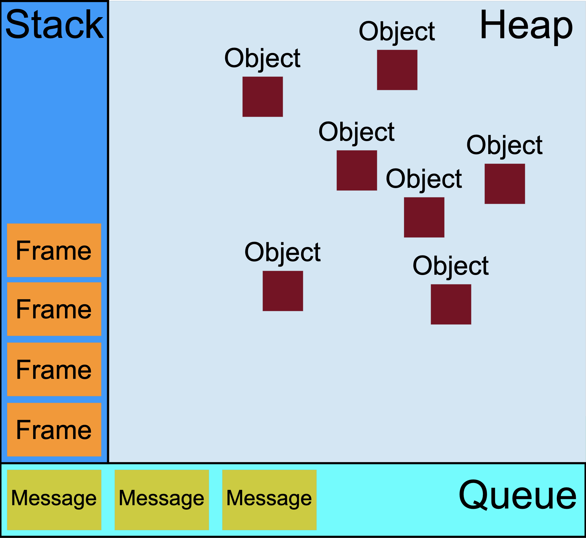

并发模型和事件循环（Concurrency model and the event loop）。

<!--more-->


原文来自 [MDN JavaScript 主题的高阶教程](https://developer.mozilla.org/en-US/docs/Web/JavaScript#advanced)部分，一共 5 篇，分别涉及继承和原型链、严格模式、类型数组、内存管理、并发模型和事件循环。本篇是第 5 篇，关于[并发模型和事件循环](https://developer.mozilla.org/en-US/docs/Web/JavaScript/Event_loop)。

**2023-06-23 更新：** 今天发现，MDN 原文结构进行了调整，原来[高级教程](https://developer.mozilla.org/en-US/docs/Web/JavaScript#advanced)的 5 篇文章只剩下了 3 篇，分别是继承和原型链、内存管理、并发模型和事件循环，其中，严格模式被转移到了 [References/Misc](https://developer.mozilla.org/en-US/docs/Web/JavaScript/Reference#additional_reference_pages) 下，类型数组被转移到了 [JavaScript Guide](https://developer.mozilla.org/en-US/docs/Web/JavaScript/Guide#typed_arrays) 下。


JavaScript 有一个基于 **事件循环（event loop）** 的并发模型，这个模型用于执行代码，收集和处理事件，执行队列子任务。它和其他语言例如 C 和 Java 的模型有许多不同。

## 运行时概念

下面部分试着描述一个理论上的模型。现代的 JavaScript 引擎基于此进行实现以及做了很多优化。

### 可视化的描述



### 堆（Stack）

函数调用会形成一个若干帧组成的栈。

```js
function foo(b) {
  let a = 10;
  return a + b + 11;
}

function bar(x) {
  let y = 3;
  return foo(x * y);
}

console.log(bar(7)); //returns 42
```

当调用`bar`时，第一个帧被创建，其中包含了`bar`的参数和局部变量。当在`bar`中调用`foo`，第二个帧被创建，且被放到栈顶。当`foo`调用返回时，顶部帧出栈（栈中只有`bar`的调用帧）。当`bar`调用返回时，栈被清空。

### 堆（Heap）

对象被分配在堆内存中，堆用来表示一大块（通常是非结构化的）内存空间。

### 队列（Queue）

一个 JavaScript 运行时包含着一组待处理消息的消息队列。每个消息都关联着一个函数，消息被处理时，调用该函数。

在[事件循环](#事件循环)的某个时刻，运行时会从消息队列头开始处理消息。队列头的消息被移出消息队列，其对应的函数被调用（该消息作为函数参数传入）。同时，一个新的栈帧被创建。

事件处理函数会一直执行，直到栈空。然后事件循环将处理队列的下一个事件（如果事件队列不为空的话）。

## 事件循环

**事件循环（event loop）**这个名字源于其实现方式，类似于：

```js
while (queue.waitForMessage()) {
  queue.processNextMessage();
}
```

`queue.waitForMessage()`同步等待消息到达（如果还没有消息等待被处理）。

### 执行至完成

任何一个消息被处理前，前一个消息都已被处理完成。

这为程序的分析提供了一些不错的特性。例如，当一个函数执行时，它不会被抢占，只有在其完全执行完成后，其他代码才会被执行（才能修改这个函数操作的数据）。这和 C 语言不同，例如 C 语言中一个函数被执行时可能会被运行时系统在某个时刻中断，转而在另一个线程中执行其他代码。

这个模型也有缺点，如果前一个消息执行时间过长，web 应用将无法处理用户的交互，例如点击或滚动等。为了缓解这个问题，浏览器一般会弹出一个框，提示"脚本运行时间过长（a script is taking too long to run）“。一个最佳实践是简短每一个消息的处理时间，如果允许，甚至可以将一个消息分成若干个消息来处理。

### 添加消息

在浏览器中，每当事件发生时，消息被添加到消息队列，同时对应的事件处理函数会与之关联。如果没有事件处理函数，该事件会丢失。所以，点击一个绑定了点击事件处理函数的元素会添加一个消息到消息队列，对于其他类型事件也类似。

[`setTimeout`](https://developer.mozilla.org/en-US/docs/Web/API/WindowOrWorkerGlobalScope/setTimeout)函数调用时需要传递两个参数：一个待添加的消息，一个时间值（可选，默认为`0`）。这个*时间值（time value）*表示至少在多久以后，该消息将被添加到消息队列。如果队列中没有其他消息，且上一个消息的执行栈已为空，该消息会在这个时间后立刻被处理。然而，如果队列中还有其他消息，添加到`setTimeout`的消息必须等待其他消息执行完成。正是这个原因，第二个参数仅仅表示一个最小时间，而不是刚好为这个时间。

下面的例子证明了这一点（`setTimeout`的消息函数并没有在定时结束后调用）：

```js
const s = new Date().getSeconds();

setTimeout(function () {
  // 打印 "2", 意味着 500 毫秒以后，此回调函数并没有立刻被调用。
  console.log("Ran after " + (new Date().getSeconds() - s) + " seconds");
}, 500);

while (true) {
  if (new Date().getSeconds() - s >= 2) {
    console.log("Good, looped for 2 seconds");
    break;
  }
}
```

### 零时延

零时延并不意味着回调函数会在零毫秒后被调用。例如调用`setTimeout`，第二个参数传入`0`（0 毫秒）并不会在指定的间隔后调用回调函数。

何时执行取决于消息队列中正等待执行的消息数。在下面的例子中，`"this is just a message"`会先于`setTimeout`回调函数中的语句被打印，因为`setTimeout`第二个参数仅表示处理回调函数的最小时延（而非保证时间）。

基本上，即使为`setTimeout`指定了特定的时延，其回调函数也需要等待消息队列中所有消息处理完成，之后才会被执行。

```js
(function () {
  console.log("this is the start");

  setTimeout(function cb() {
    console.log("Callback 1: this is a msg from call back");
  }); // 默认第二个参数为 0

  console.log("this is just a message");

  setTimeout(function cb1() {
    console.log("Callback 2: this is a msg from call back");
  }, 0);

  console.log("this is the end");
})();

// "this is the start"
// "this is just a message"
// "this is the end"
// "Callback 1: this is a msg from call back"
// "Callback 2: this is a msg from call back"
```

### 不同运行时环境间的通信

Web Worker 或跨域的`iframe`都拥有各自的栈、堆以及消息队列。两个不同的运行时只能通过[postMessage](https://developer.mozilla.org/en-US/docs/Web/API/Window/postMessage)方法通信。如果一个运行时监听了`message`事件，另一个运行时可以通过该方法向前者追加消息。

## 永不阻塞

事件循环模型里，一个十分有趣的特性是 JavaScript 从不阻塞，这和大部分其他语言不同。I/O 处理通常通过事件和回调函数，所以当应用在等待[IndexedDB](https://developer.mozilla.org/en-US/docs/Web/API/IndexedDB_API)查询结果或[XHR](https://developer.mozilla.org/en-US/docs/Web/API/XMLHttpRequest)请求结果返回时，仍然可以处理其他事情，如用户输入事件。

由于历史原因存在一些例外，例如`alert`或同步的 XHR，但应该尽量避免使用它们。注意：也存在一些[例外中的例外](http://stackoverflow.com/questions/2734025/is-javascript-guaranteed-to-be-single-threaded/2734311#2734311)（但这些通常都是实现上的 BUG，而非其他原因）。

## 相关规范

> [HTML Living Standard](https://html.spec.whatwg.org/multipage/webappapis.html#event-loops) > [The definition of 'Event loops' in that specification.](https://html.spec.whatwg.org/multipage/webappapis.html#event-loops)

> [Node.js Event Loop](https://nodejs.org/en/docs/guides/event-loop-timers-and-nexttick/#what-is-the-event-loop)
