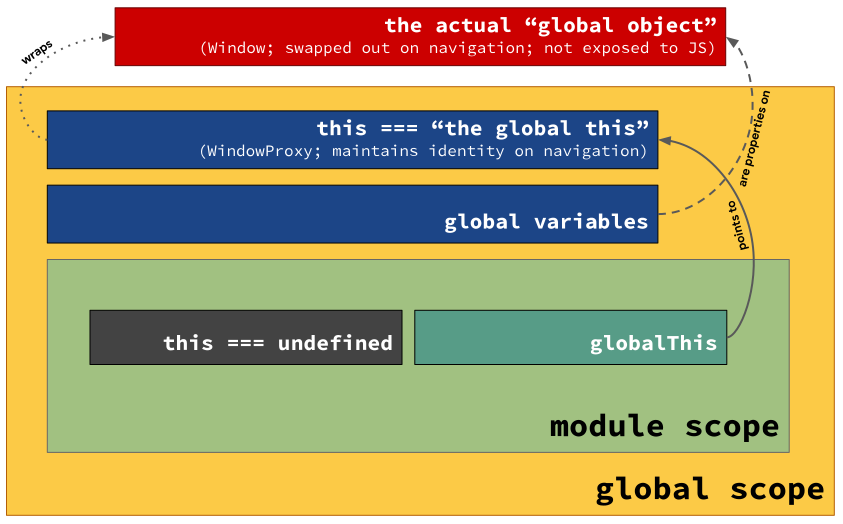

一种令人震惊的 globalThis Polyfill 通用实现。

<!--more-->

## 译者序

本文翻译自[Mathias](https://twitter.com/mathias)的博客文章-[A horrifying globalThis polyfill in universal JavaScript](https://mathiasbynens.be/notes/globalthis)，文章翻译建立在我理解的基础之上，如有疏漏，欢迎各位评论区指正。

> 关于作者：作者名叫[Mathias Bynens](https://twitter.com/mathias)，Google 工程师，Chrome 浏览器 DevTools 以及 JavaScript V8 引擎开发者。擅长领域包括：JavaScript, HTML, CSS, HTTP, performance, security, Bash, Unicode, macOS。Mathias 同时痴迷于 Web 标准的制定，他也是[TC39](https://github.com/tc39)委员之一，本篇博客便是他对自己参与贡献的提案[`globalThis`](https://github.com/tc39/proposal-global#html-and-the-windowproxy)的总结和思考，该提案目前位于[Stage 4](https://github.com/tc39/proposals/blob/master/finished-proposals.md)。

正文如下：

---

[`globalThis`提案](https://github.com/tc39/proposal-global)引入了一种在任何 JavaScript 环境下访问全局`this`的机制。听起来似乎实现向前兼容很简单（译者注：原文为*It sounds like a simple thing to polyfill*，*polyfill*简单来说就是在早期浏览器上使用一些 hack 实现新特性，本篇译文后面的**向前兼容**如非特指都是指代*polyfill*），但实际上会比较困难。直到[Toon](https://twitter.com/tverwaes)给了我一种出乎意料的、创造性的解决方案之前，我甚至认为这不可能实现。

这篇文章描述了实现`globalThis`向前兼容的困难程度，这样的向前兼容至少需要如下前置条件：

- 它必须在所有的 JavaScript 环境中都能正常工作，例如浏览器、web workers、浏览器中的插件、Node.js、[Deno](https://deno.land/)以及一些其他的[独立 JavaScript 引擎程序](https://github.com/GoogleChromeLabs/jsvu)。
- 它必须支持常规模式、严格模式以及 [JavaScript 模块](https://developers.google.com/web/fundamentals/primers/modules)。
- 它必须在任何的上下文中都能正常工作（例如，尽管该*polyfill*是被打包软件在构建过程插入一段严格模式的函数中（注意：这里及下文提到的 **严格模式的函数中** 既包括在函数中使用严格模式，也包括使用了全局严格模式下的函数），它依然能输出正确的结果）。

## 一些术语

在这之前，我们先解释一些术语。`globalThis`相当于全局作用域的`this`。这和浏览器中的全局对象并不一样，且[原因比较复杂](https://github.com/tc39/proposal-global#html-and-the-windowproxy)。



注意在 JavaScript 模块中，在你的代码和全局作用域之间存在一个模块作用域（module scope），模块作用域中隐藏了全局作用域中的`this`值，所以在模块作用域最上层中，`this`等于`undefined`。

长话短说，`globalThis`并非“全局对象（global object）”，简而言之，它就是全局作用域中的`this`。感谢[Domenic](https://twitter.com/domenic)帮助我理解了这一重要却细微的差别。

## `globalThis`的备选方案

在浏览器中，`globalThis`就等于`window`：

```js
globalThis === window;
// → true
```

也等于[`frames`](https://html.spec.whatwg.org/multipage/window-object.html#dom-frames)：

```js
globalThis === frames;
// → true
```

然而，在 workers 中（例如 web workers 或者 service workers），`window`和`frames`均为`undefined`。不过幸运的是，[`self`](https://developer.mozilla.org/en-US/docs/Web/API/Window/self)在所有浏览器环境中都有效，因此是一个更可靠的选择：

```js
globalThis === self;
// → true
```

> 译者注：上述原作者提到的 web worker 和 service worker 都属于 web 环境，[MDN](https://developer.mozilla.org/en-US/docs/Web/API/Web_Workers_API)将 service worker 叫做 web worker 的一类，不过值得注意的是，在[MDN 的另一篇使用说明中](https://developer.mozilla.org/en-US/docs/Web/API/Web_Workers_API/Using_web_workers) web worker 并不包含 service worker。

在 Node.js 环境中，`window`、`frames`以及`self`都不存在，不过我们可以使用`global`：

```js
globalThis === global;
// → true
```

上述所有变量（`window`、`frames`、`self`以及`global`）在独立的 JavaScript 引擎程序中都无法使用（你可以通过[`jsvu`](https://github.com/GoogleChromeLabs/jsvu)来安装并使用这些引擎）。不过在这些引擎程序里，你可以使用`this`：

```js
globalThis === this;
// → true
```

由于正常模式函数中的`this`就是全局的`this`，所以哪怕你无法在全局作用域下运行代码，在正常模式下，仍然可以通过以下方法获取全局`this`：

```js
globalThis ===
  (function () {
    return this;
  })();
// → true
```

不过，如果使用 JavaScript 模块，模块顶层的`this`等于`undefined`，而且在严格模式的函数中，`this`也等于`undefined`。所以这些情况下这种方法也不管用。

如果位于严格模式的环境下，只有一种办法可以临时打破这一约束：使用`Function`构造器函数：

```js
globalThis === Function("return this")();
// → true
```

应该说有两种方法，”间接的“`eval`调用有同样的效果：

```js
globalThis === (0, eval)("this");
// → true
```

> 注：`eval(code)`是一种”直接调用“，`eval`中代码的执行作用域为当前作用域。而`(0, eval)(code)`是一种”[间接调用](http://2ality.com/2014/01/eval.html)“，执行作用域始终为全局作用域。

在浏览器中，如果开启了[内容安全策略（Content Security Policy (CSP)）](https://developer.mozilla.org/en-US/docs/Web/HTTP/CSP)，则不允许使用`Function`构造函数以及`eval`函数。网站通常会采用这个策略，而且[Chrome 浏览器扩展中会强制执行](https://developer.chrome.com/extensions/contentSecurityPolicy#restrictions)。这意味着一个正确的 polyfill 实现不能依靠`Function`或`eval`。

> 注：`setTimeout('globalThis = this', 0)`也无法在 CSP 中使用。除了这个原因，不使用这种方式还出于以下两个考量。首先，这种方法并不是[ECMAScript 规范](https://html.spec.whatwg.org/multipage/timers-and-user-prompts.html#dom-settimeout)，无法在所有 JavaScript 环境中生效。其次，它是异步执行的，在一个被作为依赖的 polyfill 中这样实现会非常糟糕。

## 一种想当然的 polyfill 实现方式

似乎将上述方法合到一起，便能实现我们想要的 polyfill，例如：

```js
// 一种想当然的 globalThis shim 实现（译者注：shim和polyfill在这里是同一个东西，详细区别可以查看 https://stackoverflow.com/questions/6599815/what-is-the-difference-between-a-shim-and-a-polyfill）不要使用它！
const getGlobalThis = () => {
  if (typeof globalThis !== "undefined") return globalThis;
  if (typeof self !== "undefined") return self;
  if (typeof window !== "undefined") return window;
  if (typeof global !== "undefined") return global;
  if (typeof this !== "undefined") return this;
  throw new Error("Unable to locate global `this`");
};
// 注：使用`var`而不是`const`是为了
// 保证在全局作用域下执行代码时 `globalThis`
// 成为一个全局对象（而不仅仅只是只存在于顶层的词法作用域）
// 译者注：只有`var`创建的变量可以绑定到全局对象上。
//        这里作者说`const`定义的变量只存在于词法作用域中。
//        实际上，JavaScript的“词法作用域”不像全局作用域真实存在，其更多地在闭包中被提及：https://stackoverflow.com/a/51165345/14251417
var globalThis = getGlobalThis();
```

可惜，上面的实现在严格模式下的函数中，以及在非浏览器环境的 JavaScript 模块中都无法生效（除非原生支持`globalThis`）。之外，`getGlobal`也可能返回一个错误的结果，因为他依赖于`this`，`this`除了与上下文环境有关，它也可以被一些打包工具更改。

## 一种可靠的 polyfill 实现方式

假设有如下一个执行环境，有可能实现一个可靠的`globalThis` polyfill 吗？

- 你不能依赖于`globalThis`、`window`、`self`、`global`或者`this`
- 你不能使用`Function`或`eval`
- 但是你可以使用或整合 JavaScript 提供的内置功能

最终证明确实存在一种方法，但是看起来并没有那么优美。让我们先停下来思考几分钟。

最初，我们不知道如何直接访问全局`this`时，该如何获取它呢？如果我们能以某种方式在`globalThis`上添加一个函数属性，并且让它作为`globalThis`的方法执行，我们就能从函数返回值拿到这个全局`this`。

如果不依赖于`globalThis`以及引用它的一些特定环境下的绑定，我们如何实现上述功能呢？（译者注：原文为*How can we do something like that without relying on globalThis or any host-specific binding that refers to it?*）。如果只是像下面这样实现是不够的：

```js
function foo() {
  return this;
}
var globalThisPolyfilled = foo();
```

`foo()`现在不再作为一个对象的方法属性来调用，所以正如上面提到过的，在严格模式或者 JavaScript 模块中，`this`为`undefined`。严格模式下函数中的`this`被设置成了`undefined`。但是，在[`getters`](https://tc39.es/ecma262/#sec-getvalue)和[`setters`](https://tc39.es/ecma262/#sec-putvalue)中却并非如此！

```js
Object.defineProperty(globalThis, "__magic__", {
  get: function () {
    return this;
  },
  configurable: true, // 这样设置可以确保后面能够删除 getter
});
// 注：使用`var`而不是`const`是为了
// 保证在全局作用域下执行代码时 `globalThis`
// 成为一个全局对象（而不仅仅只是只存在于顶层的词法作用域）
// 译者注：只有`var`创建的变量可以绑定到全局对象上。
//        这里作者说`const`定义的变量只存在于词法作用域中。
//        实际上，JavaScript的“词法作用域”不像全局作用域真实存在，其更多地在闭包中被提及：https://stackoverflow.com/a/51165345/14251417
var globalThisPolyfilled = __magic__;
delete globalThis.__magic__;
```

上面的代码在`globalThis`上添加了一个 getter，通过访问这个 getter 来获取`globalThis`的引用，最后删除 getter 进行复原。使用这个技巧可以在所有期待的环境下正常访问`globalThis`，但是可以看到在第一行，仍然依赖了全局的`this`（代码中为`globalThis`）。能否避免这种依赖呢？在不直接访问`globalThis`的情况下，如何添加一个全局可访问的 getter？

除了在`globalThis`上添加 getter，我们还可以在全局`this`继承的对象，也就是`Object.prototype`上进行添加：

```js
Object.defineProperty(Object.prototype, "__magic__", {
  get: function () {
    return this;
  },
  configurable: true, // 这样设置可以确保后面能够删除 getter
});
// 注：使用`var`而不是`const`是为了
// 保证在全局作用域下执行代码时 `globalThis`
// 成为一个全局对象（而不仅仅只是只存在于顶层的词法作用域）
// 译者注：只有`var`创建的变量可以绑定到全局对象上。
//        这里作者说`const`定义的变量只存在于词法作用域中。
//        实际上，JavaScript的“词法作用域”不像全局作用域真实存在，其更多地在闭包中被提及：https://stackoverflow.com/a/51165345/14251417
var globalThis = __magic__;
delete Object.prototype.__magic__;
```

> 注：在`globalThis`提案之前，ECMAScript 规范实际上并没有规定全局的`this`必须要继承自`Object.prototype`，只说了其必须是一个对象。`Object.create(null)`创建的对象就没有继承自`Object.prototype`，JavaScript 引擎即使使用它作为全局`this`，也没有违背规范。如果这样的话上面的代码还是会失败（事实上，[IE7 就是这么干的](https://regmedia.co.uk/2007/10/31/jscriptdeviationsfromes3.pdf#2.5)！）。幸运的是，更多现代的 JavaScript 引擎似乎都同意`Object.prototype`必须在全局`this`的原型链上。

在现代的 JavaScript 环境中，如果已经支持`globalThis`，为了避免对`Object.prototype`的修改，可以对上述代码作如下修改：

```js
(function () {
  if (typeof globalThis === "object") return;
  Object.defineProperty(Object.prototype, "__magic__", {
    get: function () {
      return this;
    },
    configurable: true, // 这样设置可以确保后面能够删除 getter
  });
  __magic__.globalThis = __magic__; // lol what???
  delete Object.prototype.__magic__;
})();

// 现在你的代码能正常使用 `globalThis` 了
console.log(globalThis);
```

或者，也可以使用`__defineGetter__`：

```js
(function () {
  if (typeof globalThis === "object") return;
  Object.prototype.__defineGetter__("__magic__", function () {
    return this;
  });
  __magic__.globalThis = __magic__; // lol what???
  delete Object.prototype.__magic__;
})();

// 现在你的代码能正常使用 `globalThis` 了
console.log(globalThis);
```

成功了，你见到了至今为止最震惊的 polyfill 实现！这完全违背了最佳实践：**不要修改不是你创建的对象**。污染内置对象的原型对象一般来说都是很糟糕的做法，我在[这篇文章里做了详细解释](https://mathiasbynens.be/notes/prototypes)。

从另一面来说，这个 polyfill 失败的唯一原因就是有人在 polyfill 代码运行之前，设法改变了`Object`或者`Object.defineProperty`（或者`Object.prototype.__defineGetter__`）。我想不出更可靠的解决方案了，你呢？

## 测试这段 polyfill

这个 polyfill 是一个 <del style="background-color: #fdd">很好的</del><i style="background-color: #afa">有趣的</i> 通用 JavaScript 的实现案例：它是纯 JavaScript 的实现，而且不依赖于任何宿主环境特定的内置变量等等，因此在任何实现 ECMAScript 的环境中都能正常运行。这也是这个 polyfill 实现的首要目标！让我们来做一些测试进行验证。

这里有一个[使用了该 polyfill 的 HTML 示例页面](https://mathiasbynens.be/demo/globalthis)。页面中使用[传统脚本`globalthis.js`](https://mathiasbynens.be/demo/globalthis.js)和[模块脚本`globalthis.mjs`](https://mathiasbynens.be/demo/globalthis.mjs)打印了`globalThis`（两者源代码相同）。这个示例可以用来验证该 polyfill 在浏览器中正常运行。在[V8 v7.1 / Chrome 71](https://v8.dev/blog/v8-release-71#javascript-language-features)、Firefox 65、Safari 12.1、iOS Safari 12.2 中均原生支持`globalThis`。如果想要测试 polyfill 最有趣的部分，可以在一些老浏览器中打开这个示例页面。

> 注：该 polyfill 不支持 IE10 以及之前版本的浏览器，出于一些原因，尽管`__magic__`作为全局`this`的引用，`__magic__.globalThis = __magic__`却并不能让`globalThis`变为全局可访问的变量。虽然`__magic__`和`window`都是`[object Window]`，但是`__magic__ !== window`，意味着这些浏览器在实现时也可能受困于[全局对象和全局`this`的区别](#一些术语)。为了使其在 IE10 和 IE9 中也正常工作，可以增加[上述提到的一些备选方案](#`globalThis`的备选方案)。为了支持 IE8，需要在`try`-`catch`中调用`Object.defineProperty`，如果失败则进入`catch`语句块进行操作（这种方法同样可以解决 IE7 中全局`this`并不继承自`Object.prototype`的问题）。[点击此处查看这个支持老 IE 的示例](https://mathiasbynens.be/demo/globalthis-ie)。

为了在 Node.js 以及其他独立的 JavaScript 引擎程序中测试，下载示例中的 JavaScript 文件：

```sh
# 以模块形式下载polyfill示例源码
curl https://mathiasbynens.be/demo/globalthis.mjs > globalthis.mjs
# 复制一份（或者使用软链接）文件，以便使用传统模式的JavaScript
ln -s globalthis.mjs globalthis.js
```

现在我们可以在`node`里测试了：

```sh
$ node --experimental-modules --no-warnings globalthis.mjs
Testing the polyfill in a module
[object global]

$ node globalthis.js
Testing the polyfill in a classic script
[object global]
```

为了在独立的 JavaScript 引擎程序中测试，可以使用[`jsvu`](https://github.com/GoogleChromeLabs/jsvu)来安装你想要的引擎，然后直接运行脚本即可。例如：在 V8 v7.0 版本（该版本不原生支持`globalThis`）和 v7.1 版本（该版本原生支持`globalThis`）中分别进行测试：

```sh
$ jsvu v8@7.0 # 安装 `v8-7.0.276` 引擎程序

$ v8-7.0.276 globalthis.mjs
Testing the polyfill in a module
[object global]

$ v8-7.0.276 globalthis.js
Testing the polyfill in a classic script
[object global]

$ jsvu v8@7.1 # 安装 `v8-7.1.302` 引擎程序

$ v8-7.1.302 globalthis.js
Testing the polyfill in a classic script
[object global]

$ v8-7.1.302 globalthis.mjs
Testing the polyfill in a module
[object global]
```

类似地，你还可以在 JavaScriptCore、SpiderMonkey、Chakra 甚至是一些小众的例如[`XS`](https://github.com/Moddable-OpenSource/moddable-xst)等等 JavaScript 引擎中测试，下面的例子中使用了`JavaScriptCore`：

```sh
$ jsvu # 安装 `javascriptcore` 引擎程序

$ javascriptcore globalthis.mjs
Testing the polyfill in a module
[object global]

$ javascriptcore globalthis.js
Testing the polyfill in a classic script
[object global]
```

## 总结

写一个通用的 JavaScript 方案（译者注：这里的通用方案指的就是能在任何 JavaScript 环境下执行的代码方案）可能会很棘手，而且经常需要一些创造性的解决思路。如果你的方案需要获取全局`this`的值，那么新的`globalThis`特性会让你实现起来更加容易。正确实现`globalThis`的向前兼容比想象中要困难许多，但是至少这里给出了一种解决方案。

请记得除非你真正需要，否则无需使用该 polyfill。[JavaScript 模块](https://developers.google.com/web/fundamentals/primers/modules)可以让你更简单地导入和导出所需功能，而且无需修改全局状态，其实大部分的现代 JavaScript 代码都无需访问全局`this`。`globalThis`只对于一些需要它的库（libraries）和 polyfill 方案有用。

## npm 上已有的一些`globalThis` polyfill 实现

自从写了这篇文章以后，以下的几个 npm 包已经开始使用上面提到的一些技巧提供`globalThis` polyfill 的实现：

- [@ungap/global-this](https://github.com/ungap/global-this)
- [es5-ext](https://github.com/medikoo/es5-ext/blob/master/global.js)


我并非这些包的作者，也不是维护者。


## 翻译

- [原文](https://mathiasbynens.be/notes/globalthis)
- [韩语](https://ui.toast.com/weekly-pick/ko_20190503/)
