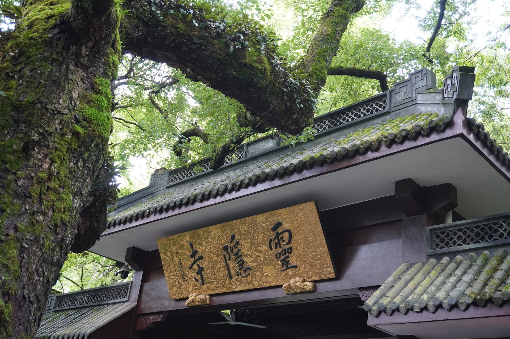
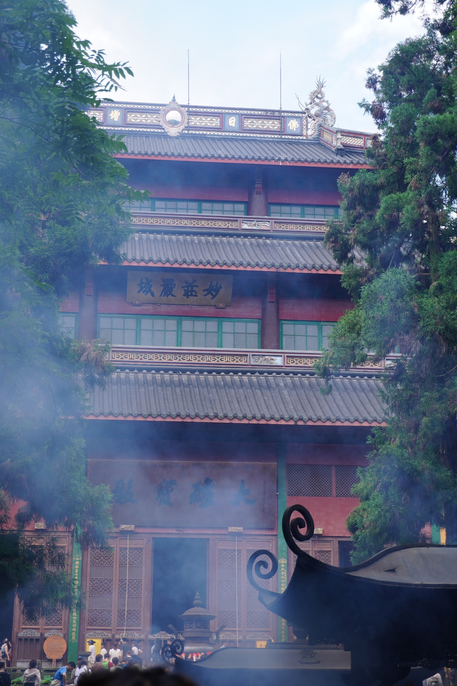
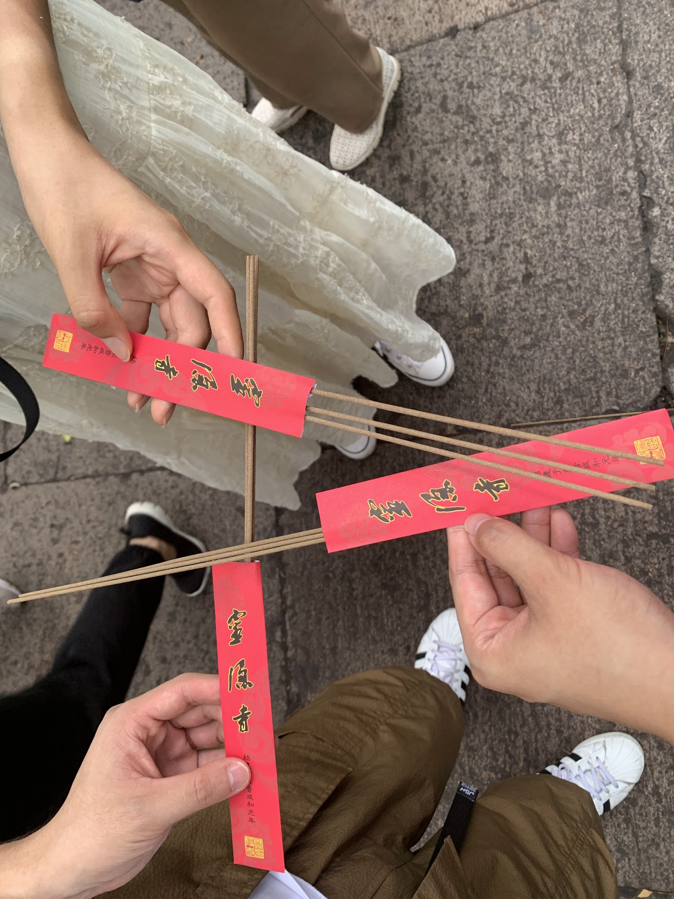
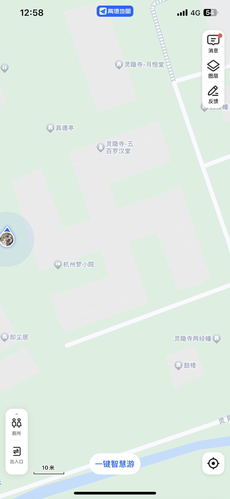
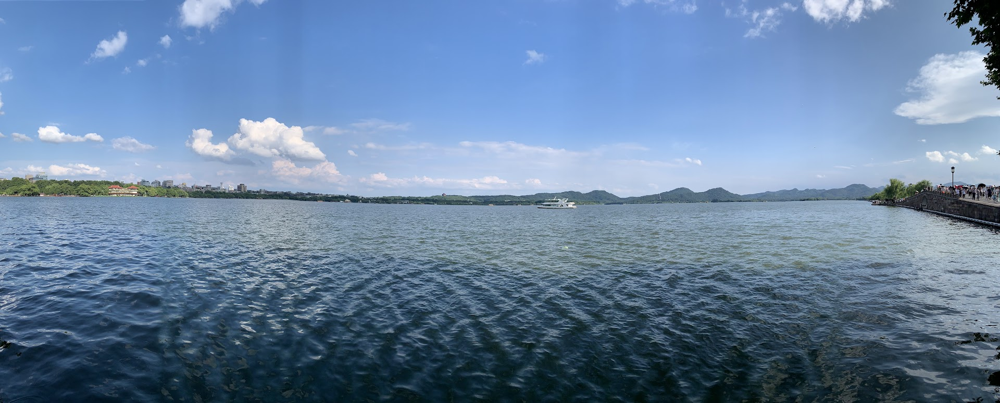
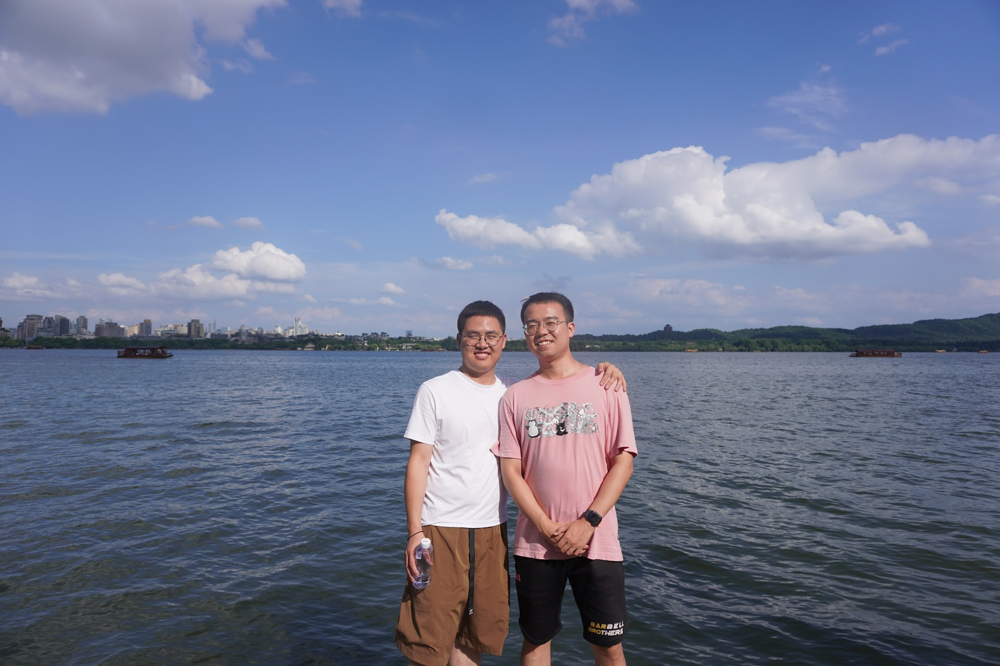
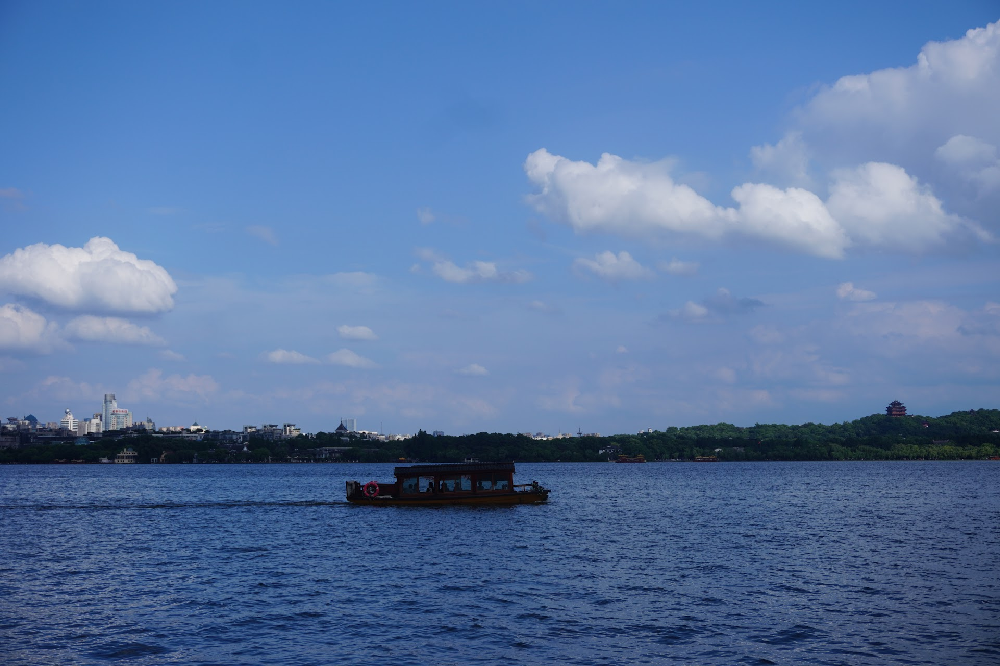
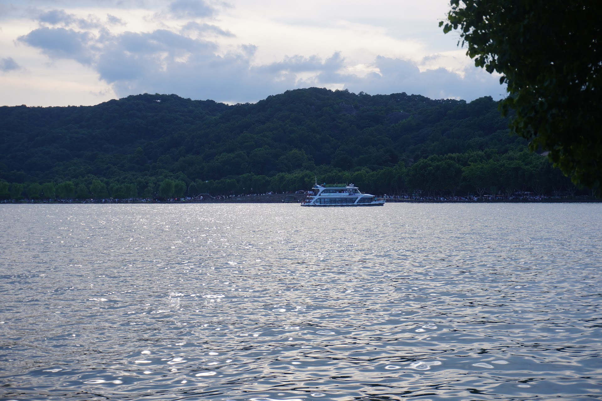
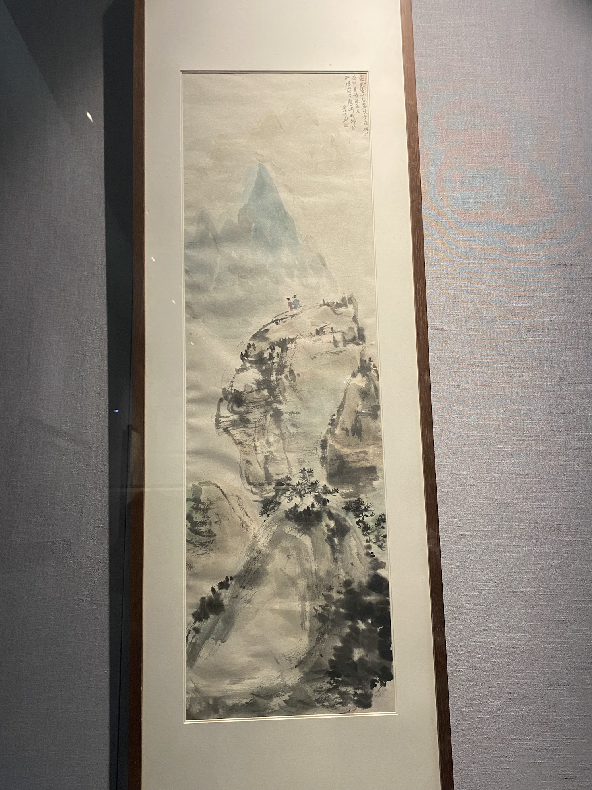

离职后，趁着女朋友工作前的一次毕业旅行，江浙沪考察。第三站是杭州~

抵达杭州已经是晚上，对象的姐姐和姐夫到车站接的我们，在附近商场吃饭。这天晚上下了大雨（这几天旅行最大的一次），让我们一度担心周末两天会下雨，出行不便。不过天公作美，第二天就放晴了，后面两天的天气都很不错（炎热）。

杭州是这次江浙沪之旅唯一没做攻略的城市，周末两天，第一天是大学的好哥们带着玩，第二天是对象的姐姐姐夫带着玩。

## 灵隐寺

周六大学好哥们开车带我们去的灵隐寺，路上堵了一阵子，到了快中午了，没吃早饭的三个人先吃了和府捞面，然后继续往飞来峰山上走。

大雄宝殿殿前求签的人非常多，烟雾缭绕。烧完的签子插满了，都难以再插进去。

整个灵隐寺还是逛了一会儿，但由于全是佛像，基本没怎么拍照。

比较有意思的是灵隐寺的五百罗汉堂，我们进去之后转了几圈也没找到进来的入口，索性随便找了个口出去。最开始还不太相信能容纳五百罗汉，直到转了好几圈。我开始好奇这个罗汉堂的地形，掏出地图一看，果然是佛教里的那个「[卐（wàn）](https://zh.wikipedia.org/zh-cn/%E5%8D%8D)」。

## 西湖

下午到的西湖，同学停好车以后沿着湖边走，经过断桥残雪，到了西湖美术馆，看完展以后就开始往回走了。

好哥们 2 年前来过北京，那时候我还很胖，他比较瘦，现在反过来了😂。

天气比较热，湖面上有一些游船。本来好哥们打算带我们坐那种比较小的船游湖，但恰好今天因天气水域这些原因停止了。记得我妈妈来北京北海那一次也是，明明感觉天气很不错，但是这种小船就是不开放，有些遗憾。

西湖美术馆的展览，都是同一个人的抽象画作，逛了会便回去了。

## 最后

杭州就去了灵隐寺和西湖，本来打算周日和姐姐姐夫去宋城，后面改为去绍兴了。所以第四站是绍兴~
