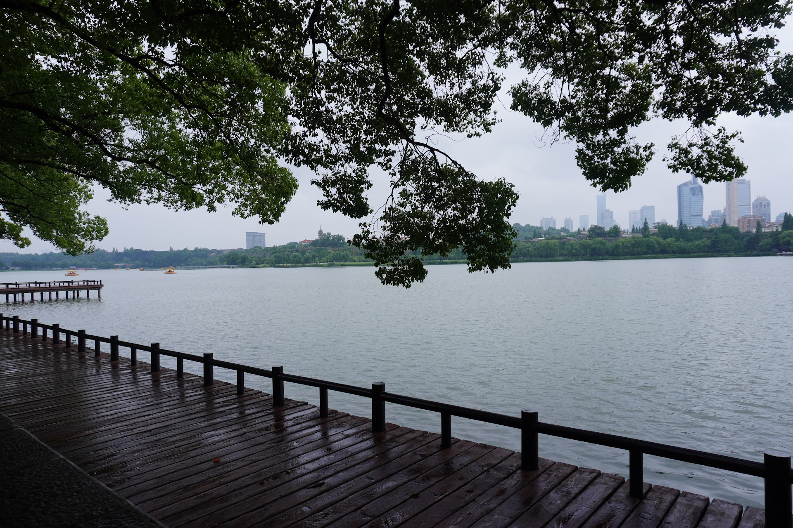

离职后，趁着女朋友工作前的一次毕业旅行，江浙沪考察。第二站是南京~

<!--more-->

## 红山森林动物园

小宝说这个动物园很人性化，没有动物表演，一些提示语也都是手写。我们在入园门口买个个可以盖章的游园护照小本本，乘着单程观光车上到山顶。

第一个仔细拍到的是这只红猩猩，刚好在人来的差不多的时候表演了下。

见到水豚的第一反应，还以为是一只很大的兔子。买纪念品的时候，幸运的抽到了水豚的盲盒。

事后才知道的动物园顶流之白面僧面猴-杜杜，可惜的是在动物园没见到他，想抽它的盲盒也没抽到，闲鱼上的同款价格也被炒得离谱。

优雅的火烈鸟，忘记看名字了，识图说好像是美洲红鹳(guàn)，火烈鸟的一种。

有只长颈鹿本来刚好向我走过来，刚拿出相机准备拍摄就掉头走了。

河面小岛上正在喂食的工作人员，以及展翅的白鹈鹕。

下午逛完动物园，就回酒店一直睡到了晚上 9 点半。期间点了个南京大牌档外卖，我和小宝都觉得美龄粥超好喝。

## 先锋书店

第二天早上吃了金陵大肉包，也特别好吃，紧接着就去了南京五台山的先锋书店。

书店位于一个地下车库，一层比较简单，上坡后二层特别大，而且这个坡道很有特色，打卡的人很多。

二层可以购买明信片，记录之后挂在一面明信片墙上。我没仔细看，不过小宝说有些明信片上的文字很打动人，像是两个时空交错的陌生人以这种方式相识。

下面是书店的一些装饰。

我挑了两本书，一本是先锋书店创始人钱小华写的[《先锋书店，生于1996》](https://book.douban.com/subject/26817470/)，一本是三联书店的图画通识丛书系列之一的《心理学》，这个系列最开始是在北京的三联书店看到，第二次见，还是想买一本。小宝挑了一本《南京城事绘》。

## 玄武湖公园

上午打卡完先锋书店，在原计划安排里本来还有南京钟山风景区。但看攻略那边实在太大，我们打算先去玄武湖公园，钟山风景区留给下一次来南京吧~

下午下了些小雨，温度很舒适，我们坐在湖边休息，看了会儿书。心想如果天天能来这看书该多好。

我们从玄武门进去，沿着樱洲、梁洲、翠洲的路线走。樱洲特别大。

## 最后

南京是值得再来一次的，这次一天半的时间，很多地方没去成。南京大屠杀博物馆也没预约上，这是一座很有人文关怀的城市。下一站是杭州~
