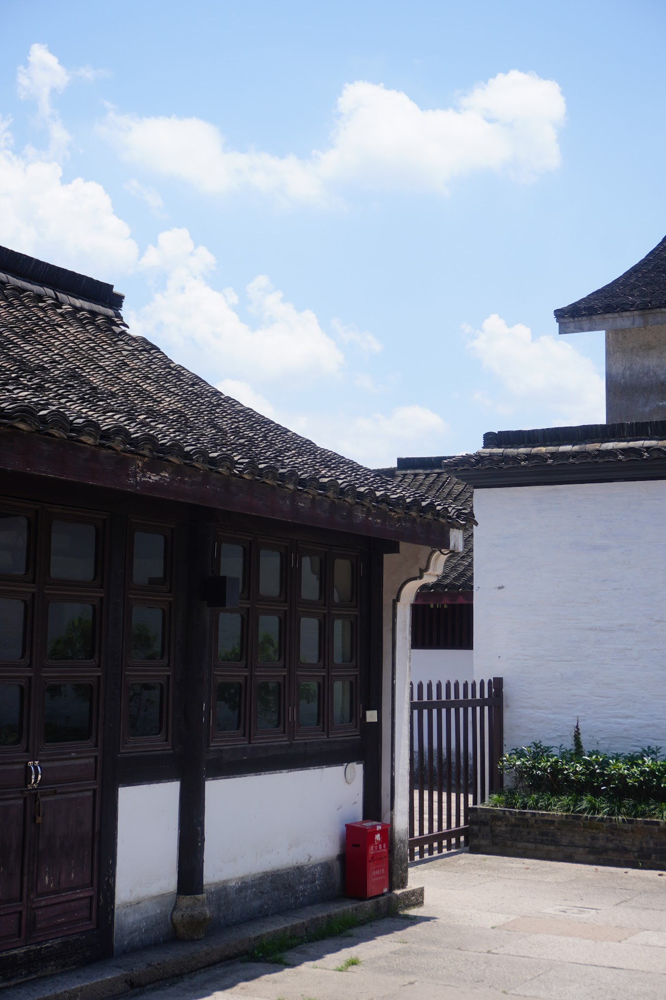

离职后，趁着女朋友工作前的一次毕业旅行，江浙沪考察。第四站是绍兴~

<!--more-->

原计划是姐姐姐夫带我们去杭州宋城，晚上临时改成了去绍兴，因为想去下鲁迅故居。

绍兴市位于杭州市东南角，杭州地铁可以直达，高铁也只需要 20 分钟。本来已经买好了高铁票，第二天一早姐夫临时决定开车前往了。

绍兴的旅程很开心，一路上女朋友都拿着相机在给姐姐拍照，前期我算是释放了出来，到后期也给她们姐妹俩拍了不少。

## 鲁迅故居

当天天气非常热，我们在外面排了一会儿队才进去。一路上女朋友都在给姐姐拍照，一身旗袍搭配这种江南小镇故居，很出片。

来到了百草园，绿油油的一片。

我们上纪念品店买了一个鲁迅冰箱贴，很多鲁迅的卡通形象和经典语录，本来打算把下面这幅画买走，店主说这个是店内装饰，不售卖。

逛完鲁迅故居，我们便去了仓桥直街，路上买了 4 根黄酒冰棒，黄酒是绍兴特色，有黄酒冰棒、冰淇淋、奶茶等等。冰棒单纯解渴，倒是没留下太深印象。

## 仓桥直街

仓桥直街这片极具江南水乡特色，我们也拍了不少照片。以下信息来源于[百度百科](https://baike.baidu.com/item/%E4%BB%93%E6%A1%A5%E7%9B%B4%E8%A1%97/248529)。


浙江省绍兴仓桥直街，位于浙江省绍兴市，全长1.5公里，由河道、民居、街坊三部分组成，民居多为清末民初建筑，众多富有地方特色的台门保存完好，具有浓郁的水乡风貌。2003年获“二〇〇三年联合国教科文组织亚太地区文化遗产保护优秀奖”。

河道两侧，以水乡传统民居为主，每家后院都有一个小河埠，为绍兴城内典型的“一河五街”格局。民居大多建于清末民初，其中有各式台门43个，这些建筑基本上建于清末民国初期，也有一些是仿古的新建筑。


## 书圣故里

最后一站驱车前往书圣故里。这一站开始换上了人像镜头，也是拍照片最多的地方。

> 直到写这篇文章的时候才知道这里的书圣指的是王羲之，怪不得看到了很多王羲之的著作。同时，这里也是蔡元培的故居。游玩的时候没去了解太多历史底蕴，光顾着拍照了。

河里可以游船，还有游客在船上，岸边有摄影师跟拍，风景很不错。

## 最后

至此为期一周的江浙沪之旅便结束了，旅途匆匆，很多景点大多都是拍拍照，没有深入了解，希望以后的旅行可以更加深入地了解某个地方，做好功课，不在数量而在质量。
