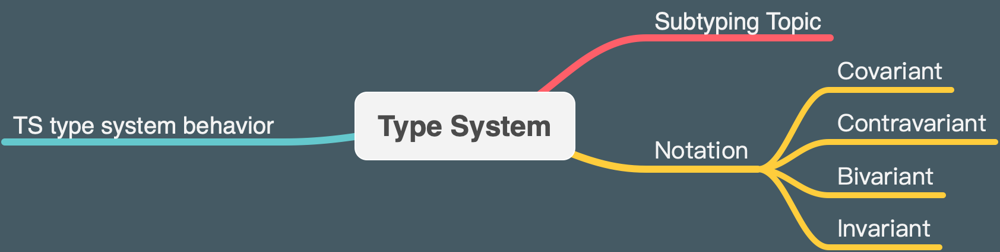
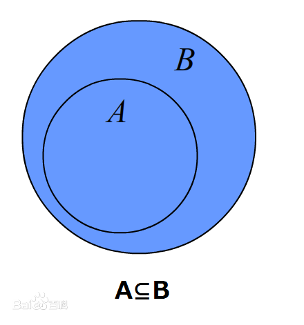
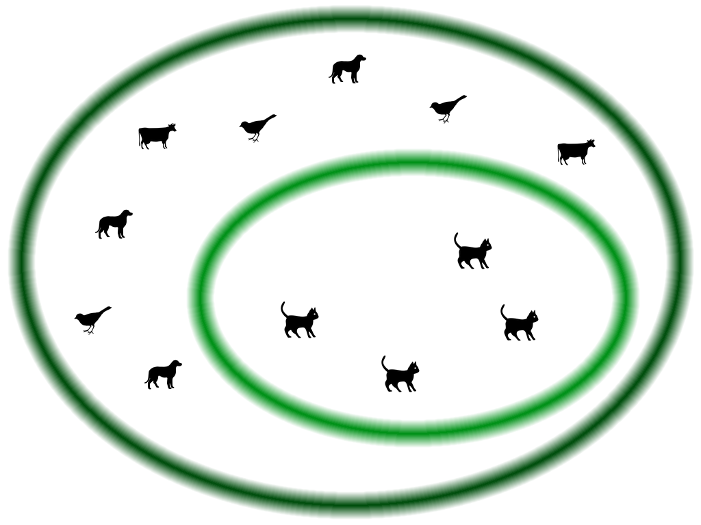

聊聊 TypeScript 类型兼容，协变、逆变、双向协变以及不变性。

<!--more-->


2020-12-06：近期在团队技术分享上，提炼了一个 [Playground](https://www.typescriptlang.org/play?#code/PQKj4yukFgCgAEJGG8fQ0eqB9FQndqAA5QL4GDkBoHxyg0fLILIzU0jAICWAdgC4CmATgGYCGAxm0QBBJgwC2PADaIA3pURMeYtgC5EAZxYdmAcwDc8tjxYAKAJRqAbgHsGAEwPwAvgkatOvAYgAi1nYjYAD3YmO3VhUQlpOSREAHdrOPMrWwcEF3gEUBR1AFcAIxYATwAHQT5rMRLjBnyGSQZi5Hp4STYWRB1Ja3ypEXEpNX6oxABeWXlFZTUAIj4AC211GYAaQ2NzCdjERAqmdWs2gDpunRMZoxZdDUr2+d0jx5mzRx2nNedHBDaOrp6pXw6NSAsZbHZTVSIOaLBiaZg8VbrUxmME7XbWfaHNgnPznS7XA7KFj3Jg6R5HZ6vRDveQJJIomJo9GY46nc50+KJcmU+Q0z6ueB-XqSYZSUFCgF+L7wbKIADC1ksPG0PFYzQQxTKiAAMrCWAAeAAqAD5QYaANoAXUcP0QqoGknUal1mn1oskpvGVpt7UQdj8Tp1ev1gM9iG9CHtUXC439OnU0tlCtYHB4SpVaoAtJnNNo+CwAGK5Jj5hgYw2lNjhLS5QQmOxsXi5SQsFF0DWVxAABUkPCKAHVGvMjWGTCU1IaUaNTcWG1xmGw7IgAD4aLS6aW2kq9gdD91qHt9wfEt2RKRhrjF0sYxAmKNSBnyPaaRDzYs6DhFUEAQm-JgAssY8xHKmoSVJspoAAxHAArC88gMFwt5vqSn6PtsdpnpIRyXOYVI7Bw7S5BwTCIAABgAJDI97YRCTiILCATGFcpJkVSGQEURJGILOjYLmk-KZK0vrbkeQ6AgeO7HsOoagpeJZXDe9Z+OhOzPh0KEfl+4y-gBQEgaq-piBBiDQXBVKIch75oaiOxxjhGzwRhhEsMRpGUTI9l0Qx4SXCxOhsbyASOoIjJovZdJ4fInGudxHleUobD0YxvQcAA1rogWxBkTiOKJu7EiC4z5dJ7qJsAiAlOoACMagleJfighyADUTEsCslVSXuWGgpceidWJhWNaa9XEu6WQVVVABMaiAPjmgCh+oAIW6AOZGgAyEYA9c6AMEagBccqN8zuoAMP+AATygCmiotW27V1Q06AdgCn0VtgDQcmti24IA2XKAGBKgD0poA98qAL8BgA-2vggClRoAmKkHYAAkaAKdygCwcjgHZagA8vk6icJYnAjqCY47pJg3DiaU6mjY9jSupmEOkjKMcGjHBqBTqPo+6o75QTqKkyV8zGKC+UmBKIpYU5akYgcrK4uzxhOblArABVAACLDqJmDA6Ew1iEZGWF01TnBY7jgJOdLiCADAqgDsFotpCAAragBY-9VRyIIAQ8qAA6mgCIOotgC-ig7Yymo7gBYmm7DuANj-U22y5bkKBimZE0u06ICH3GR1LYCIAAQgw6YMKqHTZrmDD5kWCllkwFZlOEvAheqMoVfk1jEnahGINYaUIHt7pc1d8yAnlbdFQNBX7VhiaJwAkkwacZ4gWfrrnV6KYXlbVhwtbl5qgj-rkLDGGwGPjGOE4s4am6+mIa8b-uiCr+v7Cng6o40SzYWx6RYU7OSNEfEyuGqUyzLC9ibIXDUpIbhEhJDoDqXBVaIG6IAq4yh1DcgFmiPkbxHCSyEraI+F82ASTPsfS+slt5xjvvIB+tlEDkjjG-NEkVP5MmfFiHEZwZgJGsFwckzDWFPAQW8ShqDUETUQFXGuypBAqw6A3BAGCT49XGJI9gHcJG4KwY1GRiiyoJ1oBozRlAUCAGW-QAIeaADRlDAcMkCaLMTQFoBsiqmnGhXHYgIrSewiA6K0-C0QOMtEcEouR1DzCce6K0XifHzDcUyZSQIfAqScZHMY0c7xYSGPzaJqQdgGwnnmQs08C5FyrIgUuKNEDg0AFoKi0tA8AbJmFhXBQlfxMOE4EUTo6RzMEcZUOhcjKFYDGOJ8SHSJIdCzZprSODtM6fLGpX9In+GjrYrI5j5mQG0YgQAsCqAEk5Ix6BAAQ-4AdW1ABk3oAJjkVyIEAJ-agBDGMAJD-2iFnXMsRVAAyuuUk4R5icEEMI2udQymfg6vkNeiAj4vnyIIOwepmD5nhoIO5twACqHBpDjGzoAgAZLIKExJGKMR4DxOFMw1AyHoqg5eiACwMA4JoAAcolUEiL-AopkFCMoZKbwQlxbIAl5VhB2CXESng6hKYz3UN8X0gRQQzBmHacIULlCwskD6Do2koRV3yOK3lxLSUUsSo4EV4wij9QNgAUQ4BwVWUsKoIwANIHW6NYApRL1A8C4O0L8Uh04oyXPkL8NKhUdECIGGloJAhysQEUP1jzpnBq1TGYNCZTXCBiT4wQN4egACs2DgvgMwdg3B+CCCEKiHgagaUoIFJmjwObk6onyIWsNxahJErlKCPNKKk4Hw6AW4QoJ6XtpmAiakQaq0VvGPSgdMxlV9u9bsNQDah12lmAiH5swx18OEh0PgtV5SgixaquUQa+AzQ3eMfIEr5SODXaCPdHK1n6MAMrybgs2eEhXwQibAmAKlViCxQ7BUQAH11BPrYC+t9HA7BJ1AnYNQqpdXyECGoJgHSgUcCpEUWD8HOC1tLdmrwXZtCsCAx+jeP6Sg4ZYHh0DhkINMCg7EGDChUOIfkMh2jYgEO1oQPJa8pEUahENNYbDGGxwsAPMRvD8J2CfwNuSdIbGsk3h0O0OUxEDgcC7Da5IiA7n-sA9Yd9onQryANuS6udoY5GGkOIbcbAxk1AxMQrij9EA0cgh1RjTnEC-s06+7TwGyOhFmOK3hsbDXGo4AgLjdgeN8fcBwHm8nFOqxU+ocwTk5nXIWUswAC-GrUAG+mABcQAAxaAGlbDAmzABo-oARejABwKhgQA9GaADOTQAJmmLUuaY1L8yWgYYfep24w973lrChCatOH9DyDaKSYkKHmNoakxmqLnWpVsARsSTgPWy1eDCgAR1rHCIWg3dARmcAKdjM88k8DSmwOULy+BpRMDR+bK3MOCFXPNxbLyOD3YfeJiqcpVQAHIOgJoYvsdeJY2AsPrqRDrOaOovMkCUAA-AhJCN3AeaFVAIMHd3Zs5poYgCTjxeTTf4QsNNaVEBLcqsaqqJmpCSCKNJ-ON5YSY96wIG7FGigWAcz5Lryh3t9ds7FUiy8weBCOBCWJ4wZg0vFUilFwukKi9GzoGuoxVdQjg5NjgMxWPwCOwXankgLsk7ZzztgfOvBPduC95bWOBCf0siYJn3XbdsBu2YHHdCRZnFFxCF4uOvvackN+AnB2hLZFa2YpZGBACR2oAC0VAAxKtDQAG8qECuRHzRtydjbUAANygAJOXEJI-IbRAAA5nHhHM2WeCG+x0IIIQwjOJGGFZQiQ1ORx17aPgxgXSCaDK6avYZ9u2jjN350wZ8HhmtBOmiI-e8GkZqCQfvpebV6nZzIdkxEqzAWEsPlyxKHN-pKQz3v9cQzAP+Sc-nD2KUI-kfoW9C-74kAYSO4Dwr+8g+Mug2FRR4g+56IsnTse1R1RAX8b8NMFJf0a4YkYwMA9WB0bvUEYfPURwafPUIJXxHmboYUavJyZAzQI4cBDgfVfgeYOpQhJxCKFvd3PVCqZfTmTvJgP7TkOIW2ILVWNQKguIf-IzLFPXGzMPCqPYMpX-LwTFR0awMODoO1B1NgDqSyRoAIQIPUV8V5BAfAjocYNAzQVArCbvDAsg+g1sRwDQwg1WEghYcgxpU0LgpLRwIAA)，里面包含了更直观易懂的例子对全文的一些概念进行了补充说明。可以配合全文查看。


## 前言

学过集合论的同学一定知道子集的概念，使用 ES6 class 写过继承的同学一定知道子类的概念，而使用过 TypeScript 的同学，也许知道子类型的概念。

但是你知道协变 _(Covariant)_、逆变 _(Contravariant)_、双向协变 _(Bivariant)_ 和不变 _(Invariant)_ 这些概念吗？你知道像 TypeScript 这种强大的静态类型检查的编程语言，是怎么做类型兼容的吗？我们今天来聊聊。



## 关于 Subtyping

子类型是编程语言中一个有趣的概念，源自于数学中子集的概念：

> 如果集合 A 的任意一个元素都是集合 B 的元素，那么集合 A 称为集合 B 的子集。



而子类型则是面向对象设计语言里常提到的一个概念，是继承机制的一个产物，以下概念来源百度：

> 在编程语言理论中，子类型是一种类型多态的形式。这种形式下，子类型可以替换另一种相关的数据类型（超类型，英语：supertype）。

> 子类型与面向对象语言中（类或对象）的继承是两个概念。子类型反映了类型（即面向对象中的接口）之间的关系；而继承反映了一类对象可以从另一类对象创造出来，是语言特性的实现。因此，子类型也称接口继承；继承称作实现继承。

我们可以理解子类就是实现继承，子类型就是接口继承，下面这幅图更精确的定义了这个概念，很多同学应该知道这个例子：



**这幅图中，猫是一种动物，所以我们说猫是动物的子集，猫是动物的子类，或者说猫这种类型是动物这种类型的子类型。**

## Co..., Contra..., Bi..., Invariant?

一下提到四个陌生的单词，很多同学肯定一下就懵了。React 开发者应该对 HOC _(High Order Component)_ 不陌生，它就是使用一个基础组件作为参数，返回一个高阶组件的函数。React 的基础是组件 _(Component)_，在 TypeScript 里是类型 _(Type)_，因此我们用**HOT _(High Order Type)_** 来表示一个复杂类型，这个复杂类型接收一个泛型参数，返回一个复合类型。

下面我用一个例子来阐述这四个概念，你可以将它使用[TypeScript Playground](https://www.typescriptlang.org/play/#)运行，查看静态错误提示，进行更深刻理解：

```typescript
interface SuperType {
  base: string;
}
interface SubType extends SuperType {
  addition: string;
}

// subtype compatibility
let superType: SuperType = { base: "base" };
let subType: SubType = { base: "myBase", addition: "myAddition" };
superType = subType;

// Covariant
type Covariant<T> = T[];
let coSuperType: Covariant<SuperType> = [];
let coSubType: Covariant<SubType> = [];
coSuperType = coSubType;

// Contravariant --strictFunctionTypes true
type Contravariant<T> = (p: T) => void;
let contraSuperType: Contravariant<SuperType> = function (p) {};
let contraSubType: Contravariant<SubType> = function (p) {};
contraSubType = contraSuperType;

// Bivariant --strictFunctionTypes false
type Bivariant<T> = (p: T) => void;
let biSuperType: Bivariant<SuperType> = function (p) {};
let biSubType: Bivariant<SubType> = function (p) {};
// both are ok
biSubType = biSuperType;
biSuperType = biSubType;

// Invariant --strictFunctionTypes true
type Invariant<T> = { a: Covariant<T>; b: Contravariant<T> };
let inSuperType: Invariant<SuperType> = { a: coSuperType, b: contraSuperType };
let inSubType: Invariant<SubType> = { a: coSubType, b: contraSubType };
// both are not ok
inSubType = inSuperType;
inSuperType = inSubType;
```

我们将基础类型叫做`T`，复合类型叫做`Comp<T>`：

- 协变 _(Covariant)_：协变表示`Comp<T>`类型兼容和`T`的一致。
- 逆变 _(Contravariant)_：逆变表示`Comp<T>`类型兼容和`T`相反。
- 双向协变 _(Covariant)_：双向协变表示`Comp<T>`类型双向兼容。
- 不变 _(Bivariant)_：不变表示`Comp<T>`双向都不兼容。

## TS 类型系统

在一些其他编程语言里面，使用的是名义类型 _Nominal type_，比如我们在 Java 中定义了一个 class `Parent`，在语言运行时就是有这个`Parent`的类型。因此如果有一个继承自`Parent`的`Child`类型，则`Child`类型和`Parent`就是类型兼容的。但是如果两个不同的 class，即使他们内部结构完全一样，他俩也是完全不同的两个类型。

但是我们知道 JavaScript 的复杂数据类型 Object，是一种结构化的类型。哪怕使用了 ES6 的 class 语法糖，创建的类型本质上还是 Object，因此 TypeScript 使用的也是一种结构化的类型检查系统 _structural typing_：

> TypeScript uses structural typing. This system is different than the type system employed by some other popular languages you may have used (e.g. Java, C#, etc.)

> The idea behind structural typing is that two types are compatible if their members are compatible.

因此在 TypeScript 中，判断两个类型是否兼容，只需要判断他们的“结构”是否一致，也就是说结构属性名和类型是否一致。而不需要关心他们的“名字”是否相同。

基于上面这点，我们可以来看看 TypeScript 中那些“奇怪”的疑问：

### 为什么 TS 中的函数类型是双向协变的？

**首先我们需要知道，函数这一类型是逆变的。**

对于协变，我们很好理解，比如`Dog`是`Animal`，那`Array<Dog>`自然也是`Array<Animal>`。但是对于某种复合类型，比如函数。`(p: Dog) => void`却不是`(p: Animal) => void`，反过来却成立。这该怎么理解？我这里提供两种思路：

假设`(p: Dog) => void`为`Action<Dog>`，`(p: Animal) => void`为`Action<Animal>`。

1. 基于函数的本质

   我们知道，函数就是接收参数，然后做一些处理，最后返回结果。函数就是一系列操作的集合，而对于一个具体的类型`Dog`作为参数，函数不仅仅可以把它当成`Animal`，来执行一些操作；还可以访问其作为`Dog`独有的一些属性和方法，来执行另一部分操作。因此`Action<Dog>`的操作肯定比`Action<Animal>`要多，因此后者是前者的子集，兼容性是相反的，是逆变。

2. 基于第三方函数对该函数调用

   假设有一个函数`F`，其参数为`Action<Animal>`，也就是`type F = (fp: Action<Animal>) => void`。我们假设`Action<Dog>`与`Action<Animal>`兼容，此时我们如果传递`Action<Dog>`来调用函数`F`，会不会有问题呢？

   答案是肯定的，因为在函数`F`的内部，会对其参数`fp`也就是`(p: Animal) => void`进行调用，此时`F`也可以使用`Cat`这一`Animal`对其进行调用。而此时我们传递的参数`fp`是`(p: Dog) => void`；`fp`被调用时使用的是`Cat`这一参数。这显然会使程序崩溃！

   因此对于函数这一特殊类型，兼容性需要和其参数的兼容性相反，是逆变。

**其次我们再来看看为什么 TS 里的函数还同时支持协变，也就是双向协变的？**

前面提到，TS 使用的是结构化类型。因此如果`Array<Dog>`和`Array<Animal>`兼容，我们可以推断：

- `Array<Dog>.push`与`Array<Animal>.push`兼容
  - 也就是`(item: Dog) => number`和`(item: Animal) => number`兼容
    - `((item: Dog) => number).arguments`和`((item: Animal) => number).arguments`兼容
      - `Dog`和`Animal`兼容

为了维持结构化类型的兼容性，TypeScript 团队做了一个权衡 _(trade-off)_。保持了函数类型的双向协变性。但是我们可以通过设置编译选项`--strictFunctionTypes true`来保持函数的逆变性而关闭协变性。

### 为什么参数少的函数可以和参数多的函数兼容？

这个问题其实和函数类型逆变兼容一个道理，也可以用上述的两种思路理解，`Dog`相当于多个参数，`Animal`相当于较少的参数。

### 为什么返回值不是 void 的函数可以和返回值是 void 的函数兼容？

从第三方函数调用的角度，如果参数是一个非 void 的函数。则表明其不关心这个函数参数执行后的返回结果，因此哪怕给一个有返回值的函数参数，第三方的调用函数也不关系，是类型安全的，可以兼容。

### 怎么构造像 Java 那样的名义类型？

通常情况下，我们不需要构造名义类型。但是一定要实现的话，也有一些 trick：

名义字符串：

```typescript
// Strings here are arbitrary, but must be distinct
type SomeUrl = string & { "this is a url": {} };
type FirstName = string & { "person name": {} };

// Add type assertions
let x = <SomeUrl>"";
let y = <FirstName>"bob";
x = y; // Error

// OK
let xs: string = x;
let ys: string = y;
xs = ys;
```

名义结构体：

```typescript
interface ScreenCoordinate {
  _screenCoordBrand: any;
  x: number;
  y: number;
}
interface PrintCoordinate {
  _printCoordBrand: any;
  x: number;
  y: number;
}

function sendToPrinter(pt: PrintCoordinate) {
  // ...
}
function getCursorPos(): ScreenCoordinate {
  // Not a real implementation
  return { x: 0, y: 0 };
}

// Error
sendToPrinter(getCursorPos());
```

### 如何在运行时检测变量的“名义”类型？

TypeScript 的类型检测只是一种编译时的转译，编译后类型是擦除的，无法使用 JavaScript 的`instanceof`关键字实现类型检验：

```typescript
interface SomeInterface {
  name: string;
  length: number;
}
interface SomeOtherInterface {
  questions: string[];
}

function f(x: SomeInterface | SomeOtherInterface) {
  // Can't use instanceof on interface, help?
  if (x instanceof SomeInterface) {
    // ...
  }
}
```

如果要实现检测，需要我们自己实现函数判断类型内部的结构：

```typescript
function isSomeInterface(x: any): x is SomeInterface {
  return typeof x.name === 'string' && typeof x.length === 'number';

function f(x: SomeInterface|SomeOtherInterface) {
  if (isSomeInterface(x)) {
    console.log(x.name); // Cool!
  }
}
```

还有更多“奇怪”的疑问，可以参考[TypeScript Wiki FAQs](https://github.com/Microsoft/TypeScript/wiki/FAQ#type-system-behavior)。

## 类型安全和不变性

最后来聊一下不变性 _(Invariant)_ 的应用。上面我们提到`Array<T>`这一复合类型是协变。但是对于可变数组，协变并不安全。同样，逆变也不安全（不过一般逆变不存在于数组）。

下面这个例子中运行便会报错：

```typescript
class Animal {}

class Cat extends Animal {
  meow() {
    console.log("cat meow");
  }
}

class Dog extends Animal {
  wow() {
    console.log("dog wow");
  }
}

let catList: Cat[] = [new Cat()];
let animalList: Animal[] = [new Animal()];
let dog = new Dog();

// covariance is not type safe
animalList = catList;
animalList.push(dog);
catList.forEach((cat) => cat.meow()); // cat.meow is not a function

// contravariance is also not type safe, if it exist here
catList = animalList;
animalList.push(dog);
catList.forEach((cat) => cat.meow());
```

因此，我们使用可变数组时应该避免出现这样的错误，在做类型兼容的时候尽量保持数组的不可变性 _(immutable)_。而对于可变数组，类型本应该做到不变性。但是编程语言中很难实现，[在 Java 中数组类型也都是可变而且协变的](https://en.wikipedia.org/wiki/Covariance_and_contravariance_%28computer_science%29#Covariant_arrays_in_Java_and_C.23)。

## 参考

1. [What are covariance and contravariance?](https://www.stephanboyer.com/post/132/what-are-covariance-and-contravariance)
2. [Covariance, contravariance and a little bit of TypeScript](https://medium.com/@michalskoczylas/covariance-contravariance-and-a-little-bit-of-typescript-2e61f41f6f68)
3. [_TypeScript Deep Dive_](https://github.com/basarat/typescript-book)
4. [Type System Behavior](https://github.com/Microsoft/TypeScript/wiki/FAQ#type-system-behavior)
