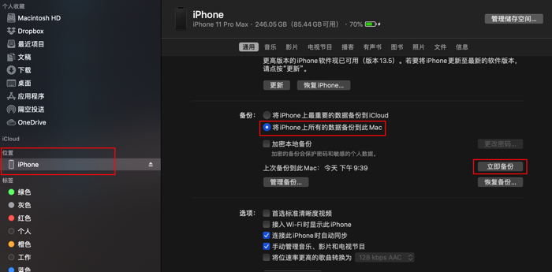
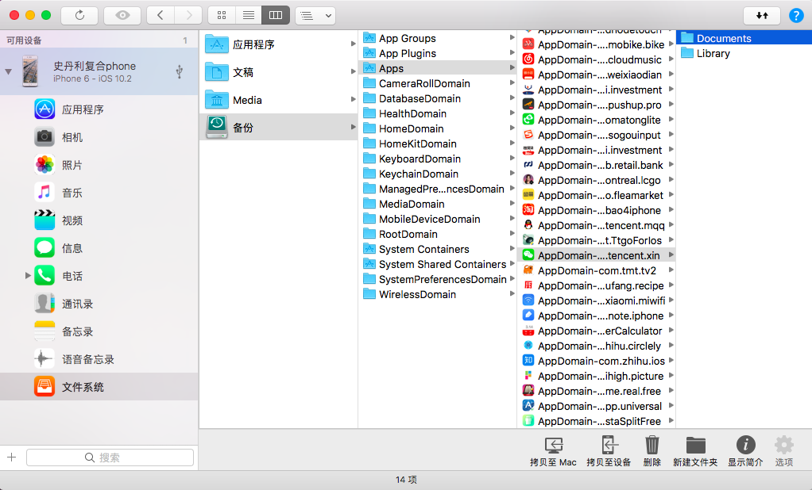
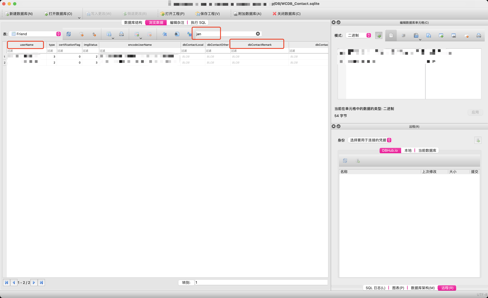

基于微信聊天记录的日历热力图 🔥🔥🔥，纪念日给女朋友一个惊喜 🚀🚀🚀

<!--more-->

- [点击查看项目地址](https://github.com/tianzhich/wechat-chatting-records-heatmap)

- [点此在线预览](https://tianzhich.github.io/wechat-chatting-records-heatmap/)

## 起因

和女票在一起 1000 天了，上次她给我看她朋友圈有朋友做了一个微信聊天记录的热力图，觉得很有意思，这次便想着也给她做一个。本以为这玩意应该有开源的项目可以直接复用，但使用**热力图**、**微信聊天记录**这样的关键字并没有找到，特别是微信聊天记录的提取，还是费了不少时间。便想着写一篇博客记录一下，方便大家参考。

## 步骤概览

制作这样的热力图，一共分为 4 步：

1. 提取微信聊天记录
2. 分析数据库，以天为单位获取聊天记录数
3. 生成热力图
4. 后期加工

接下来我会一步一步分析，帮助大家制作自己的热力图。

## 提取微信聊天记录

这是我认为最麻烦的一步。想到提取微信聊天记录，最开始想到的就是使用微信自带的备份，不过这种备份是加密的，而且我搜了下还没见到有方案破解这种备份。博主手机是 iOS，便先尝试搜索 iOS 的解决方案。

幸运的是，iOS 备份中的微信文件，特别是微信聊天记录库都是未加密的，意味着从 iOS 备份中可以直接读取微信聊天记录库，反观 PC 和 Android 中的文件却都是加密的（我猜测可能因为 iOS 作为封闭系统，安全性本来就较高，也获取不到软件数据，所以需要从备份中读取软件数据）。

### iOS 备份

那么接下来就是先[备份你的 iPhone](https://support.apple.com/zh-sg/guide/iphone/iph3ecf67d29/ios)，以 Mac 为例，在 MacOS 10.15 及以上版本中直接使用“访达”，旧版本使用 iTunes 即可。我这里是 MacOS 11，备份时不要勾选“加密本地备份”，点击“立即备份”即可。

> 我在备份时遇到一些小差错，很久以前我开启过“加密本地备份”，但是这次却没看到被勾上，直到备份完成才发现是一份加密备份。大家备份前可以先点击对勾，确定是否真正开启，如果开启请先关闭。



备份完成后进入下一步。

### 提取备份

虽然 iOS 备份中的微信聊天记录数据库是未加密的，不过备份本身打开后却是一堆以数字命名的文件夹，所有 APP 的文件似乎都被打散了，无法找到微信聊天记录在哪个文件夹。因此需要有方法先把混乱的备份恢复成可以阅读的。

> 关于 iOS 备份浏览，市面上有很多成熟的软件，比较有名的是 iMazing 和 iPhone Backup Extractor，但他们几乎都只能免费读取，提取则是收费的（免费软件其实我也不放心），在这之前我也搜索过开源方案，但是没找到合适的，自己也没太多时间折腾，最终选择了 iMazing，因为它有位于中国的第三方销售商。

下面是 iOS 备份读取软件 iMazing 读取后的界面：



### 提取微信聊天记录数据库

微信的聊天记录数据库位于 `Documents/xxx/DB/*.sqlite`，`xxx` 是设备上登录的用户，如果设备上用户少比如我就两个，则可以马上找到那个常用的。进入 `DB` 目录后，可以发现很多 `message_x.sqlite` 文件，和一个 `WCDB_Contact.sqlite` 文件，其中前者里面保存了我们的聊天记录，后者则是联系人。

先安装一个免费的 sqlite 数据库软件 [DB Browser for SQLite](https://sqlitebrowser.org/dl/)。安装完成后随便加载一个数据库例如 `message_1.sqlite`，会发现里面有很多张表，命名为 `Chat_balablabalabala`，其中每张表存储着你和某个联系人的聊天记录，后面这串字母是该联系人 `userName` 字段的 MD5 Hash 值，这个字段则位于 `WCDB_Contact.sqlite` 数据库。

那么首先我们需要打开 `WCDB_Contact.sqlite` 数据库，找到其中的 `Friend` 表，下面是我过滤后的 `Friend` 表：



上面我标出了三个红框，从左到右，第一个是前面提到的 `userName` 列，第二个是 DB Browser 提供的表搜索功能，第三个是 `dbContactRemark` 字段。由于我们并不清楚 `userName`，而用户的昵称，微信号和我们的备注名都位于 `dbContactRemark` 列，虽然是 _BLOB_ 格式，但仍然可以通过搜索定位到，例如我搜索女票的用户昵称 `jan..`。定位到具体联系人以后，我们只需要复制 `userName`，找到提供 MD5 Hash 加密的工具（我这里使用的是一个[在线网址 MD5 Hash Generator](https://www.md5hashgenerator.com/)），把加密后的字符串复制下来，假设我这里是 `mymd5hashedusername`

最后，便轮流打开 `message_x.sqlite` 数据库，找到对应的 `Chat_mymd5hashedusername` 表，就找到你们所有的聊天记录了。可以先大致浏览一下，如果你们的记录保存完好，回到第一天，看到消息，会不会很开心呢？反正我当时看到是特别开心，很有成就感。

> 我的微信记录大概占内存 40G，拆分的 `message_x.sqlite` 也就 4 个，所以我选择手动找表，且每张表是按字母表和数字顺序列出来的，可以很快找到。如果感兴趣的同学还可以通过编程实现。

到此为止我们可以使用 iMazing 将对应的这个库复制到特定文件夹，同时记住我们找到的表 `Chat_mymd5hashedusername`。

### 参考 && Android 或 Mac 微信数据库的破解方法

在进入下一步分析数据库之前，这里列出来在这个过程中我搜索到的一些资料，其中也包含了 Android 和 PC 版本微信数据库的破解方法。

- [iOS 微信的本地存储结构简析](https://daily.zhihu.com/story/8807166)，这篇文章提到的微信记录均位于 `MM.sqlite` 数据库，后来微信进行了拆表，拆成了我上面提到的 `message_x.sqlite`。

- [WechatExport-iOS](https://github.com/stomakun/WechatExport-iOS/pull/12)，C# 写的软件，用于从 iOS 备份中导出微信聊天记录，作者没有维护，不过最新的一个 PR 已经兼容了最新微信。

- [WechatExporter](https://github.com/BlueMatthew/WechatExporter)，上面程序的 c++ 实现版本，作者当前（2021-11-04）还在维护，回复也很积极。

- [WeChatExporter](https://github.com/tsycnh/WeChatExporter)，NodeJS 版本，star 较多，但作者已放弃维护。

- [MacOS 版本微信数据库破解](https://github.com/allen1881996/WeChat-Data-Analysis)，`README` 写得有问题，其实就是 MacOS 版本的破解，和 iOS 备份没啥关系。

- [Mac OS 版本微信数据库破解](https://github.com/forest0/wechat_history_export)，提供了方法用于导出解密后的数据库（不用每次都输入密码）。

- [Android 版本微信数据库破解](https://blog.csdn.net/qq_44761480/article/details/108032489)，比较新的教程。

## 分析数据库，获取数据

拿到宝贵的数据以后，这里日历热力图的数据提取就很简单了。可以选择大家偏爱的编程语言实现，只需要以天为单位，统计表中的记录数目即可。下面是我使用 NodeJS 的实现方法：

```js
const fs = require("fs");
const db = require("better-sqlite3")("message.sqlite", {
  verbose: console.log,
});
const dayjs = require("dayjs");

const sql =
  "SELECT DATE(CreateTime, 'unixepoch') AS 'date', count(*) as 'count' FROM Chat_mymd5hashedusername GROUP BY DATE(CreateTime, 'unixepoch')";

const stmt = db.prepare(sql);

const jsonArray = [];

let curDate,
  index = 0;

for (const { date, count } of stmt.iterate()) {
  if (index === 0) {
    curDate = dayjs(date);
  }

  // if there are no records one day, set `amout: 0`
  if (index > 0 && !curDate.isSame(date)) {
    jsonArray.push({ amount: 0, date: curDate.format("YYYY-MM-DD") });
    curDate = curDate.add(1, "day");
  }

  index++;
  curDate = curDate.add(1, "day");
  jsonArray.push({ amount: count, date });
}

fs.writeFile("heatmap_data.json", JSON.stringify(jsonArray), (err) => {
  if (err) {
    throw err;
  }
});
```

基本上使用 sql 语句就实现了，需要注意的是如果某一天没有数据，手动设置为 0。下面是导出的部分数据：

```json
[
  { "amount": 725, "date": "2019-01-26" },
  { "amount": 1024, "date": "2019-01-27" },
  { "amount": 682, "date": "2019-01-28" },
  { "amount": 326, "date": "2019-01-29" },
  { "amount": 252, "date": "2019-01-30" },
  { "amount": 143, "date": "2019-01-31" },
  { "amount": 269, "date": "2019-02-01" },
  { "amount": 259, "date": "2019-02-02" }
]
```

> 我这里导出的是数据格式为 json，也可以使用 csv 等其他易于处理的格式。

## 生成热力图

来到这里，基本上就完成 80% 了，因为热力图已经有很多开源的实现版本，需要的数据格式和我上面使用的也大同小异。我参考了 [d3 | reusable heatmap calendar](http://bl.ocks.org/eesur/5fbda7f410d31da35e42) 的实现，修改了部分参数。

当然，在这个过程中我也搜索到了很多优秀的版本，下面都列举出来给大家参考：

- [d3 | reusable heatmap calendar](http://bl.ocks.org/eesur/5fbda7f410d31da35e42)，我参考的版本

- [Calendar View](https://bl.ocks.org/mbostock/4063318)，和上面类似，数据格式为 csv，但缺乏一些坐标

- [HeatMap 日历热图](https://github.com/uiwjs/react-heat-map)，React 版本

- [Calendar heatmap](https://github.com/nikolaydubina/calendarheatmap)，提供 CLI 和在线生成两种方式

- [D3 Calendar Heatmap](https://github.com/DKirwan/calendar-heatmap)，很早的项目，star 较多，已不再维护

- [React Calendar Heatmap](https://github.com/kevinsqi/react-calendar-heatmap)，React 版本

- [GitHub Isometric Contributions extension](https://github.com/jasonlong/isometric-contributions)，三维日历热力图，是一个浏览器插件

- [Memomatics](https://github.com/LouisYLWang/Memomatics)，也是纪念日给女朋友的数据可视化项目，貌似挺有意思

- [Support Calendar Heatmap](https://github.com/airbnb/visx/issues/191)，关于日历热图的一些讨论

## 后期加工

得到热力图以后，发挥你的创意，进行一些二次创作吧。由于我没想到什么创意，直接发给了女票让她加工，最终添加了一个大标题。

## 未完待续

其实最麻烦的还是拿到微信的聊天记录数据库，有了数据以后，我们还可以创造出很多惊喜，例如词云，词频，或者是不同时段聊天频率分析等等，展现的形式也可以多种多样，都是可以在今后进行探索，送你的她一个惊喜。

希望这篇文章能帮助到你。
