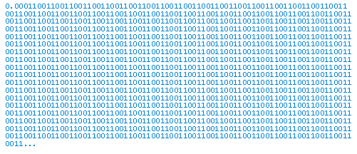

## 写在前面

以前面试遇到过一个问题：为什么 JavaScript 里 `0.1+0.2 !== 0.3`。当时我回答了浮点数精度有误差，所以不等于。显然面试官不满意，这不谁都知道吗？

后来看小红书，发现上面也强调过不要进行 `0.1+0.2 === 0.3` 的判断，但是仅仅提到如下理由：

> 关于浮点数值计算会产生舍入误差的问题，有一点需要明确：这是使用基于 IEEE754 数值的浮点计算的通病，ECMAScript 并非独此一家；其他使用相同数值格式的语言也存在这个问题。

上面仅仅提到 ECMAScript 使用了基于 IEEE754 标准的浮点数存储机制导致了误差，但是深入 IEEE754 标准，甚至深入计算机层面，又是为什么？作为一个学过《计算机组成原理》的人，我将以计算机的视角，深挖一下答案，希望对你也有所帮助。

## 什么是浮点数？

首先需要知道，计算机中数的表示有定点数和浮点数。

- 定点数：小数点位置确定。假设 16 位机器字长，可以规定小数点在第 x 位和第 x+1 位之间，例如在第 3 位和第 4 位之间，则表示整数部分有 2 位，小数部分有 13 位（第 1 位表示符号位）。小数点在符号位后面成为**小数定点机**（这类机器只能表示小数），小数点在末尾成为**整数定点机**（这类机器只能表示整数）。

- 浮点数：小数点位置不确定。类似于十进制的科学计数法表示。由 _**阶数（*exponent*，含阶码和阶符）**_ 和 _**尾数（significand，也叫 mantissa，含尾码和尾符）**_ 构成。尾数的位数决定了浮点数的精度，阶数的位数决定了浮点数的范围。

通常定点数由于整数和小数位数固定，因此表示数范围有限，而浮点数通过阶乘，可以让数的表示范围扩大。因此浮点数用途更广。下面这幅图描述了两者的区别：


### 浮点数表达式

这里先给出浮点数的表达式：

$$
N = S \times r^j
$$

其中 S 为尾码（小数，可正可负，正负由符号位指定），j 为阶码（整数，可正可负，正负由阶符指定），r 为尾数的基值（r 在计算机中通常取 2、4、8、16 等）。

## 浮点数的规格化

### 为什么需要规格化？

计算机的浮点数存储时需要进行 **_规格化（Normalize）_**，而规格化是为了保证精度。

举一个例子，假设一个二进制数：`0.000110011001100...`(1100 循环)，如果不进行规格化，那么尾数部分的 `0.0001...` 前面的 0 就会浪费尾数空间。可以将尾数左移，移除前面的 0，然后调整阶数，来进行规格化，从而让尾数可以包含更多有效位，从而提高精度。

### 规格化形式

浮点数的规格化根据尾数基值 r 不同而不同（以下都指真值表示，补码表示会在下面展开）：

- r = 2，尾数最高位为 1
- r = 4，尾数最高两位不全为 0（两位二进制数表示一位四进制数，所以只需前两位不为 `00` 即可）
- r = 8，尾数最高三位不全为 0（如上）
- ...

### 规格化操作

浮点数有两种规格化方式：左规和右规，下面以 r = 2 为例：

- 左规：尾数左移 1 位，阶码减 1
- 右规：尾数右移 1 位，阶码加 1

r = 4 时，尾数移动需要以 2 位为基本单位，以此类推。

由此也可见，r 越大，能表示的浮点数范围越大，同时表示的浮点数精度越低。

## 浮点数在计算机中的运算（加减运算）

了解了浮点数及其规格化，下面我们来看看浮点数在计算机中是如何做加减法运算的。分为如下几个步骤：

1. 阶数对齐（对阶）
2. 尾数求和
3. 规格化处理
4. 舍入
5. 拓展：浮点数表示范围及溢出判断

以下步骤讲解中的基值 r 均为 2。假设有如下两个值（公式请参考[浮点数的表达式](#浮点数表达式)）：

$$
x = S_x·2^{j_x} \quad y = S_y·2^{j_y}
$$

下面只会给出讲解，具体案例会以本文重点的 JavaScript 中 `0.1 + 0.2 !== 0.3` 进行分析。

首先来看对阶。

### 对阶

由于在浮点数的加减法运算中，两个浮点数的阶数不一定相等，而对浮点数进行运算，我们需要保证阶数相等。在调整阶数和尾数，以使得两数阶数相等的过程，就叫做对阶。

#### 求阶差

首先我们需要知道两数阶数差，由于计算机中使用补码进行加减法操作，因此需要注意，其实此处包括后面的尾数求和（或求差）本质上都是使用补码进行。

> 注意：计算机做减法虽然通常使用补码，但是[IEEE 754 标准中规定阶数用移码表示](https://en.wikipedia.org/wiki/Double-precision_floating-point_format#Exponent_encoding)。具体原因及分析后面会给出。

$$
\Delta j = j_x-j_y = \begin{cases}
=0 \quad j_x = j_y \quad 已对齐 \\\
\>0 \quad j_x > j_y \begin{cases}
x向y看齐 \quad S_x\leftarrow\Delta j, \quad j_x-\Delta j \\\
y向x看齐 \quad S_y\rightarrow\Delta j, \quad j_x+\Delta j \quad √
\end{cases} \\\
\<0 \quad ...
\end{cases} 
$$

#### 对阶原则

我们采用**小阶向大阶对齐**的原则进行对阶，因为这时尾数移位是右移，即使发生移出丢失，也只会影响数据的精度，而如果发生左移丢失，则会影响数据的大小。

### 尾数求和

尾数求和，就是让对阶完成的两个浮点数的尾数部分进行求和操作，这里实际中也会使用补码进行。

### 规格化

文章前面简单提到过规格化，但是是建立在真值的基础之上。这里会说明计算机使用浮点数存储尾数时，更实用具体的规格化细节。

我们了解到，规格化是为了最大化利用尾数空间，以获得更高的精度，所以，在尾数求和完成后，新的尾数可能不再满足规格化要求，需要重新进行规格化。

#### 规格化定义

先来复习一下前面提到的规格化形式：

浮点数的规格化根据尾数基值 r 不同而不同（以下都指真值表示）：

- r = 2，尾数最高位为 1
- r = 4，尾数最高两位不全为 0（两位二进制数表示一位四进制数，所以只需前两位不为 `00` 即可）
- r = 8，尾数最高三位不全为 0（如上）
- ...

假设基值 r = 2，结合规格化形式，我们可以对已规格化的尾数 S 给出如下定义：

$$
r = 2 \quad \frac{1}{2} \leq |S| < 1
$$

#### 规格化判断

有了上述定义，尾数大于 0 或小于 0，有如下规格化形式：

| S > 0 | 规格化形式 | S < 0 | 规格化形式 |
| :---- | ---------- | ----- | ---------- |
| 真值  | 0.1XX...X  | 真值  | -0.1XX...X |
| 原码  | 0.1XX...X  | 原码  | 1.1XX...X  |
| 补码  | 0.1XX...X  | 补码  | 1.0XX...X  |
| 反码  | 0.1XX...X  | 反码  | 1.0XX...X  |

不难看出：

- 对于真值和原码，不论正数、负数，只要第一数位为 1，则为规格化形式
- 对于补码，符号位和第一数位不同，则为规格化形式（计算机可以使用异或电路很轻松地进行判断）

由于计算机使用补码，因此这里只看补码的规格化形式。值得注意的是，我们判断规格化数时，往往使用补码的规格化描述：**符号位和第一数位不同**来进行判断，而不是使用定义，因为对于补码表示的尾数 S，这里有两个特例：

- 特例一

$$
S = -\frac{1}{2} = -0.100...0 \\\
\left[S\right]_原 = 1.100...0 \\\
\left[S\right]_补 = 1.100...0
$$

如果按照定义，$S=-\frac{1}{2}$是规格化的数，但是在计算机使用补码对其存储后，按照计算机的异或电路，会认定$\left[-\frac{1}{2}\right]_补$不是规格化的数，因此，如果我们人工分析中遇到了这个特例，需要自己对其进行规格化。

- 特例二

$$
S = -1 \\\
\left[S\right]_补 = 1.000...0
$$

上面的情况中，如果按照定义，$S = -1$不是规格化的数，但是 $\left[-1\right]_补$却成为了规格化的数。

> 注意：小数定点机无法表示 -1 的原码，但是可以表示 -1 的补码。因为原码中 +0 和 -0 是不一样的，而补码中，原码的 -0 被用于编码为 -1。

#### 规格化操作

有了上述的判断标准，我们很容易得出，规格化操作为：

- 左规：在尾数采用补码存储时
  - 如果尾数为正数，当尾数第一数位为 0 时，需要进行左规
  - 如果尾数为负数，当尾数第一数位为 1 时（由于采用补码存储，因此该位真值一般为 0），需要进行左规。**注意：** 这里有一个特例，也就是上面提到的特例一，此时应该采用下面提到的右规而不是左规（因为第一数位的 1 实际上也是真值 1，左规移出会导致数据出错）
- 右规：当计算过程中发生尾数溢出（$|S| > 1$）时，需要进行右规，防止数据溢出而出错

### 舍入

当数据的长度超出了存储该数据的机器字长，我们需要进行舍入。通常在上面提到的对阶和右规过程中，都有可能发生数溢出，此时需要考虑舍入来尽可能保证数据精度。

#### 舍入的几种方法

1. 截断法：直接丢弃移出的数
2. 0 舍 1 入法：类似于四舍五入，如果丢弃 0 则不管，如果丢弃 1 则在最低位加 1
3. 恒置 1 法：不管丢弃的是 0 还是 1，最终保存的结果最低位都保证为 1
4. ...

在计算机中，还有多种方法可以处理舍入，选择哪种情况具体会考虑数据的精度保证、累积误差以及硬件实现的难易程度等等。下面谈到 IEEE754 标准时，我们还会看到几种舍入方法。

### 拓展：浮点数表示范围及溢出判断

上面我们提到移位过程可能造成数的溢出。除了操作时的溢出，还有数存储时的溢出。

如果给定一个浮点数标准（使用补码存储），我们需要判断哪些数会超出存储范围，这个判断也叫做溢出判断。

这里偷一个懒，直接放出[刘宏伟老师的计算机组成原理课](https://www.icourse163.org/course/HIT-1001527001?tid=1002257001)中的截图：


做一下简单分析，由于机器字长是固定的，因此浮点数能表示的范围和精度也都是有限的，我们便能得到四个关键点：最大（小）的正（负）数，同时得出 5 个区间：

- 比最小负数还小（或比最大正数还大）：最小负数，也就是尾数能表示的绝对值最大（-1），阶数也最大时表示的数，如果阶数超过最大阶数，为上溢；正数一边的上溢类似（注意：正数最大无法表示 1，只能为 $1-2^{-n}$）。如果数落在这部分区间，需要进行溢出错误捕获和处理。
- 对应正（负）浮点数：这个区间的浮点数可以被正确存储，不过落在这上面的数都是离散的，并非所有浮点数都能被准确表示，可能会损失一定精度（和舍入规则有关）。
- 下溢区间：下溢区间表示浮点数比最大负数大，却又小于最小正数，通常这个区间的数均会使用 0 来表示。

## IEEE 754 标准

由于 JavaScript 中浮点数的存储和运算遵循 [**IEEE 754 标准**](https://en.wikipedia.org/wiki/IEEE_754)，因此这里我们先介绍一下这个标准。

IEEE 754 标准是一套关于计算机浮点数的标准，涵盖了浮点数格式、运算、舍入方式以及溢出异常处理等等一系列与浮点数相关的定义和操作，本篇涉及到的主要为浮点数格式和舍入方式。

### 主要格式

以下三种为最常见的格式及其不同部分的位数，全部格式[请点此查看](https://en.wikipedia.org/wiki/IEEE_754#Basic_and_interchange_formats)。

|                  | 符号位 | 阶码 | 尾数 | 总位数 |
| :--------------- | ------ | ---- | ---- | ------ |
| 短实数（单精度） | 1      | 8    | 23   | 32     |
| 长实数（双精度） | 1      | 11   | 52   | 64     |
| 临时实数         | 1      | 15   | 64   | 80     |

需要注意，由于 IEEE754 标准在尾数中使用了[隐含的”1“](https://en.wikipedia.org/wiki/IEEE_754#cite_note-13)，所以其实尾数可以表示的位数会多 1 位。

这里简单说一下隐含的”1“，上面[规格化判断](#规格化判断)中提到，规格化的尾数第一位始终为”1“，因此可以将其隐藏，不真正存储在计算机中，而是进行计算时再将其补全。这样做可以将精度扩大 1 位，这里的”1“指的是真值的”1“。

### 舍入规则

IEEE 754 标准总共定义了 [5 种舍入规则](https://en.wikipedia.org/wiki/IEEE_754#Rounding_rules)。

前两种为 **_Roundings to nearest_**，顾名思义，向最近的有效数舍入，其中 **_to nearest, ties to even_** 为二进制浮点数的默认规则，也被推荐作为十进制浮点数的默认规则。与他相关的还有 [**_to nearest, ties to odd_**](https://en.wikipedia.org/wiki/Rounding#Round_half_to_odd)，不过没有定义在该标准中。

后三种为 **_Directed roundings_**，为直接舍入方法，舍入趋向固定（0、+∞、−∞）。

| Mode / Example Value            | +11.5 | +12.5 | −11.5 | −12.5 |
| ------------------------------- | ----- | ----- | ----- | ----- |
| to nearest, ties to even        | +12.0 | +12.0 | −12.0 | −12.0 |
| to nearest, ties away from zero | +12.0 | +13.0 | −12.0 | −13.0 |
| toward 0                        | +11.0 | +12.0 | −11.0 | −12.0 |
| toward +∞                       | +12.0 | +13.0 | −11.0 | −12.0 |
| toward −∞                       | +11.0 | +12.0 | −12.0 | −13.0 |

### 在 JavaScript 中的应用

JavaScript 数的存储和操作均使用上面提到的 64 位双精度浮点数标准。

舍入规则使用上面提到的默认规则：_Roundings to nearest, ties to even_。这里我们主要来讲讲这个规则，规则分为两个部分：

1. _Roundings to nearest_

   回想一下上面浮点数计算--拓展部分的浮点数表示范围及溢出判断，我们已经知道，并非每一个数都能被精确表示，也就是说我们需要对其进行舍入，使其落在最近的有效数上，而这个有效数，可能比原来的数大，也有可能比原来的数要小，我们需要判断原来的数距离哪一个更近，就选取这个更近的作为舍入后的结果。

2. _ties to even_

   那么后半句是什么意思？就是如果原来的数距离大的数和小的数距离一样，就选择”偶数“，十进制中的偶数大家都知道，二进制中的偶数，其实就是最低有效位为 0，选择这个数作为舍入后的结果。

举个例子，假设有效位为 4 位，现在有一个数为`0.000101`，此时其较大的有效数为`0.0010`，较小的有效数为`0.0001`，很明显我们需要取`0.0001`。但如果这个数是`0.000111`，此时我们则需要取`0.0010`。

上面的两种情况就是*Roundings to nearest*。而如果数为`0.000110`，此时我们参考 _ties to even_，此时我们需要取`0.0010`。

这里参考了知乎一个[答主的思路](https://www.zhihu.com/question/68131179/answer/273788172)，可以很快从二进制上发现规律。舍入时，如果最低有效位后一位为`0`，则可以知道舍去的数值小于该最低有效位表示数值的一半，此时向下舍入即可（例如上面例子中`01`小于`10`）。而如果最低有效位后一位为`1`，则再往后看，如果有不为`0`的数，则可以知道舍去的数值大于该最低有效位表示数值的一半，此时向上舍入即可（例如上面例子中`11`大于`10`），如果后面数全为`0`，则根据 _ties to even_，选择”偶数“即可（例如上面例子中`10`等于`10`）。

不知道懂了这个规则的同学，有没有回想起《计算机组成原理》课程里学到过（上面也提到过）的”0 舍 1 入法“。是不是有点像呢？”0 舍“这部分符合 _Roundings to nearest, ties to even_，而”1 入“则不能无脑做，如果”1 入“前做 _ties to even (or odd)_ 的判断，则”0 舍 1 入法“其实就是 _Roundings to nearest, ties to even (or odd)_，是不是很有趣？

## JavaScript 中 0.1 + 0.2 的计算

到此为止，我们便掌握了所有的原理，接下来进行实战，看看计算机是怎么对`0.1`和`0.2`做加法运算的。

### 转换为二进制数

首先需要将`0.1`和`0.2`转换为二进制数，对于小数来说，转换为二进制是乘 2 取整操作。我们先计算`0.1`：

| 运算过程       | 取整 | 小数部分 |
| -------------- | ---- | -------- |
| 0.1 \* 2 = 0.2 | 0    | 0.2      |
| 0.2 \* 2 = 0.4 | 0    | 0.4      |
| 0.4 \* 2 = 0.8 | 0    | 0.8      |
| 0.8 \* 4 = 1.6 | 1    | 0.6      |
| 0.6 \* 2 = 1.2 | 1    | 0.2      |
| ...            | ...  | ...      |

最终可以得到如下结果：

$$
0.1 = 0.0001100110011001100110011001100....（以1100循环）
$$



同理，得出`0.2`为（为方便展示和比较，也放上`0.1`）：

$$
\begin{aligned}
0.1 = 0.0001&100110011001100110011001100... \\\
0.2 = 0.001&100110011001100110011001100...
\end{aligned}
$$

### 以浮点数形式存储

我们取基值 r = 2，且 [IEEE 754 标准中阶数用移码表示](https://en.wikipedia.org/wiki/Double-precision_floating-point_format#Exponent_encoding)（关于移码这里不再赘述，只给出转换后结果），尾数使用补码表示，并进行规格化处理。

> 简而言之：移码 = 原来的数 + 2^n，n 为数的位数

**为了便于显示，我们在以下公式中使用`,`分割阶数符号位与数值位，使用`.`分割尾数符号位与数值位，使用`:`分割阶数和尾数，使用`[]`表示溢出或隐含的数。**

首先需要对尾数进行规格化，由于尾数为正数，且可以隐含第一个”1“，因此尾数表示为：

$$
S(0.1) = 0[1].1001100110011001100110011001100110011001100110011001\[1001...\](小数点后共52位) \\\
S(0.2) = 0[1].1001100110011001100110011001100110011001100110011001\[1001...\](小数点后共52位)
$$

可以看到，上面的数发生了溢出，溢出位为`1001...`。我们采用默认舍入规则 _Roundings to nearest, ties to even_，进行处理，得到：

$$
S(0.1) = 0[1].1001100110011001100110011001100110011001100110011010(小数点后共52位) \\\
S(0.2) = 0[1].1001100110011001100110011001100110011001100110011010(小数点后共52位)
$$

表示完尾数后，再表示阶数（使用移码）：

$$
j(0.1) = 0,1111111100(-4) \\\
j(0.2) = 0,1111111101(-3)
$$

这里顺便说一下使用移码的好处，相信大家也看出来了，使用移码表示后，负数之间的比较也会变得很清晰。

### 开始计算

接下来我们开始计算，首先是对阶。

根据小阶向大阶对齐，`0.1`的阶数+1，尾数进行右移（要注意此时右移第一位补的是隐含的”1“而不是”0“）：

$$
\begin{aligned}
S(0.1) = 0&.1100110011001100110011001100110011001100110011001101[0] \\\
S(0.2) = 0[1]&.1001100110011001100110011001100110011001100110011010
\end{aligned}
$$

接下来进行尾数求和：

$$
\begin{aligned}
S(0.1) = 0.&1100110011001100110011001100110011001100110011001101[0] \\\
S(0.2) = 0[1].&1001100110011001100110011001100110011001100110011010 \\\
sum(0.1+0.2) = 0[10].&0110011001100110011001100110011001100110011001100111
\end{aligned} \\\
j(sum) = 0,1111111101(-3)
$$

`sum`并非一个规格化的数，我们对其尾数进行规格化：

$$
S(sum) = 0[1].0011001100110011001100110011001100110011001100110011[1]
$$

可以看到，规格化后溢出了一个`1`，继续采用默认规则 _Roundings to nearest, ties to even_ 进行处理，得到：

$$
S(sum) = 0[1].0011001100110011001100110011001100110011001100110100 \\\
j(sum) = 0,1111111110(-2)
$$

我们来计算一下`0.3`并对其规格化处理后，得到：

$$
S(0.3) = 0[1].0011001100110011001100110011001100110011001100110011 \\\
j(0.3) = 0,1111111110(-2)
$$

### 比较结果

最后，我们将`0.3`和`sum`放一起看看：

$$
\begin{aligned}
sum = 0,1111111110:0[1].&0011001100110011001100110011001100110011001100110100 \\\
0.3 = 0,1111111110:0[1].&0011001100110011001100110011001100110011001100110011
\end{aligned}
$$

结果相差了$2^{-2}\times2^{-52} = 2^{-54}$！！！

如果再将上面两个二进制数转换成我们熟悉的十次方：

$$
\begin{aligned}
sum(0.1 + 0.2) = &0.300000000000000044408920985006... \\\
0.3  = &0.299999999999999988897769753748...
\end{aligned}
$$

JavaScript 控制台输出：

```javascript
var sum = 0.300000000000000044408920985006; // 中间有15个0
var dot3 = 0.299999999999999988897769753748;
console.log(sum, dot3); // 0.30000000000000004, 0.3
```

## 总结

这篇文章的完成历经了很多阶段，重新编写整理了几次。记得第一次写完的时候觉得自己肯定懂了，可是后面翻起来却发现很多地方不知所云，例如对 IEEE754 舍入标准的理解，对隐含”1“操作的理解等等。

由于学习《计算机组成原理》的时候老师只讲了”0 舍 1 入法“等等比较简单易懂的方法，而在实际应用中，例如 IEEE754 标准里，却并没有那么简单，可见学习和实践，是需要相结合起来的。

我仍然不敢说我完全理解了，日后看起来可能还会有不懂的地方，如果大家有疑惑欢迎评论区提出来，一起学习和进步！

## 参考

1. [MOOC - 计算机组成原理（刘宏伟老师）](https://www.icourse163.org/course/HIT-1001527001?tid=1002257001)
2. [Is floating point math broken?](https://stackoverflow.com/a/28679423)
3. [Rounding floating-point numbers](https://en.wikipedia.org/wiki/IEEE_754-1985#Rounding_floating-point_numbers)
4. [IEEE 754: Rounding Rules](https://en.wikipedia.org/wiki/IEEE_754#Rounding_rules)
5. [fixed point vs floating point number](https://stackoverflow.com/questions/7524838/fixed-point-vs-floating-point-number)
6. [IEEE 754 Roundings to nearest, ties to even 理解](https://www.zhihu.com/question/68131179/answer/273788172)
